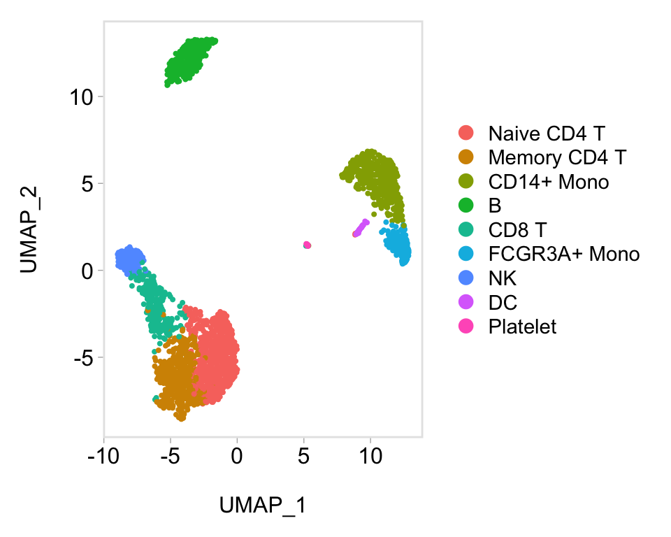

# Seurat 数据可视化

> Seurat 内可视化功能的概览。


``` r
library(Seurat)
library(SeuratData)
library(ggplot2)
library(patchwork)
```


``` r
pbmc3k.final <- LoadData("pbmc3k", type = "pbmc3k.final")
pbmc3k.final$groups <- sample(c("group1", "group2"), size = ncol(pbmc3k.final), replace = TRUE)
features <- c("LYZ", "CCL5", "IL32", "PTPRCAP", "FCGR3A", "PF4")
pbmc3k.final
## An object of class Seurat 
## 13714 features across 2638 samples within 1 assay 
## Active assay: RNA (13714 features, 2000 variable features)
##  3 layers present: data, counts, scale.data
##  2 dimensional reductions calculated: pca, umap
```


## 标记 Marker 基因表达的五种可视化方式

### 山脊图

``` r
# 源自 ggridges。
RidgePlot(pbmc3k.final, features = features, ncol = 2)
```


### 小提琴图 

``` r
VlnPlot(pbmc3k.final, features = features)
```


``` r
# 小提琴图也可以根据某些变量进行分割。只需将分割变量添加到对象元数据中，并将其传递给 split.by 参数
VlnPlot(pbmc3k.final, features = "percent.mt", split.by = "groups")
```


### 特征图 

``` r
# 在低维空间中可视化特征表达
FeaturePlot(pbmc3k.final, features = features)
```


``` r
# 绘制图例以将颜色映射到表达水平
FeaturePlot(pbmc3k.final, features = "MS4A1")
```


``` r
# 调整图中的对比度
FeaturePlot(pbmc3k.final, features = "MS4A1", min.cutoff = 1, max.cutoff = 3)
```


``` r
# 基于非零表达的分位数计算特定特征的对比度水平，在绘制多个标记时尤为实用。
FeaturePlot(pbmc3k.final, features = c("MS4A1", "PTPRCAP"), min.cutoff = "q10", max.cutoff = "q90")
```


``` r
# 可视化两个基因的共表达情况
FeaturePlot(pbmc3k.final, features = c("MS4A1", "CD79A"), blend = TRUE)
```


``` r
# 将可视化拆分以按组查看表达（替代 FeatureHeatmap）
FeaturePlot(pbmc3k.final, features = c("MS4A1", "CD79A"), split.by = "groups")
```


### 点图 

``` r
# 点的大小对应于表达该基因的细胞百分比
# 每个簇中的特征。颜色代表平均表达水平
DotPlot(pbmc3k.final, features = features) + RotatedAxis()
```


``` r
# SplitDotPlotGG 已被替换为 DotPlot 的 `split.by` 参数
DotPlot(pbmc3k.final, features = features, split.by = "groups") + RotatedAxis()
```


``` r
# DimPlot 替代了 TSNEPlot、PCAPlot 等。此外，默认情况下它会按顺序绘制'umap'、'tsne'或 'pca'
DimPlot(pbmc3k.final)
```


``` r

pbmc3k.final.no.umap <- pbmc3k.final
pbmc3k.final.no.umap[["umap"]] <- NULL
DimPlot(pbmc3k.final.no.umap) + RotatedAxis()
```


### 热图

``` r
DoHeatmap(subset(pbmc3k.final, downsample = 100), features = features, size = 3)
```


``` r
# DoHeatmap 现在显示一个分组条，将热图分割成组或簇。这可以通过`group.by`参数进行更改
DoHeatmap(pbmc3k.final, features = VariableFeatures(pbmc3k.final)[1:100], cells = 1:500, size = 4, angle = 90) + NoLegend()
```


## ggplot2 联用

``` r
baseplot <- DimPlot(pbmc3k.final, reduction = "umap")
# 添加自定义 title
baseplot + labs(title = "Clustering of 2,700 PBMCs")
```


``` r
# 使用社区创建的主题，覆盖默认的 Seurat 应用主题
# remotes::install_github('sjessa/ggmin')
baseplot + ggmin::theme_powerpoint()
```




``` r
# Seurat 还提供了几种内置主题，例如 DarkTheme；更多详情请参阅
# ?SeuratTheme
baseplot + DarkTheme()
```


``` r
# 将主题串联起来
baseplot + FontSize(x.title = 20, y.title = 20) + NoLegend()
```


## 交互式绘图功能

### HoverLocator

Seurat 利用 R 的 plotly 图形库创建交互式图表。这一交互式绘图功能适用于任何基于 ggplot2 的散点图（需要包含` geom_point` 图层）。使用时，只需创建一个基于 ggplot2 的散点图（例如 `DimPlot()` 或 `FeaturePlot()` ），然后将生成的图表传递给 `HoverLocator()` 函数即可。


``` r
# 通过传入信息的数据框，包含额外的数据以与单元格名称一起显示。在使用 FetchData 时效果良好。
plot <- FeaturePlot(pbmc3k.final, features = "MS4A1")
HoverLocator(plot = plot, information = FetchData(pbmc3k.final, vars = c("ident", "PC_1", "nFeature_RNA")))
```


### CellSelector
Seurat 提供的另一项交互功能是能够手动选择细胞进行进一步研究。我们发现这对于那些不总是通过无偏聚类分离、但看起来明显不同的小簇特别有用。现在，您可以通过创建一个基于 ggplot2 的散点图（例如使用 `DimPlot()` 或 `FeaturePlot()` ），并将返回的图传递给 `CellSelector()` 来选择这些细胞。 `CellSelector()` 将返回一个包含所选点名称的向量，以便您可以将它们设置为新的身份类别并执行差异表达分析。


例如，假设在聚类过程中树突状细胞（DCs）与单核细胞合并了，但我们想根据它们在 tSNE 图中的位置来观察它们的独特之处。

``` r
pbmc3k.final <- RenameIdents(pbmc3k.final, DC = "CD14+ Mono")
plot <- DimPlot(pbmc3k.final, reduction = "umap")
select.cells <- CellSelector(plot = plot)
head(select.cells)
```


``` r
# 然后我们可以更改这些细胞的标识，将它们转化为自己的小型簇
Idents(pbmc3k.final, cells = select.cells) <- "NewCells"

# 现在，我们寻找特定于新细胞的标记物，并找到明确的树突状细胞标记物
newcells.markers <- FindMarkers(pbmc3k.final, ident.1 = "NewCells", ident.2 = "CD14+ Mono", min.diff.pct = 0.3, only.pos = TRUE)
head(newcells.markers)
```

<details>
  <summary>使用 CellSelector 自动分配细胞身份</summary>
除了返回细胞名称的向量外， `CellSelector()` 还可以获取选定的细胞并为它们分配新的身份标识，返回一个已设置身份类别的 Seurat 对象。这是通过将用于生成绘图的 Seurat 对象传递到 `CellSelector()` 并指定一个身份类别来实现的。例如，我们将选择与之前相同的细胞集，并将它们的身份类别设置为“selected”。


``` r
pbmc3k.final <- CellSelector(plot = plot, object = pbmc3k.final, ident = "selected")

levels(pbmc3k.final)
```

</details>


## 绘图辅助工具
 LabelClusters 和 LabelPoints 将在基于 ggplot2 的散点图上标注聚类（着色变量）或单个点

``` r
plot <- DimPlot(pbmc3k.final, reduction = "pca") + NoLegend()
LabelClusters(plot = plot, id = "ident")
```


两个函数都支持`repel`功能，它能智能地错开标签位置，并绘制从标签指向点或簇的连接线

``` r
LabelPoints(plot = plot, points = TopCells(object = pbmc3k.final[["pca"]]), repel = TRUE)
```


``` r
plot1 <- DimPlot(pbmc3k.final)
# Create scatter plot with the Pearson correlation value as the title
plot2 <- FeatureScatter(pbmc3k.final, feature1 = "LYZ", feature2 = "CCL5")
# Combine two plots
plot1 + plot2
```


``` r
# Remove the legend from all plots
(plot1 + plot2) & NoLegend()
```


