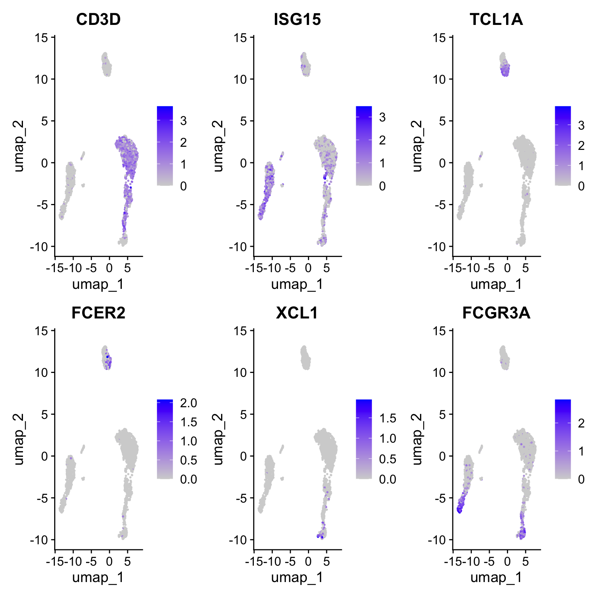

# Seurat 中使用 sctransform 方法

> 使用更新版 sctransform 进行归一化、特征选择、整合及差异表达分析的示例。

单细胞 RNA 测序数据中的生物学异质性常被技术因素（如测序深度）所混淆。即便在同一细胞类型中，各细胞检测到的分子数量也可能存在显著差异。要准确解读 scRNA-seq 数据，需通过有效的预处理和标准化步骤来消除这类技术性变异。


在本论文中，我们提出了一种用于单细胞 RNA 测序实验分子计数数据标准化和方差稳定的建模框架。该方法避免了伪计数添加或对数转换等启发式步骤，并改善了常见的下游分析任务，如可变基因选择、降维和差异表达分析。我们将此方法命名为 `sctransform` 。


``` r
library(Seurat)
library(ggplot2)
library(sctransform)
```


## 设置 Seurat 对象

``` r
library(SeuratData)
pbmc <- LoadData("pbmc3k", type = "pbmc3k")
pbmc
## An object of class Seurat 
## 13714 features across 2638 samples within 1 assay 
## Active assay: RNA (13714 features, 2000 variable features)
##  3 layers present: data, counts, scale.data
##  2 dimensional reductions calculated: pca, umap
```

## 应用 sctransform 标准化方法

- 请注意，这一条指令替代了 `NormalizeData()` 、 `ScaleData()` 和 `FindVariableFeatures()` 的功能。   
- 转换后的数据将存储在 SCT 分析模块中，该模块在执行 sctransform 后会被设为默认选项。   
- 在标准化过程中，我们还可以消除混杂的变异来源，例如线粒体映射百分比。   
- 在 Seurat v5 版本中，默认采用 SCT v2 算法。如需切换回 v1 版本，可通过设置 vst.flavor = 'v1' 实现。    
- [glmGamPoi](https://bioconductor.org/packages/release/bioc/html/glmGamPoi.html) 包显著提高了速度，若已安装则默认使用，具体操作指南见此处.  


``` r
# 将线粒体百分比存储在对象元数据中
pbmc <- PercentageFeatureSet(pbmc, pattern = "^MT-", col.name = "percent.mt")

# run sctransform
pbmc <- SCTransform(pbmc, vars.to.regress = "percent.mt", verbose = FALSE)
```


## 通过 PCA 降维和 UMAP 嵌入进行维度缩减

``` r
# These are now standard steps in the Seurat workflow for visualization and clustering
pbmc <- RunPCA(pbmc, verbose = FALSE)
pbmc <- FindNeighbors(pbmc, dims = 1:30, verbose = FALSE)
pbmc <- FindClusters(pbmc, verbose = FALSE)
pbmc <- RunUMAP(pbmc, dims = 1:30, verbose = FALSE)

DimPlot(pbmc, label = TRUE)
```


<details>
  <summary>为什么在使用 sctransform 时可以选择更多的主成分？</summary>
 
 在标准的 Seurat 工作流程中，我们针对此数据集主要关注 10 个主成分（PCs），但需要指出的是，即使调高该参数设置，结果也较为相似。有趣的是，我们发现使用 sctransform 时，通过进一步提高该参数往往能带来额外益处。我们认为这是因为 sctransform 工作流程执行了更高效的标准化处理，能强力消除数据中的技术性干扰。
 
 
 即便经过标准的对数归一化处理，测序深度的差异仍是一个混杂因素，这种影响可能微妙地干扰更高阶的主成分。而在 sctransform 中，该效应得到了显著缓解。这意味着高阶主成分更有可能反映微妙但具有生物学意义的异质性来源——因此包含这些成分可能会改进下游分析。


此外，sctransform 默认返回 3,000 个可变特征，而非 2,000 个。其原理类似：额外的可变特征较少受到细胞间技术差异的影响，反而可能反映更细微的生物学波动。总体而言，我们发现使用 sctransform 得到的结果对这些参数的依赖性更低（事实上，当使用转录组中所有基因时，我们获得了几乎一致的结果，尽管这会降低计算效率）。这有助于用户获得更稳健的结果，同时还能应用标准分析流程——通过相同的参数设置可快速应用于新数据集：


例如，以下代码通过单一命令复现了完整的端到端工作流程：

``` r
pbmc1 <- CreateSeuratObject(pbmc_data) %>%
    PercentageFeatureSet(pattern = "^MT-", col.name = "percent.mt") %>%
    SCTransform(vars.to.regress = "percent.mt") %>%
    RunPCA() %>%
    FindNeighbors(dims = 1:30) %>%
    FindClusters() %>%
    RunUMAP(dims = 1:30)
    
```

</details>  


<details>
  <summary>sctransform 的归一化值存储在哪里？</summary>
  
sctransform 的结果存储在“SCT”分析中。您可以在我们的 vignette、命令速查表或开发者指南中了解更多关于 Seurat 中多分析数据和命令的信息。

`pbmc[["SCT"]]$scale.data` 包含残差（标准化值），并直接作为 PCA 的输入。请注意该矩阵是非稀疏的，因此若为所有基因存储会占用大量内存。为节省内存，我们默认在 `SCTransform()` 函数调用中设置 `return.only.var.genes = TRUE`，仅存储可变基因的这些值。


为辅助可视化和解释，我们还将皮尔逊残差转换回‘校正后’的 UMI 计数。您可将其理解为所有细胞测序深度相同时预期观察到的 UMI 计数。若需了解具体实现方式，请参阅此处的校正函数。


‘校正后’的 UMI 计数存储在 `pbmc[["SCT"]]$counts` 中。我们将这些校正计数的对数标准化版本存储在 `pbmc[["SCT"]]$data` 中，这对可视化非常有帮助。

</details>  


用户可根据经典标记物独立注释细胞群。然而，sctransform 标准化方法在多个方面展现出比标准 Seurat 流程更清晰的生物学区分：

- 基于 CD8A、GZMK、CCL5、CCR7 的表达谱，清晰区分至少 3 个 CD8 T 细胞亚群（初始态、记忆态、效应态）. 
- 依据 S100A4、CCR7、IL32 和 ISG15 的表达，明确分离出三个 CD4 T 细胞亚群（初始态、记忆态、IFN 激活态）.  
- B 细胞群中基于 TCL1A 和 FCER2 标记物，显示出额外的发育亚结构特征.  
- 将 NK 细胞进一步区分为 CD56dim 与 bright 亚群，依据 XCL1 和 FCGR3A 标记基因. 


``` r
# 这些现在是 Seurat 工作流程中用于可视化和聚类的标准步骤 将经典标记基因可视化为小提琴图。
VlnPlot(pbmc, features = c("CD8A", "GZMK", "CCL5", "S100A4", "ANXA1", "CCR7", "ISG15", "CD3D"),
    pt.size = 0.2, ncol = 4)
```


``` r
# 在 sctransform 嵌入上可视化规范标记基因。
FeaturePlot(pbmc, features = c("CD8A", "GZMK", "CCL5", "S100A4", "ANXA1", "CCR7"), pt.size = 0.2,
    ncol = 3)
```


``` r
FeaturePlot(pbmc, features = c("CD3D", "ISG15", "TCL1A", "FCER2", "XCL1", "FCGR3A"), pt.size = 0.2,
    ncol = 3)
```



