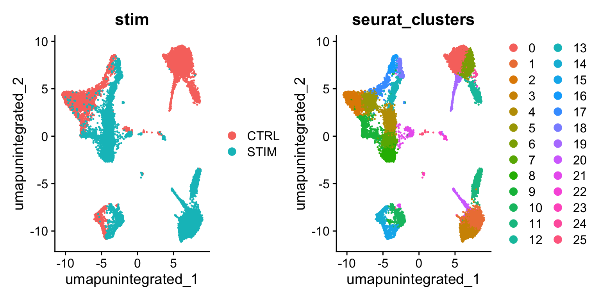
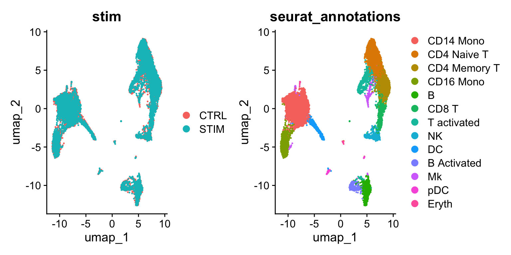
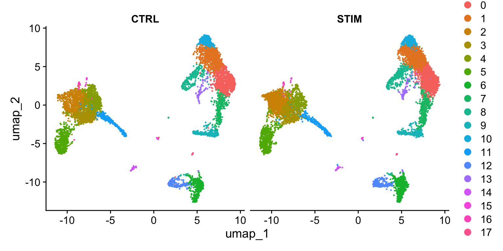
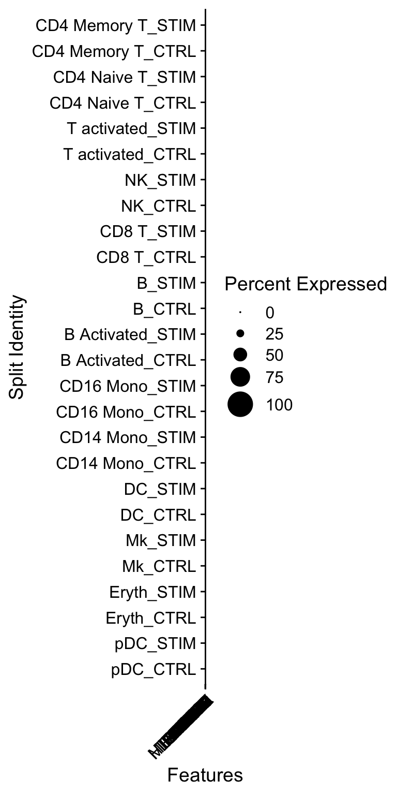
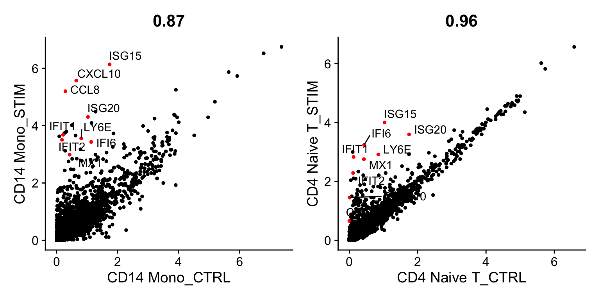
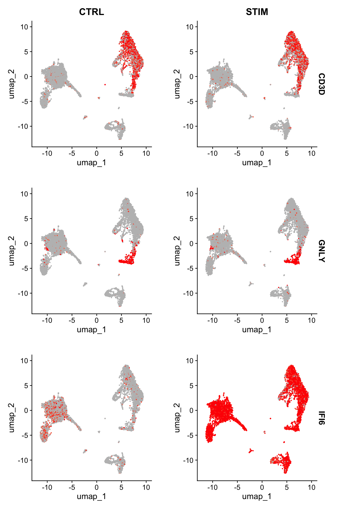
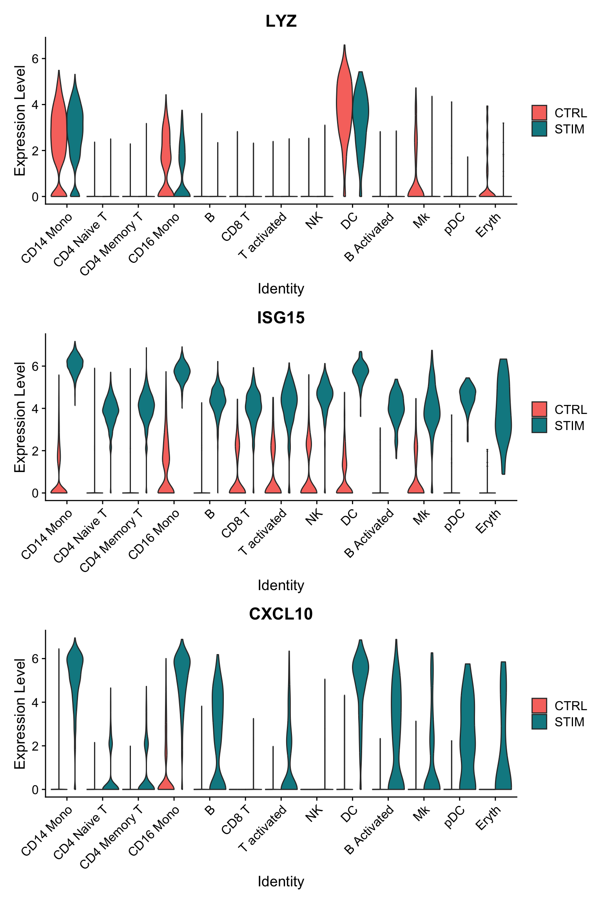
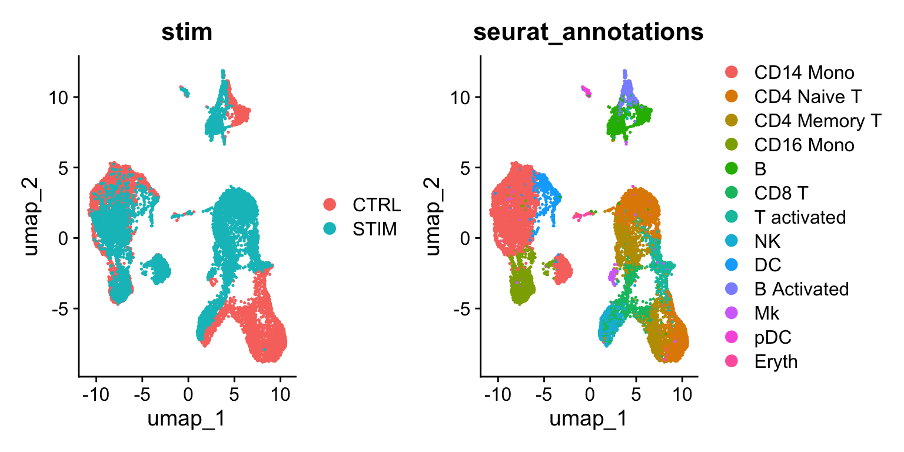
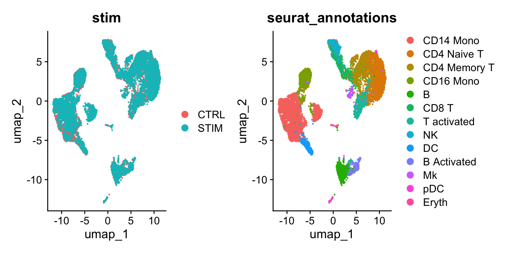

# scRNA-Seq 整合简介

> 整合 scRNA-Seq 数据集简介，旨在识别和比较不同实验间共享的细胞类型。

单细胞测序数据集的整合（例如跨实验批次、供体或条件）通常是 scRNA-seq 工作流程中的重要步骤。整合分析有助于匹配不同数据集间共有的细胞类型和状态，这既能增强统计效力，更重要的是能促进跨数据集的精确比较分析。在 Seurat 的早期版本中，我们已引入包括基于"锚点"的整合流程在内的多种整合分析方法。许多实验室也发表了强大且开创性的整合分析方法，如 [Harmony](https://portals.broadinstitute.org/harmony/) 和 [scVI](https://docs.scvi-tools.org/en/stable/index.html)。详情请参阅我们关于 [《使用多种工具整合 scRNA-seq 数据》](https://satijalab.org/seurat/articles/seurat5_integration)的教程文档。


本教程旨在概述利用 Seurat 整合流程对复杂细胞类型进行对比分析的多种可能性。我们主要关注以下几个关键目标：

- 识别在两个数据集中均存在的细胞亚群.  
- 获取在对照组和刺激组细胞中均保守的细胞类型标记物. 
- 对比数据集以寻找细胞类型对刺激的特异性反应. 

## 设置 Seurat 对象


``` r
library(Seurat)
library(SeuratData)
library(patchwork)
```


``` r
# install dataset
# InstallData("ifnb")
```

该对象包含来自人类 PBMC 的两种条件数据：干扰素刺激细胞和对照细胞（存储在对象元数据的 stim 列中）。我们的目标是将这两种条件的数据整合在一起，以便能够跨数据集联合识别细胞亚群，并探索各组在不同条件下的差异。


在 Seurat 的早期版本中，我们需要将数据表示为两个不同的 Seurat 对象。而在 Seurat v5 中，我们将所有数据保留在同一个对象内，但将其分割为多个“层”。要了解更多关于层的信息，请参阅我们的 Seurat 对象交互指南。


``` r
# 加载数据
ifnb <- LoadData("ifnb")

# 将 RNA 测量数据分为两层，一层用于对照细胞，一层用于刺激细胞
ifnb[["RNA"]] <- split(ifnb[["RNA"]], f = ifnb$stim)
ifnb
## An object of class Seurat 
## 14053 features across 13999 samples within 1 assay 
## Active assay: RNA (14053 features, 0 variable features)
##  4 layers present: counts.CTRL, counts.STIM, data.CTRL, data.STIM
```

## 执行非整合分析
我们可以首先在不进行整合的情况下分析数据集。由此产生的聚类既由细胞类型又受刺激条件影响，这给下游分析带来了挑战。


``` r
# 跑标准分析流程
ifnb <- NormalizeData(ifnb)
ifnb <- FindVariableFeatures(ifnb)
ifnb <- ScaleData(ifnb)
ifnb <- RunPCA(ifnb)
```


``` r
ifnb <- FindNeighbors(ifnb, dims = 1:30, reduction = "pca")
ifnb <- FindClusters(ifnb, resolution = 2, cluster.name = "unintegrated_clusters")
## Modularity Optimizer version 1.3.0 by Ludo Waltman and Nees Jan van Eck
## 
## Number of nodes: 13999
## Number of edges: 555146
## 
## Running Louvain algorithm...
## Maximum modularity in 10 random starts: 0.8153
## Number of communities: 26
## Elapsed time: 1 seconds
```


``` r
ifnb <- RunUMAP(ifnb, dims = 1:30, reduction = "pca", reduction.name = "umap.unintegrated")
DimPlot(ifnb, reduction = "umap.unintegrated", group.by = c("stim", "seurat_clusters"))
```




## 执行整合
我们现在旨在整合两种条件下的数据，使得来自相同细胞类型/亚群的细胞能够聚类在一起。


我们通常将此过程称为整合/比对。在将两个基因组序列进行比对时，识别共享/同源区域有助于解释序列间的差异。类似地，对于单细胞 RNA 测序数据的整合，我们的目标并非消除不同条件间的生物学差异，而是首先识别共享的细胞类型/状态——这能让我们针对这些特定细胞类型比较刺激组与对照组的表达谱。


Seurat v5 整合流程旨在返回一个捕捉多组数据间共同变异来源的降维结果，使处于相似生物学状态的细胞得以聚类。该方法生成的降维结果（即 `integrated.cca` ）可用于可视化与无监督聚类分析。评估性能时，我们可以使用预加载在 `seurat_annotations` 元数据列中的细胞类型标签。


``` r
ifnb <- IntegrateLayers(object = ifnb, method = CCAIntegration, orig.reduction = "pca", new.reduction = "integrated.cca", verbose = FALSE)

# 集成后重新合并图层
ifnb[["RNA"]] <- JoinLayers(ifnb[["RNA"]])

ifnb <- FindNeighbors(ifnb, reduction = "integrated.cca", dims = 1:30)
ifnb <- FindClusters(ifnb, resolution = 1)
## Modularity Optimizer version 1.3.0 by Ludo Waltman and Nees Jan van Eck
## 
## Number of nodes: 13999
## Number of edges: 590406
## 
## Running Louvain algorithm...
## Maximum modularity in 10 random starts: 0.8448
## Number of communities: 18
## Elapsed time: 1 seconds
```


``` r
ifnb <- RunUMAP(ifnb, dims = 1:30, reduction = "integrated.cca")
DimPlot(ifnb, reduction = "umap", group.by = c("stim", "seurat_annotations"))
```




为了将两种条件并排可视化，我们可以使用 `split.by` 参数来显示按聚类着色的每种条件。

``` r
DimPlot(ifnb, reduction = "umap", split.by = "stim")
```




## 识别保守的细胞类型标记基因

为了识别在不同实验条件下保守的典型细胞类型标记基因，我们提供了 `FindConservedMarkers()` 函数。该函数对每个数据集/组进行差异基因表达分析，并利用 MetaDE R 包中的元分析方法合并 p 值。例如，我们可以计算在集群 6（自然杀伤细胞）中不受刺激条件影响的保守标记基因。

``` r
Idents(ifnb) <- "seurat_annotations"
nk.markers <- FindConservedMarkers(ifnb, ident.1 = "NK", grouping.var = "stim", verbose = FALSE)
head(nk.markers)
##       CTRL_p_val CTRL_avg_log2FC CTRL_pct.1 CTRL_pct.2 CTRL_p_val_adj
## GNLY           0        6.854586      0.943      0.046              0
## NKG7           0        5.358881      0.953      0.085              0
## GZMB           0        5.078135      0.839      0.044              0
## CLIC3          0        5.765314      0.601      0.024              0
## CTSW           0        5.307246      0.537      0.030              0
## KLRD1          0        5.261553      0.507      0.019              0
##       STIM_p_val STIM_avg_log2FC STIM_pct.1 STIM_pct.2 STIM_p_val_adj max_pval
## GNLY           0        6.435910      0.956      0.059              0        0
## NKG7           0        4.971397      0.950      0.081              0        0
## GZMB           0        5.151924      0.897      0.060              0        0
## CLIC3          0        5.505208      0.623      0.031              0        0
## CTSW           0        5.240729      0.592      0.035              0        0
## KLRD1          0        4.852457      0.555      0.027              0        0
##       minimump_p_val
## GNLY               0
## NKG7               0
## GZMB               0
## CLIC3              0
## CTSW               0
## KLRD1              0
```

可以对无监督聚类结果（存储在 `seurat_clusters` 中）执行相同的分析，并使用这些保守标记来注释数据集中的细胞类型。


带有 `split.by` 参数的 `DotPlot()` 函数可用于查看跨条件下保守的细胞类型标记，同时显示表达水平以及表达任何给定基因的细胞在簇中的百分比。这里我们为 14 个簇中的每一个绘制了 2-3 个强标记基因。


``` r
# 需要修复并正确设置顺序
Idents(ifnb) <- factor(Idents(ifnb), levels = c("pDC", "Eryth", "Mk", "DC", "CD14 Mono", "CD16 Mono",
    "B Activated", "B", "CD8 T", "NK", "T activated", "CD4 Naive T", "CD4 Memory T"))

markers.to.plot <- c("CD3D", "CREM", "HSPH1", "SELL", "GIMAP5", "CACYBP", "GNLY", "NKG7", "CCL5",
    "CD8A", "MS4A1", "CD79A", "MIR155HG", "NME1", "FCGR3A", "VMO1", "CCL2", "S100A9", "HLA-DQA1",
    "GPR183", "PPBP", "GNG11", "HBA2", "HBB", "TSPAN13", "IL3RA", "IGJ", "PRSS57")
DotPlot(ifnb, features = markers.to.plot, cols = c("blue", "red"), dot.scale = 8, split.by = "stim") +
    RotatedAxis()
```




## 识别不同条件下的差异表达基因
既然我们已经对齐了受刺激细胞和对照细胞，现在可以开始进行比较分析，观察刺激引发的差异。

我们可以通过 `AggregateExpression` 命令将相似类型和状态的细胞聚合并创建“伪批量”表达谱。作为初步探索性分析，我们可以比较两种细胞类型（初始 CD4 T 细胞和 CD14 单核细胞）的伪批量表达谱，并对比它们在刺激前后的基因表达特征。我们特别标注了对干扰素刺激反应显著的基因。如图所示，许多相同基因在这两种细胞类型中均上调表达，可能代表了一条保守的干扰素响应通路，不过 CD14 单核细胞表现出更强的转录响应。


``` r
library(ggplot2)
library(cowplot)
theme_set(theme_cowplot())

aggregate_ifnb <- AggregateExpression(ifnb, group.by = c("seurat_annotations", "stim"), return.seurat = TRUE)
genes.to.label = c("ISG15", "LY6E", "IFI6", "ISG20", "MX1", "IFIT2", "IFIT1", "CXCL10", "CCL8")

p1 <- CellScatter(aggregate_ifnb, "CD14 Mono_CTRL", "CD14 Mono_STIM", highlight = genes.to.label)
p2 <- LabelPoints(plot = p1, points = genes.to.label, repel = TRUE)

p3 <- CellScatter(aggregate_ifnb, "CD4 Naive T_CTRL", "CD4 Naive T_STIM", highlight = genes.to.label)
p4 <- LabelPoints(plot = p3, points = genes.to.label, repel = TRUE)

p2 + p4
```




我们现在可以询问相同类型细胞在不同条件下哪些基因发生了变化。首先，我们在 `meta.data` 槽中创建一个列来保存细胞类型和刺激信息，并将当前标识切换为该列。然后，我们使用 `FindMarkers() `来寻找刺激和对照 B 细胞之间不同的基因。请注意，这里显示的许多顶级基因与我们之前绘制的核心干扰素反应基因相同。此外，像 CXCL10 这样的基因，我们之前看到它们对单核细胞和 B 细胞的干扰素反应具有特异性，也在这个列表中显示出高度显著性。


请注意，本分析得出的 p 值应谨慎解读，因为这些检验将每个细胞视为独立重复样本，忽略了源自同一样本的细胞间固有相关性。正如此处所述，跨多条件的差异表达（DE）检验应明确使用多个样本/重复，并可在将同一样本和亚群的细胞聚合（“伪批量”）后进行。由于数据中仅有一个重复样本，我们在此未执行此分析，但请参阅我们比较健康与糖尿病样本的示例教程，了解如何进行跨条件的 DE 分析。


``` r
ifnb$celltype.stim <- paste(ifnb$seurat_annotations, ifnb$stim, sep = "_")
Idents(ifnb) <- "celltype.stim"
b.interferon.response <- FindMarkers(ifnb, ident.1 = "B_STIM", ident.2 = "B_CTRL", verbose = FALSE)
head(b.interferon.response, n = 15)
##                 p_val avg_log2FC pct.1 pct.2     p_val_adj
## ISG15   5.387767e-159  5.0588481 0.998 0.233 7.571429e-155
## IFIT3   1.945114e-154  6.1124940 0.965 0.052 2.733468e-150
## IFI6    2.503565e-152  5.4933132 0.965 0.076 3.518260e-148
## ISG20   6.492570e-150  3.0549593 1.000 0.668 9.124009e-146
## IFIT1   1.951022e-139  6.2320388 0.907 0.029 2.741772e-135
## MX1     6.897626e-123  3.9798482 0.905 0.115 9.693234e-119
## LY6E    2.825649e-120  3.7907800 0.898 0.150 3.970885e-116
## TNFSF10 4.007285e-112  6.5802175 0.786 0.020 5.631437e-108
## IFIT2   2.672552e-108  5.5525558 0.786 0.037 3.755738e-104
## B2M      5.283684e-98  0.6104044 1.000 1.000  7.425161e-94
## PLSCR1   4.634658e-96  3.8010721 0.793 0.113  6.513085e-92
## IRF7     2.411149e-94  3.1992949 0.835 0.187  3.388388e-90
## CXCL10   3.708508e-86  8.0906108 0.651 0.010  5.211566e-82
## UBE2L6   5.547472e-83  2.5167981 0.851 0.297  7.795863e-79
## PSMB9    1.716262e-77  1.7715351 0.937 0.568  2.411863e-73
```


另一种可视化这些基因表达变化的有用方法是使用`FeaturePlot`或`DotPlot`函数的`split.by`选项。这将按分组变量（此处为刺激条件）展示给定基因列表的特征图。例如，CD3D 和 GNLY 是典型的细胞类型标记基因（分别对应 T 细胞和 NK/CD8 T 细胞），它们几乎不受干扰素刺激的影响，在对照组和刺激组中表现出相似的基因表达模式。而 IFI6 和 ISG15 则是核心干扰素应答基因，在所有细胞类型中均相应上调。最后，CD14 和 CXCL10 是展现细胞类型特异性干扰素应答的基因——CD14 在 CD14 单核细胞中受刺激后表达下降（这可能导致监督分析框架中的错误分类，从而凸显整合分析的价值）；CXCL10 则在干扰素刺激后于单核细胞和 B 细胞中显著上调，但在其他细胞类型中无此现象。

``` r
FeaturePlot(ifnb, features = c("CD3D", "GNLY", "IFI6"), split.by = "stim", max.cutoff = 3, cols = c("grey", "red"), reduction = "umap")
```




``` r
plots <- VlnPlot(ifnb, features = c("LYZ", "ISG15", "CXCL10"), split.by = "stim", group.by = "seurat_annotations", pt.size = 0, combine = FALSE)
wrap_plots(plots = plots, ncol = 1)
```




## 使用 SCTransform 标准化数据集进行整合
作为对数归一化的替代方案，Seurat 还支持使用 sctransform 工作流对 scRNA-seq 数据进行预处理。 IntegrateLayers 函数同样支持 SCTransform 归一化后的数据，只需设置 `normalization.method` 参数即可，如下所示。


``` r
# 拆分数据集并在不集成的情况下处理
ifnb <- LoadData("ifnb")

ifnb[["RNA"]] <- split(ifnb[["RNA"]], f = ifnb$stim)
ifnb <- SCTransform(ifnb)
ifnb <- RunPCA(ifnb)

ifnb <- RunUMAP(ifnb, dims = 1:30)
DimPlot(ifnb, reduction = "umap", group.by = c("stim", "seurat_annotations"))
```




``` r
# 整合数据集的情况下处理
ifnb <- IntegrateLayers(object = ifnb, method = CCAIntegration, normalization.method = "SCT", verbose = F)
ifnb <- FindNeighbors(ifnb, reduction = "integrated.dr", dims = 1:30)
ifnb <- FindClusters(ifnb, resolution = 0.6)
## Modularity Optimizer version 1.3.0 by Ludo Waltman and Nees Jan van Eck
## 
## Number of nodes: 13999
## Number of edges: 544695
## 
## Running Louvain algorithm...
## Maximum modularity in 10 random starts: 0.9071
## Number of communities: 19
## Elapsed time: 1 seconds

ifnb <- RunUMAP(ifnb, dims = 1:30, reduction = "integrated.dr")
DimPlot(ifnb, reduction = "umap", group.by = c("stim", "seurat_annotations"))
```




``` r
# 执行差异表达分析
ifnb <- PrepSCTFindMarkers(ifnb)
ifnb$celltype.stim <- paste(ifnb$seurat_annotations, ifnb$stim, sep = "_")
Idents(ifnb) <- "celltype.stim"
b.interferon.response <- FindMarkers(ifnb, ident.1 = "B_STIM", ident.2 = "B_CTRL", verbose = FALSE)
```
