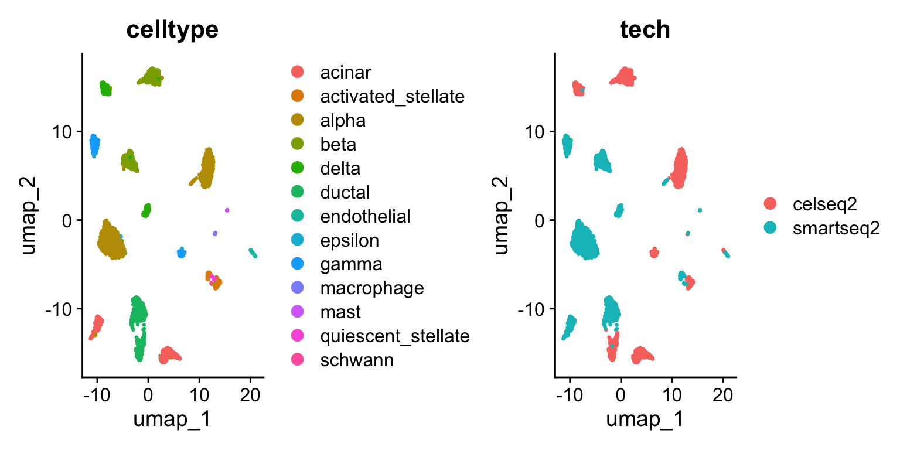
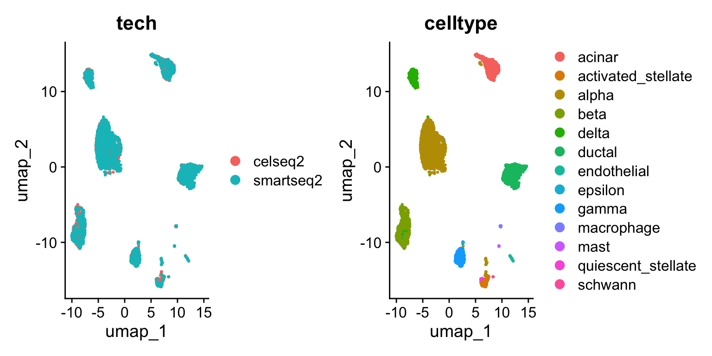
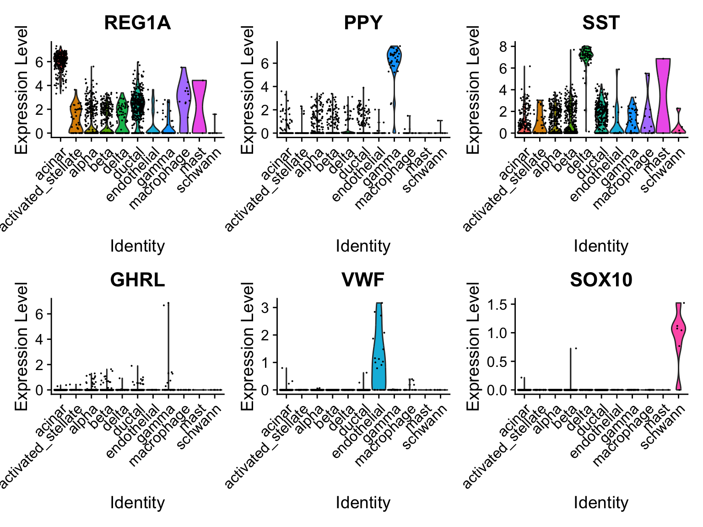
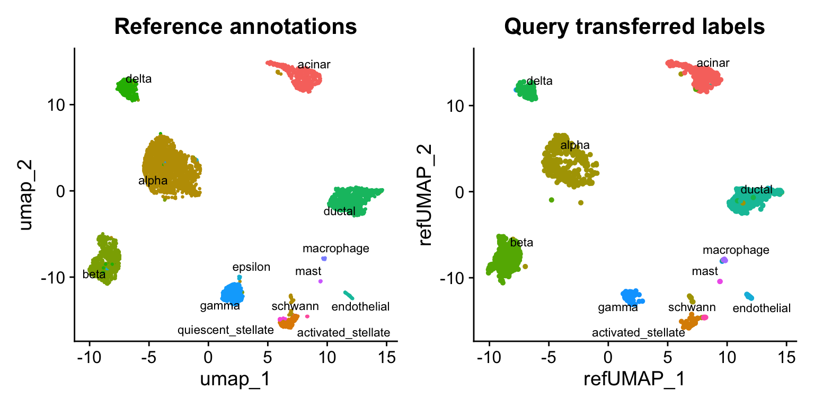

# 映射与注释查询数据集

> 学习如何将查询单细胞 RNA 测序数据集映射至参考数据集，以实现查询细胞的自动化注释与可视化。

我们首先构建一个集成参考集，随后演示如何利用该参考集对新查询数据集进行注释。生成集成参考集的流程与整合介绍教程中详述的工作流一致。一旦生成，此参考集可用于分析额外的查询数据集，执行诸如细胞类型标签转移、将查询细胞投影至参考 UMAP 等任务。值得注意的是，该方法无需校正原始查询数据，因此在拥有高质量参考集时是一种高效策略。


## 数据集预处理

在本示例中，我们选择了通过四种技术生成的人类胰岛细胞数据集：CelSeq（GSE81076）、CelSeq2（GSE85241）、Fluidigm C1（GSE86469）和 SMART-Seq2（E-MTAB-5061）。为方便起见，我们通过 SeuratData 包分发该数据集。元数据包含每项技术（ tech 列）和四种数据集中每个细胞的细胞类型注释（ celltype 列）。


``` r
library(Seurat)
library(SeuratData)
library(ggplot2)
```

作为演示，我们将使用部分技术子集构建参考数据集，随后将剩余数据集映射到该参考上。我们首先从四种技术中筛选细胞，并进行无整合的分析。

``` r
# InstallData("panc8")
panc8 <- LoadData("panc8")
table(panc8$tech)
## 
##     celseq    celseq2 fluidigmc1     indrop  smartseq2 
##       1004       2285        638       8569       2394
```


``` r
# 我们将使用来自 2 种技术的数据作为参考
pancreas.ref <- subset(panc8, tech %in% c("celseq2", "smartseq2"))
pancreas.ref[["RNA"]] <- split(pancreas.ref[["RNA"]], f = pancreas.ref$tech)

# 预处理数据集（无整合）
pancreas.ref <- NormalizeData(pancreas.ref)
pancreas.ref <- FindVariableFeatures(pancreas.ref)
pancreas.ref <- ScaleData(pancreas.ref)
pancreas.ref <- RunPCA(pancreas.ref)
pancreas.ref <- FindNeighbors(pancreas.ref, dims = 1:30)
pancreas.ref <- FindClusters(pancreas.ref)
## Modularity Optimizer version 1.3.0 by Ludo Waltman and Nees Jan van Eck
## 
## Number of nodes: 4679
## Number of edges: 174953
## 
## Running Louvain algorithm...
## Maximum modularity in 10 random starts: 0.9180
## Number of communities: 19
## Elapsed time: 0 seconds
```


``` r
pancreas.ref <- RunUMAP(pancreas.ref, dims = 1:30)
DimPlot(pancreas.ref, group.by = c("celltype", "tech"))
```




接下来，我们将这些数据集整合到一个共享参考中。具体方法请参阅我们的[整合指南介绍](https://satijalab.org/seurat/articles/integration_introduction)。

``` r
pancreas.ref <- IntegrateLayers(object = pancreas.ref, method = CCAIntegration, orig.reduction = "pca", new.reduction = "integrated.cca", verbose = FALSE)
pancreas.ref <- FindNeighbors(pancreas.ref, reduction = "integrated.cca", dims = 1:30)
pancreas.ref <- FindClusters(pancreas.ref)
## Modularity Optimizer version 1.3.0 by Ludo Waltman and Nees Jan van Eck
## 
## Number of nodes: 4679
## Number of edges: 190152
## 
## Running Louvain algorithm...
## Maximum modularity in 10 random starts: 0.8680
## Number of communities: 15
## Elapsed time: 0 seconds
```


``` r
pancreas.ref <- RunUMAP(pancreas.ref, reduction = "integrated.cca", dims = 1:30)
DimPlot(pancreas.ref, group.by = c("tech", "celltype"))
```




## 使用集成参考进行细胞类型分类

Seurat 同样支持将参考数据（或元数据）映射到查询对象上。尽管两种方法有共通之处（均始于锚点识别），但数据转移与整合存在两个重要区别：

1. 在数据转移过程中，Seurat 不会对查询表达数据进行校正或修改。   
2. 在数据转移时，Seurat 默认提供将参考数据的 PCA 结构投影至查询选项，而非使用 CCA 学习联合结构。对于单细胞 RNA 测序数据集间的数据投影，我们通常建议启用此选项。


定位锚点后，我们使用 `TransferData()` 函数根据参考数据（参考细胞类型标签向量）对查询细胞进行分类。 `TransferData()` 返回包含预测 ID 和评分的矩阵，可将其添加至查询元数据中。


``` r
# 选择两种技术用于查询数据集
pancreas.query <- subset(panc8, tech %in% c("fluidigmc1", "celseq"))
pancreas.query <- NormalizeData(pancreas.query)
pancreas.anchors <- FindTransferAnchors(reference = pancreas.ref, query = pancreas.query, dims = 1:30, reference.reduction = "pca")
predictions <- TransferData(anchorset = pancreas.anchors, refdata = pancreas.ref$celltype, dims = 1:30)
pancreas.query <- AddMetaData(pancreas.query, metadata = predictions)
```

由于我们拥有完整整合分析中的原始标签注释，因此可以评估预测的细胞类型注释与完整参考数据的匹配程度。在本例中，我们发现细胞类型分类具有高度一致性，超过 96%的细胞被正确标记。


``` r
pancreas.query$prediction.match <- pancreas.query$predicted.id == pancreas.query$celltype
table(pancreas.query$prediction.match)
## 
## FALSE  TRUE 
##    63  1579
```

为了进一步验证这一点，我们可以检查一些特定胰岛细胞群的典型细胞类型标记物。需要注意的是，尽管某些细胞类型仅由一两个细胞代表（例如 epsilon 细胞），我们仍能正确分类它们。

``` r
table(pancreas.query$predicted.id)
## 
##             acinar activated_stellate              alpha               beta 
##                262                 39                436                419 
##              delta             ductal        endothelial              gamma 
##                 73                330                 19                 41 
##         macrophage               mast            schwann 
##                 15                  2                  6
```


``` r
VlnPlot(pancreas.query, c("REG1A", "PPY", "SST", "GHRL", "VWF", "SOX10"), group.by = "predicted.id")
```




## 单模态 UMAP 投影
我们还支持将查询数据投影到参考 UMAP 结构上。这可以通过计算参考 UMAP 模型后调用 `MapQuery()` 而非 `TransferData()` 来实现。


``` r
pancreas.ref <- RunUMAP(pancreas.ref, dims = 1:30, reduction = "integrated.cca", return.model = TRUE)
pancreas.query <- MapQuery(anchorset = pancreas.anchors, reference = pancreas.ref, query = pancreas.query,refdata = list(celltype = "celltype"), reference.reduction = "pca", reduction.model = "umap")
```


<details>
  <summary>MapQuery 的作用是什么？</summary>
  
`MapQuery()` 是三个函数的封装： `TransferData()` 、 `IntegrateEmbeddings()` 和 `ProjectUMAP()` 。 `TransferData()` 用于传递细胞类型标签并估算 ADT 值； `IntegrateEmbeddings()` 用于通过校正查询数据的低维嵌入来整合参考数据和查询数据；最后 `ProjectUMAP()` 用于将查询数据投影到参考数据的 UMAP 结构上。使用中间函数实现相同功能的等效代码如下：


``` r
pancreas.query <- TransferData(anchorset = pancreas.anchors, reference = pancreas.ref, query = pancreas.query,
    refdata = list(celltype = "celltype"))
pancreas.query <- IntegrateEmbeddings(anchorset = pancreas.anchors, reference = pancreas.ref, query = pancreas.query,
    new.reduction.name = "ref.pca")
pancreas.query <- ProjectUMAP(query = pancreas.query, query.reduction = "ref.pca", reference = pancreas.ref,
    reference.reduction = "pca", reduction.model = "umap")
```

</details>


现在我们可以将查询细胞与参考数据一同可视化。


``` r
p1 <- DimPlot(pancreas.ref, reduction = "umap", group.by = "celltype", label = TRUE, label.size = 3,
    repel = TRUE) + NoLegend() + ggtitle("Reference annotations")
p2 <- DimPlot(pancreas.query, reduction = "ref.umap", group.by = "predicted.celltype", label = TRUE,
    label.size = 3, repel = TRUE) + NoLegend() + ggtitle("Query transferred labels")
p1 + p2
```




