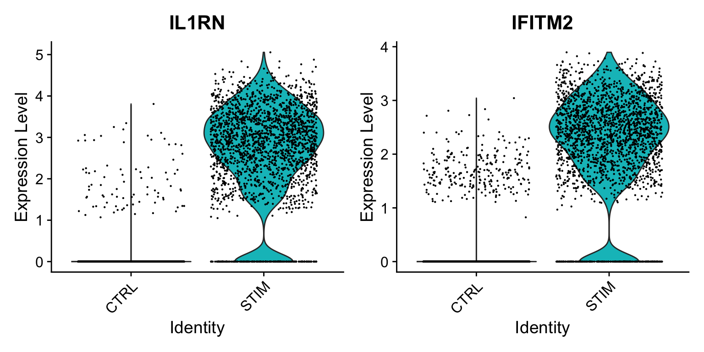
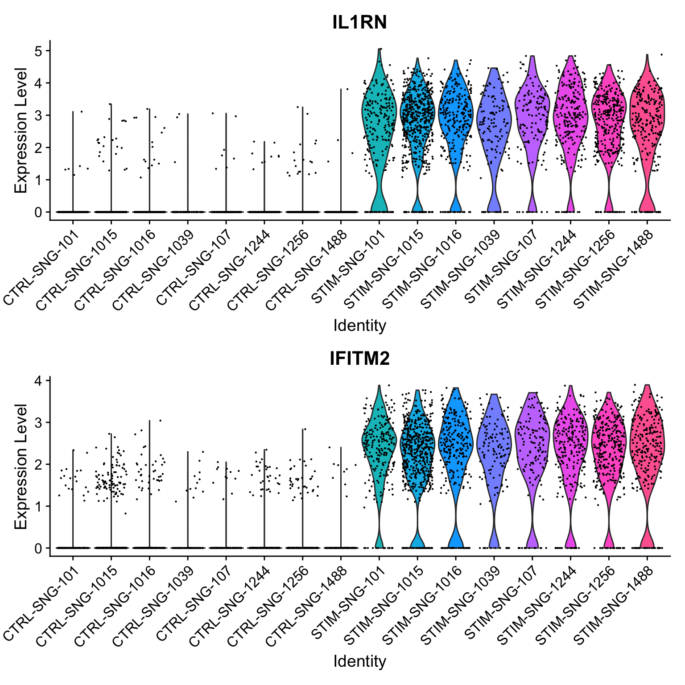

# 差异表达分析


``` r
library(Seurat)
library(SeuratData)
library(ggplot2)
ifnb <- LoadData("ifnb")
```

## 执行默认差异表达分析
Seurat 的大部分差异表达功能可通过 `FindMarkers()` 函数访问。默认情况下，Seurat 基于非参数 Wilcoxon 秩和检验进行差异表达（DE）测试。若要测试两组特定细胞间的差异表达基因，需指定 `ident.1` 和 `ident.2` 参数。


``` r
# 规范化数据
ifnb <- NormalizeData(ifnb)

# 查找 CD16 单核细胞与 CD1 单核细胞之间的差异基因
Idents(ifnb) <- "seurat_annotations"
monocyte.de.markers <- FindMarkers(ifnb, ident.1 = "CD16 Mono", ident.2 = "CD14 Mono")
# 查看结果
head(monocyte.de.markers)
##        p_val avg_log2FC pct.1 pct.2 p_val_adj
## VMO1       0   5.700274 0.778 0.084         0
## MS4A4A     0   3.349751 0.748 0.143         0
## FCGR3A     0   3.281942 0.982 0.418         0
## PLAC8      0   3.268470 0.636 0.124         0
## CXCL16     0   2.014758 0.938 0.475         0
## MS4A7      0   2.386436 0.978 0.558         0
```

结果数据框包含以下列：   
- p_val：未校正的 p 值   
- avg_log2FC：两组间平均表达量的对数倍变化。正值表示该特征在第一个组中表达更高。   
- pct.1：在第一个组中检测到该特征的细胞百分比。   
- pct.2：在第二个组中检测到该特征的细胞百分比。   
- p_val_adj：校正后的 p 值，基于数据集中所有特征进行 Bonferroni 校正。   


如果省略 `ident.2` 参数或将其设置为 `NULL` ， `FindMarkers()` 将测试由 `ident.1` 指定的组与所有其他细胞之间的差异表达特征。此外，参数 `only.pos` 可设置为 TRUE 以仅搜索正向标记，即在 `ident.1` 组中表达更高的特征。

``` r
# 在 CD14+单核细胞与所有其他细胞之间寻找差异表达特征，仅搜索阳性标记物
monocyte.de.markers <- FindMarkers(ifnb, ident.1 = "CD16 Mono", ident.2 = NULL, only.pos = TRUE)
# 查看结果
head(monocyte.de.markers)
##        p_val avg_log2FC pct.1 pct.2 p_val_adj
## FCGR3A     0   4.532656 0.982 0.168         0
## MS4A7      0   3.806350 0.978 0.216         0
## CXCL16     0   3.274267 0.938 0.196         0
## VMO1       0   6.254651 0.778 0.044         0
## MS4A4A     0   4.747731 0.748 0.055         0
## LST1       0   2.927351 0.912 0.228         0
```


## 在同一细胞类型内跨条件进行差异表达分析
由于该数据集包含处理信息（对照与干扰素-β刺激），我们还可以探究同一类型细胞在不同条件下哪些基因发生变化。首先，我们在 meta.data 槽中创建一个列来存储细胞类型和处理信息，并将当前 Idents 切换为该列。然后使用 `FindMarkers()` 找出对照与受刺激 CD14 单核细胞之间差异的基因。


``` r
ifnb$celltype.stim <- paste(ifnb$seurat_annotations, ifnb$stim, sep = "_")
Idents(ifnb) <- "celltype.stim"
mono.de <- FindMarkers(ifnb, ident.1 = "CD14 Mono_STIM", ident.2 = "CD14 Mono_CTRL", verbose = FALSE)
head(mono.de, n = 10)
##         p_val avg_log2FC pct.1 pct.2 p_val_adj
## IFIT1       0   7.319139 0.985 0.033         0
## CXCL10      0   8.036564 0.984 0.035         0
## RSAD2       0   6.741673 0.988 0.045         0
## TNFSF10     0   6.991279 0.989 0.047         0
## IFIT3       0   6.883785 0.992 0.056         0
## IFIT2       0   7.179929 0.961 0.039         0
## CXCL11      0   8.624208 0.932 0.012         0
## CCL8        0   9.134191 0.918 0.017         0
## IDO1        0   5.455898 0.965 0.089         0
## MX1         0   5.059052 0.960 0.093         0
```
然而，从该分析中获得的 p 值需谨慎解读，因为这些检验将每个细胞视为独立重复样本，忽略了源自同一样本的细胞间固有相关性。此类分析已被证明会产生大量假阳性关联，如 Squair 等人 2021 年、Zimmerman 等人 2021 年、Junttila 等人 2022 年及其他研究所证实。下文我们将展示如何利用伪批量分析（pseudobulking）来校正此类样本内相关性。

### 执行伪批量分析后的差异表达分析
进行伪批量分析时，我们将使用 `AggregateExpression()` 函数对同一样本中所有细胞的基因计数按细胞类型求和。这将为每个样本和细胞类型生成一个基因表达谱。随后可在样本层面使用 DESeq2 进行差异表达分析，此时将样本（而非单个细胞）视为独立观测单位。


首先需要获取每个细胞的样本信息。由于该信息未加载至元数据中，我们将从原始论文源数据的 [GitHub 仓库](https://github.com/yelabucsf/demuxlet_paper_code/tree/master/)中加载。

<details>
  <summary>向数据集中添加样本信息</summary>


``` r
# 加载每个细胞的推断样本 ID
ctrl <- read.table(url("https://raw.githubusercontent.com/yelabucsf/demuxlet_paper_code/master/fig3/ye1.ctrl.8.10.sm.best"), head = T, stringsAsFactors = F)
stim <- read.table(url("https://raw.githubusercontent.com/yelabucsf/demuxlet_paper_code/master/fig3/ye2.stim.8.10.sm.best"), head = T, stringsAsFactors = F)
info <- rbind(ctrl, stim)

# 通过将'-'替换为'.'来重命名单元格 ID
info$BARCODE <- gsub(pattern = "\\-", replacement = "\\.", info$BARCODE)

# 仅保留具有高置信度样本 ID 的细胞
info <- info[grep(pattern = "SNG", x = info$BEST), ]

# 在 ctrl 和 stim 组中移除具有重复 ID 的细胞
info <- info[!duplicated(info$BARCODE) & !duplicated(info$BARCODE, fromLast = T), ]

# 现在将样本 ID 添加到 ifnb
rownames(info) <- info$BARCODE
info <- info[, c("BEST"), drop = F]
names(info) <- c("donor_id")
ifnb <- AddMetaData(ifnb, metadata = info)

# 移除没有供体 ID 的细胞
ifnb$donor_id[is.na(ifnb$donor_id)] <- "unknown"
ifnb <- subset(ifnb, subset = donor_id != "unknown")
```

</details>


我们现在可以根据供体 ID 进行伪批量分析（ `AggregateExpression()` ）。

``` r
# 基于供体-条件-细胞类型 (donor-condition-celltype) 对计数进行伪批量处理
pseudo_ifnb <- AggregateExpression(ifnb, assays = "RNA", return.seurat = T, group.by = c("stim", "donor_id", "seurat_annotations"))

# 每个“细胞”都是一个供体-条件-细胞类型的伪批量表达谱
tail(Cells(pseudo_ifnb))
## [1] "STIM_SNG-1488_NK"          "STIM_SNG-1488_DC"         
## [3] "STIM_SNG-1488_B Activated" "STIM_SNG-1488_Mk"         
## [5] "STIM_SNG-1488_pDC"         "STIM_SNG-1488_Eryth"
```


``` r
pseudo_ifnb$celltype.stim <- paste(pseudo_ifnb$seurat_annotations, pseudo_ifnb$stim, sep = "_")
```

接下来，我们在伪批量水平上对 CD14 单核细胞进行差异表达（DE）测试，并将其与之前的单细胞水平 DE 结果进行比较。

``` r
Idents(pseudo_ifnb) <- "celltype.stim"

bulk.mono.de <- FindMarkers(object = pseudo_ifnb, 
                         ident.1 = "CD14 Mono_STIM", 
                         ident.2 = "CD14 Mono_CTRL",
                         test.use = "DESeq2")
head(bulk.mono.de, n = 15)
##                  p_val avg_log2FC pct.1 pct.2     p_val_adj
## IL1RN    3.701542e-275   5.588693     1     1 5.201777e-271
## IFITM2   1.955626e-250   4.108615     1     1 2.748242e-246
## SSB      2.699554e-203   2.893183     1     1 3.793683e-199
## NT5C3A   2.239898e-198   4.426872     1     1 3.147729e-194
## RTCB     5.700554e-162   2.738430     1     1 8.010989e-158
## RABGAP1L 4.743010e-161   4.494047     1     1 6.665352e-157
## DYNLT1   9.735640e-159   2.265511     1     1 1.368150e-154
## PLSCR1   3.191691e-146   2.501836     1     1 4.485284e-142
## ISG20    9.664488e-145   5.214558     1     1 1.358151e-140
## NAPA     2.858013e-144   1.782667     1     1 4.016365e-140
## DDX58    5.957026e-142   3.908225     1     1 8.371409e-138
## HERC5    6.333722e-133   4.360282     1     1 8.900780e-129
## OASL     3.892853e-130   3.691383     1     1 5.470627e-126
## EIF2AK2  6.636434e-128   3.386754     1     1 9.326180e-124
## TMEM50A  6.731955e-117   1.264359     1     1 9.460416e-113
```


<details>
  <summary>比较单细胞水平与伪bulk水平结果</summary>

``` r
# 比较单细胞水平与伪批量水平结果之间的 DE P 值
names(bulk.mono.de) <- paste0(names(bulk.mono.de), ".bulk")
bulk.mono.de$gene <- rownames(bulk.mono.de)

names(mono.de) <- paste0(names(mono.de), ".sc")
mono.de$gene <- rownames(mono.de)

merge_dat <- merge(mono.de, bulk.mono.de, by = "gene")
merge_dat <- merge_dat[order(merge_dat$p_val.bulk), ]

# 在两者中均具有边际显著性的基因数量；仅在批量数据中具有边际显著性；以及仅在单细胞数据中具有边际显著性
common <- merge_dat$gene[which(merge_dat$p_val.bulk < 0.05 & 
                                merge_dat$p_val.sc < 0.05)]
only_sc <- merge_dat$gene[which(merge_dat$p_val.bulk > 0.05 & 
                                  merge_dat$p_val.sc < 0.05)]
only_bulk <- merge_dat$gene[which(merge_dat$p_val.bulk < 0.05 & 
                                    merge_dat$p_val.sc > 0.05)]

print(paste0('# Common: ',length(common)))
## [1] "# Common: 3519"
print(paste0('# Only in single-cell: ',length(only_sc)))
## [1] "# Only in single-cell: 1649"
print(paste0('# Only in bulk: ',length(only_bulk)))
## [1] "# Only in bulk: 204"
```

我们可以看到，虽然单细胞数据和伪批量数据的 p 值存在相关性，但单细胞数据的 p 值通常更小，表明显著性水平更高。具体而言，有 3,519 个基因在两项分析中均显示差异表达证据（未进行多重假设检验前），1,649 个基因仅在单细胞分析中呈现差异表达，而仅有 204 个基因仅在批量分析中显示差异表达。我们可以使用 VlnPlot 来探究这些差异。


首先，我们可以检查在两项分析中差异表达最显著的基因。

``` r
# 在单细胞数据集中创建一个新列来标注样本-条件-细胞类型
ifnb$donor_id.stim <- paste0(ifnb$stim, "-", ifnb$donor_id)

# 画图
Idents(ifnb) <- "celltype.stim"
print(merge_dat[merge_dat$gene%in%common[1:2],c('gene','p_val.sc','p_val.bulk')])
##        gene p_val.sc    p_val.bulk
## 2785  IL1RN        0 3.701542e-275
## 2739 IFITM2        0 1.955626e-250
VlnPlot(ifnb, features = common[1:2], idents = c("CD14 Mono_CTRL", "CD14 Mono_STIM"), group.by = "stim") 
```




``` r
VlnPlot(ifnb, features = common[1:2], idents = c("CD14 Mono_CTRL", "CD14 Mono_STIM"), group.by = "donor_id.stim", ncol = 1) 
```



在这里，SRGN 和 HLA-DRA 在单细胞分析中都具有非常小的 p 值（数量级分别为 10<sup>−21</sup> 和 10<sup>−9</sup>），但在伪批量分析中 p 值约为 0.18，显著增大。虽然忽略样本信息时，对照组和模拟细胞之间似乎存在差异，但在样本水平上信号明显减弱，并且我们可以看到样本间存在显著变异性。

</details>


### 使用其他检验进行差异表达分析
最后，我们还支持使用其他方法进行多种差异表达检验。为全面起见，当前支持以下检验方法：  


- “wilcox”：Wilcoxon 秩和检验（默认，使用‘presto’包）    
- “wilcox_limma”：Wilcoxon 秩和检验（使用‘limma’包）    
- “bimod：单细胞特征表达似然比检验（McDavid 等人，《生物信息学》，2013 年）  
- “roc”：标准 AUC 分类器    
- “t” : Student’s t-test    
- “poisson”: 基于负二项分布假设的似然比检验。仅适用于 UMI 数据集   
- “negbinom”：基于负二项分布假设的似然比检验。仅适用于 UMI 数据集    
- “LR”：采用逻辑回归框架鉴定差异表达基因。针对每个特征单独构建逻辑回归模型预测分组归属，并通过似然比检验与零模型进行比较    
- “MAST”：一种将细胞检测率作为协变量处理的广义线性模型框架（Finak 等人，《Genome Biology》，2015 年）（安装说明）    
- “DESeq2”：基于负二项分布模型的差异表达分析（Love 等人，《基因组生物学》，2014 年）（安装说明）对于 MAST 和 DESeq2，请确保单独安装这些软件包，以便将它们作为 Seurat 的一部分使用。安装完成后，可通过 test.use 参数指定要使用的差异表达测试方法。   


``` r
# Test for DE features using the MAST package
Idents(ifnb) <- "seurat_annotations"
head(FindMarkers(ifnb, ident.1 = "CD14 Mono", ident.2 = "CD16 Mono", test.use = "MAST"))
```


