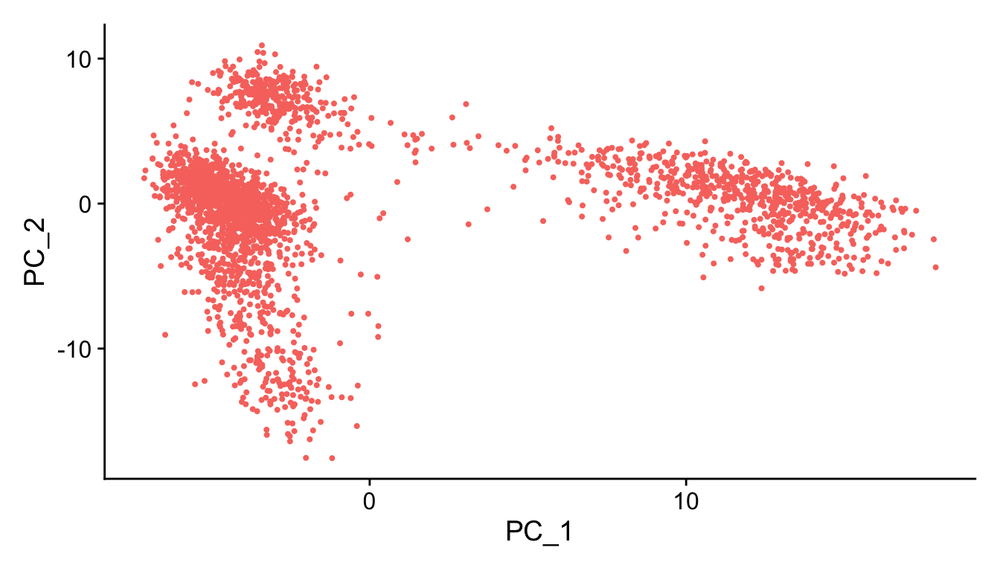
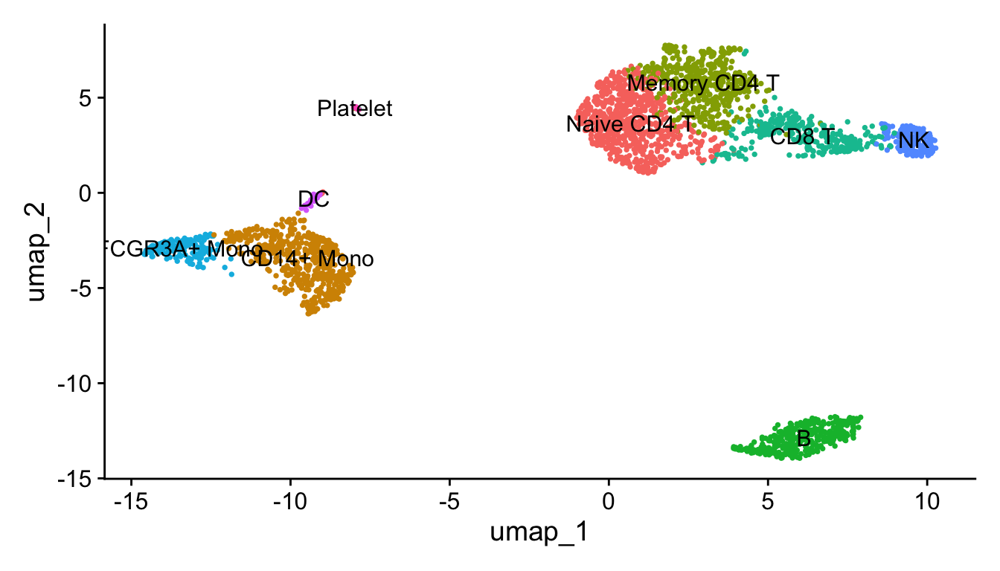

# (PART) 单样本分析 {-}


# Seurat 教程

## 数据和R包准备

代码：https://satijalab.org/seurat/articles/pbmc3k_tutorial

数据：https://cf.10xgenomics.com/samples/cell/pbmc3k/pbmc3k_filtered_gene_bc_matrices.tar.gz


``` r
rm(list = ls())
library(dplyr)
library(Seurat)
library(patchwork)
```

## 读取数据

10X的输入数据是固定的三个文件，在工作目录下新建01_data/，把三个文件放进去。


``` r
pbmc.data <- Read10X(data.dir = "01_data/")
dim(pbmc.data)
## [1] 32738  2700
pbmc.data[c("CD3D", "TCL1A", "MS4A1"), 1:30]
## 3 x 30 sparse Matrix of class "dgCMatrix"
##                                                                    
## CD3D  4 . 10 . . 1 2 3 1 . . 2 7 1 . . 1 3 . 2  3 . . . . . 3 4 1 5
## TCL1A . .  . . . . . . 1 . . . . . . . . . . .  . 1 . . . . . . . .
## MS4A1 . 6  . . . . . . 1 1 1 . . . . . . . . . 36 1 2 . . 2 . . . .
range(pbmc.data)
## [1]   0 419

pbmc <- CreateSeuratObject(counts = pbmc.data, 
                           project = "pbmc3k", 
                           min.cells = 3, 
                           min.features = 200)
pbmc
## An object of class Seurat 
## 13714 features across 2700 samples within 1 assay 
## Active assay: RNA (13714 features, 0 variable features)
##  1 layer present: counts
```

一个基因至少要在3个细胞里面有表达，才被保留；
一个细胞里面至少要表达两百个基因，才被保留。


## 质控

这里是对细胞进行的质控，指标是：

线粒体基因含量不能过高；

nFeature_RNA 不能过高或过低

> 为什么？ nFeature_RNA是每个细胞中检测到的基因数量。nCount_RNA是细胞内检测到的分子总数。nFeature_RNA过低，表示该细胞可能已死/将死或是空液滴。太高的nCount_RNA和/或nFeature_RNA表明“细胞”实际上可以是两个或多个细胞。结合线粒体基因count数除去异常值，即可除去大多数双峰/死细胞/空液滴，因此它们过滤是常见的预处理步骤。 参考自：https://www.biostars.org/p/407036/

### 查看三个指标


``` r
head(pbmc@meta.data)
##                  orig.ident nCount_RNA nFeature_RNA
## AAACATACAACCAC-1     pbmc3k       2419          779
## AAACATTGAGCTAC-1     pbmc3k       4903         1352
## AAACATTGATCAGC-1     pbmc3k       3147         1129
## AAACCGTGCTTCCG-1     pbmc3k       2639          960
## AAACCGTGTATGCG-1     pbmc3k        980          521
## AAACGCACTGGTAC-1     pbmc3k       2163          781
pbmc[["percent.mt"]] <- PercentageFeatureSet(pbmc, pattern = "^MT-")
head(pbmc@meta.data)
##                  orig.ident nCount_RNA nFeature_RNA percent.mt
## AAACATACAACCAC-1     pbmc3k       2419          779  3.0177759
## AAACATTGAGCTAC-1     pbmc3k       4903         1352  3.7935958
## AAACATTGATCAGC-1     pbmc3k       3147         1129  0.8897363
## AAACCGTGCTTCCG-1     pbmc3k       2639          960  1.7430845
## AAACCGTGTATGCG-1     pbmc3k        980          521  1.2244898
## AAACGCACTGGTAC-1     pbmc3k       2163          781  1.6643551

VlnPlot(pbmc, 
        features = c("nFeature_RNA",
                     "nCount_RNA", 
                     "percent.mt"), 
        ncol = 3,pt.size = 0.5)
```


根据这个三个图，确定了这个数据的过滤标准：

nFeature_RNA在200~2500之间；线粒体基因占比在5%以下。

### 三个指标之间的相关性


``` r
plot1 <- FeatureScatter(pbmc, 
                        feature1 = "nCount_RNA", 
                        feature2 = "percent.mt")
plot2 <- FeatureScatter(pbmc, 
                        feature1 = "nCount_RNA", 
                        feature2 = "nFeature_RNA")

plot1 + plot2
```


### 过滤


``` r
dim(pbmc)
## [1] 13714  2700
pbmc <- subset(pbmc, 
               subset = nFeature_RNA > 200 & 
                        nFeature_RNA < 2500 & 
                        percent.mt < 5)
dim(pbmc)
## [1] 13714  2638
```

## 找高变基因 (HVG)


``` r
pbmc <- NormalizeData(pbmc)
pbmc <- FindVariableFeatures(pbmc)
top10 <- head(VariableFeatures(pbmc), 10);top10
##  [1] "PPBP"   "LYZ"    "S100A9" "IGLL5"  "GNLY"   "FTL"    "PF4"    "FTH1"  
##  [9] "GNG11"  "S100A8"
```

这里选了2000个，把前十个在图上标记出来。


``` r
plot1 <- VariableFeaturePlot(pbmc)
plot2 <- LabelPoints(plot = plot1, 
                     points = top10, 
                     repel = TRUE)
plot2
```


## 标准化和降维

### 线性降维PCA 


``` r
pbmc <- ScaleData(pbmc, features = rownames(pbmc))
pbmc <- RunPCA(pbmc, features = VariableFeatures(pbmc))

VizDimLoadings(pbmc, dims = 1:2, reduction = "pca")
```


``` r
#每个主成分对应基因的热图
DimHeatmap(pbmc, dims = 1:15, cells = 500)
```


``` r
# 应该选多少个主成分进行后续分析
ElbowPlot(pbmc)
```


``` r
# 限速步骤
f = "jc.Rdata"
if(!file.exists(f)){
  pbmc <- JackStraw(pbmc, num.replicate = 100)
  pbmc <- ScoreJackStraw(pbmc, dims = 1:20)
  save(pbmc,file = f)
}
load(f)
JackStrawPlot(pbmc, dims = 1:20)
```


``` r
#PC1和2
PCAPlot(pbmc) + NoLegend()
```



``` r
DimPlot(pbmc, reduction = "pca")+ NoLegend()
```


``` r
# 结合JackStrawPlot和ElbowPlot，挑选10个PC，所以这里dims定义为1:10
pbmc <- FindNeighbors(pbmc, dims = 1:10)
pbmc <- FindClusters(pbmc, resolution = 0.5) #分辨率
## Modularity Optimizer version 1.3.0 by Ludo Waltman and Nees Jan van Eck
## 
## Number of nodes: 2638
## Number of edges: 95927
## 
## Running Louvain algorithm...
## Maximum modularity in 10 random starts: 0.8728
## Number of communities: 9
## Elapsed time: 0 seconds
# 结果聚成几类，用Idents查看
length(levels(Idents(pbmc)))
## [1] 9
```

### UMAP 和 t-sne

PCA是线性降维，这两个是非线性降维。

``` r
pbmc <- RunUMAP(pbmc, dims = 1:10)
DimPlot(pbmc, reduction = "umap")
```


## 找 marker 基因

啥叫marker基因呢。和差异基因里面的上调基因有点类似，某个基因在某一簇细胞里表达量都很高，在其他簇表达量很低，那么这个基因就是这簇细胞的象征。

找全部cluster的maker基因


``` r
pbmc.markers <- FindAllMarkers(pbmc, 
                               only.pos = TRUE,
                               min.pct = 0.25)
pbmc.markers %>% group_by(cluster) %>% top_n(n = 2, wt = avg_log2FC)
## # A tibble: 18 × 7
## # Groups:   cluster [9]
##        p_val avg_log2FC pct.1 pct.2 p_val_adj cluster gene         
##        <dbl>      <dbl> <dbl> <dbl>     <dbl> <fct>   <chr>        
##  1 9.57e- 88       2.40 0.447 0.108 1.31e- 83 0       CCR7         
##  2 1.35e- 51       2.14 0.342 0.103 1.86e- 47 0       LEF1         
##  3 7.07e-139       7.28 0.299 0.004 9.70e-135 1       FOLR3        
##  4 3.38e-121       6.74 0.277 0.006 4.64e-117 1       S100A12      
##  5 2.97e- 58       2.09 0.42  0.111 4.07e- 54 2       AQP3         
##  6 5.03e- 34       1.87 0.263 0.07  6.90e- 30 2       CD40LG       
##  7 2.40e-272       7.38 0.564 0.009 3.29e-268 3       LINC00926    
##  8 2.75e-237       7.14 0.488 0.007 3.76e-233 3       VPREB3       
##  9 7.25e-165       4.41 0.577 0.055 9.95e-161 4       GZMK         
## 10 3.27e- 88       3.74 0.419 0.061 4.48e- 84 4       GZMH         
## 11 1.69e-212       5.43 0.506 0.01  2.32e-208 5       CDKN1C       
## 12 8.23e-168       5.88 0.37  0.005 1.13e-163 5       CKB          
## 13 8.10e-179       6.22 0.471 0.013 1.11e-174 6       AKR1C3       
## 14 5.38e-112       6.07 0.29  0.007 7.38e-108 6       SH2D1B       
## 15 1.48e-220       7.63 0.812 0.011 2.03e-216 7       FCER1A       
## 16 1.46e-207       8.03 0.5   0.002 2.00e-203 7       SERPINF1     
## 17 0              14.4  0.615 0     0         8       LY6G6F       
## 18 7.32e-222      13.9  0.385 0     1.00e-217 8       RP11-879F14.2
```

### 比较某个基因在几个cluster之间的表达量

小提琴图


``` r
VlnPlot(pbmc, features = c("PPBP", "S100A9"))
```


在umap图上标记


``` r
FeaturePlot(pbmc, features = c("MS4A1", "GNLY", "CD3E", "CD14", "FCER1A", "FCGR3A", "LYZ", "PPBP", "CD8A"))
```


``` r
top10 <- pbmc.markers %>% group_by(cluster) %>% top_n(n = 10, wt = avg_log2FC)
```

### marker基因的热图


``` r
library(ggplot2)
DoHeatmap(pbmc, features = top10$gene) + NoLegend()
```


``` r
DotPlot(pbmc,features = unique(top10$gene))+RotatedAxis()
```


``` r
RidgePlot(pbmc,features = "RPS12")
```


## 根据marker基因确定细胞


``` r
a = read.delim("../supp/markers.txt", header = F)
gt = split(a[,2],a[,1]) # unstack(a[,c(2,1)])

DotPlot(pbmc, features = gt,cols = "RdYlBu") +
  RotatedAxis()
```


``` r
new.cluster.ids <- c("Naive CD4 T", 
                     "CD14+ Mono", 
                     "Memory CD4 T",
                     "B", 
                     "CD8 T", 
                     "FCGR3A+ Mono", 
                     "NK", 
                     "DC", 
                     "Platelet")

names(new.cluster.ids) <- levels(pbmc)
seu.obj <- RenameIdents(pbmc, new.cluster.ids)
p1 <- DimPlot(seu.obj, 
        reduction = "umap", 
        label = TRUE, 
        pt.size = 0.5) + NoLegend()
p1
```



