# 单样本分析

## 创建Seurat对象

``` r
#https://www.ncbi.nlm.nih.gov/pmc/articles/PMC10039079/
#untar("GSE218208_RAW.tar")
rm(list = ls())
a = data.table::fread("GSM6736629_10x-PBMC-1_ds0.1974_CountMatrix.tsv.gz",data.table = F)
a[1:4,1:4]
##                 alias:gene AAACCCAAGTAGGGTC AAACCCACACCATTCC AAACCCATCTACACTT
## 1   TSPAN6:ENSG00000000003                0                0                0
## 2     DPM1:ENSG00000000419                0                1                0
## 3    SCYL3:ENSG00000000457                0                0                0
## 4 C1orf112:ENSG00000000460                0                0                0
library(tidyverse)
a$`alias:gene` = str_split(a$`alias:gene`,":",simplify = T)[,1]
#str_split_i(a$`alias:gene`,":",i = 1)
a = distinct(a,`alias:gene`,.keep_all = T)
a = column_to_rownames(a,var = "alias:gene")
a[1:4,1:4]
##          AAACCCAAGTAGGGTC AAACCCACACCATTCC AAACCCATCTACACTT AAACGAAAGCACGTCC
## TSPAN6                  0                0                0                0
## DPM1                    0                1                0                0
## SCYL3                   0                0                0                0
## C1orf112                0                0                0                0
library(Seurat)
pbmc <- CreateSeuratObject(counts = a, 
                           project = "a", 
                           min.cells = 3, 
                           min.features = 200)
```

#### 2.质控


``` r
pbmc[["percent.mt"]] <- PercentageFeatureSet(pbmc, pattern = "^MT-")
head(pbmc@meta.data, 3)
##                  orig.ident nCount_RNA nFeature_RNA percent.mt
## AAACCCAAGTAGGGTC          a      10768         3213   7.030089
## AAACCCACACCATTCC          a       4102         1676   5.046319
## AAACCCATCTACACTT          a       4694         1740   6.305922
VlnPlot(pbmc, 
        features = c("nFeature_RNA",
                     "nCount_RNA", 
                     "percent.mt"), 
        ncol = 3, pt.size = 0.5)
```

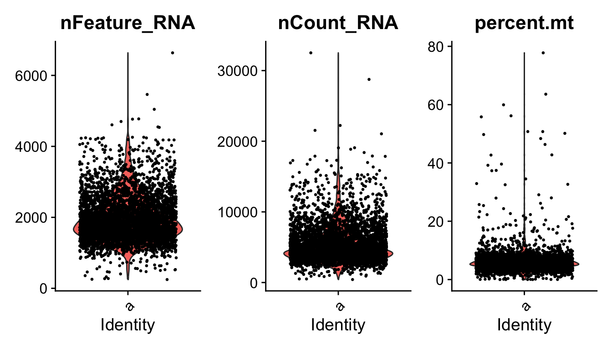

``` r
pbmc = subset(pbmc,nFeature_RNA < 4200 &
                nCount_RNA < 18000 &
                percent.mt < 18)
```

## 降维聚类分群


``` r
f = "obj.Rdata"
if(!file.exists(f)){
  pbmc = pbmc %>% 
  NormalizeData() %>%  
  FindVariableFeatures() %>%  
  ScaleData(features = rownames(.)) %>%  
  RunPCA(features = VariableFeatures(.))  %>%
  FindNeighbors(dims = 1:15) %>% 
  FindClusters(resolution = 0.5) %>% 
  RunUMAP(dims = 1:15) %>% 
  RunTSNE(dims = 1:15)
  save(pbmc,file = f)
}
load(f)
ElbowPlot(pbmc)
```

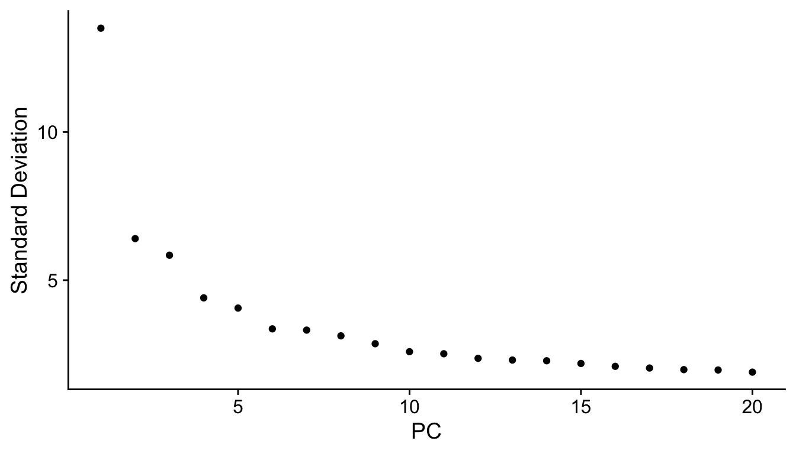

``` r
p1 <- DimPlot(pbmc, reduction = "umap",label = T)+NoLegend();p1
```

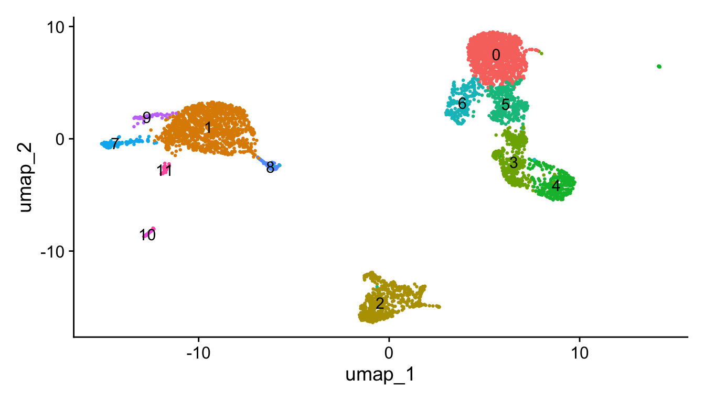

## maker 基因


``` r
library(dplyr)
f = "markers.Rdata"
if(!file.exists(f)){
  pbmc.markers <- FindAllMarkers(pbmc, only.pos = TRUE,min.pct = 0.25)
  save(pbmc.markers,file = f)
}
load(f)
mks = pbmc.markers %>% group_by(cluster) %>% top_n(n = 2, wt = avg_log2FC)
g = unique(mks$gene)
```

## maker 基因可视化


``` r
DoHeatmap(pbmc, features = g) + NoLegend()+
  scale_fill_gradientn(colors = c("#2fa1dd", "white", "#f87669"))
```

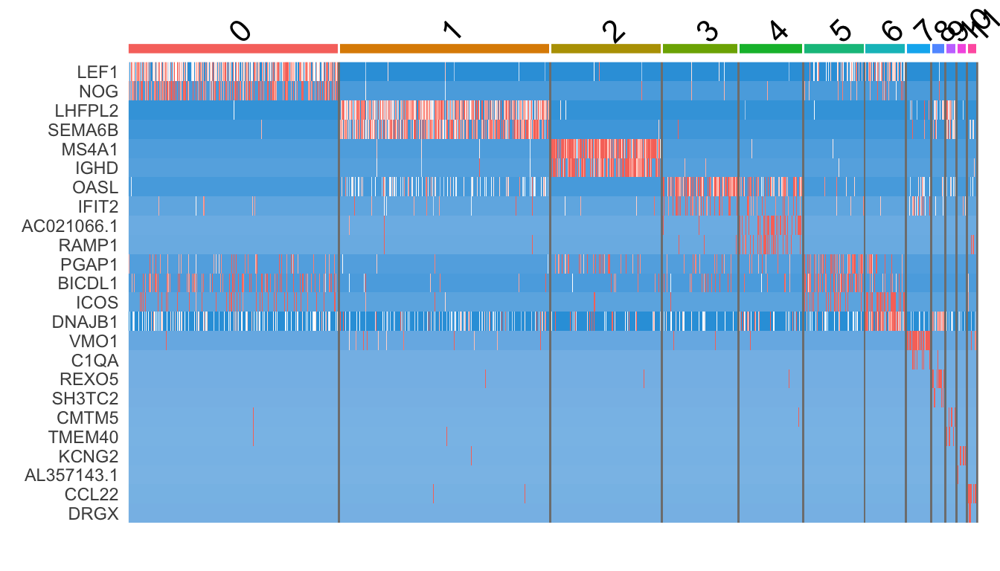

``` r

DotPlot(pbmc, features = g,cols = "RdYlBu") +
  RotatedAxis()
```

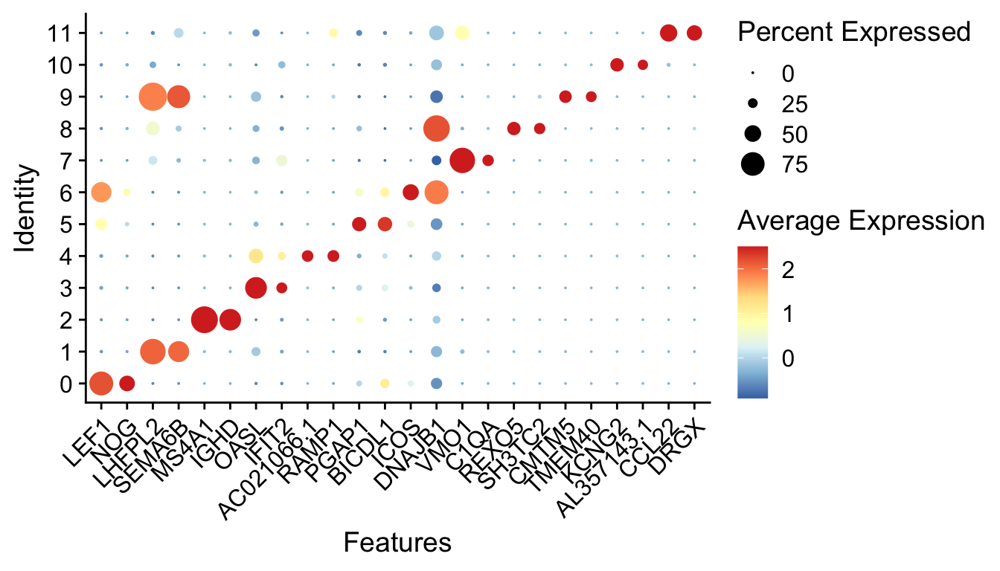

``` r

VlnPlot(pbmc, features = g[1:3])
```

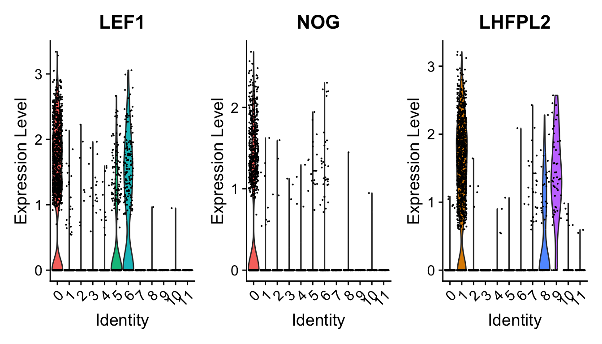

``` r

FeaturePlot(pbmc, features = g[1:4])
```

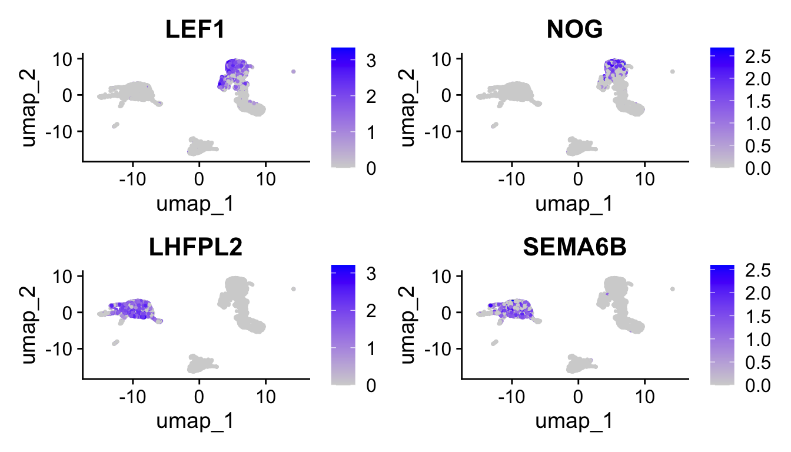

## 注释亚群

手动注释


``` r
a = read.delim("../supp/markers.txt",header = F)
gt = split(a[,2],a[,1])

DotPlot(pbmc, features = gt,cols = "RdYlBu") +
  RotatedAxis()
```

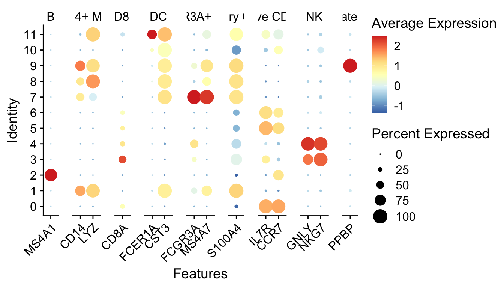


``` r
writeLines(paste0(0:11,","))
## 0,
## 1,
## 2,
## 3,
## 4,
## 5,
## 6,
## 7,
## 8,
## 9,
## 10,
## 11,
celltype = read.table("anno.txt",sep = ",") #自己照着DotPlot图填的
celltype
##    V1           V2
## 1   0  Naive CD4 T
## 2   1   CD14+ Mono
## 3   2            B
## 4   3        CD8 T
## 5   4           NK
## 6   5  Naive CD4 T
## 7   6  Naive CD4 T
## 8   7 FCGR3A+ Mono
## 9   8   CD14+ Mono
## 10  9     Platelet
## 11 10           DC
## 12 11           DC
new.cluster.ids <- celltype$V2
names(new.cluster.ids) <- levels(pbmc)
seu.obj <- RenameIdents(pbmc, new.cluster.ids)
save(seu.obj,file = "seu.obj.Rdata")
p2 <- DimPlot(seu.obj, 
        reduction = "umap", 
        label = TRUE, 
        pt.size = 0.5) + NoLegend()
p2
```

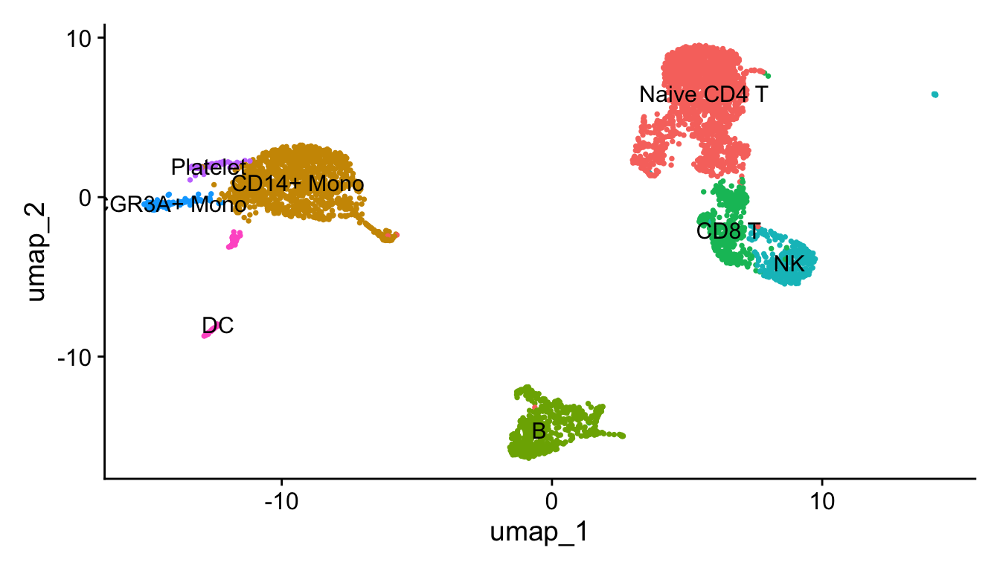


自动注释


``` r
library(celldex)
library(SingleR)
ls("package:celldex")
##  [1] "BlueprintEncodeData"              "DatabaseImmuneCellExpressionData"
##  [3] "defineTextQuery"                  "fetchLatestVersion"              
##  [5] "fetchMetadata"                    "fetchReference"                  
##  [7] "HumanPrimaryCellAtlasData"        "ImmGenData"                      
##  [9] "listReferences"                   "listVersions"                    
## [11] "MonacoImmuneData"                 "MouseRNAseqData"                 
## [13] "NovershternHematopoieticData"     "saveReference"                   
## [15] "searchReferences"                 "surveyReferences"
f = "../supp/single_ref/ref_BlueprintEncode.RData"
if(!file.exists(f)){
  ref <- celldex::BlueprintEncodeData()
  save(ref,file = f)
}
ref <- get(load(f))
library(BiocParallel)
scRNA = pbmc
test = scRNA@assays$RNA$data
pred.scRNA <- SingleR(test = test, 
                      ref = ref,
                      labels = ref$label.main, 
                      clusters = scRNA@active.ident)
pred.scRNA$pruned.labels
##  [1] "CD4+ T-cells" "Monocytes"    "B-cells"      "CD8+ T-cells" "NK cells"    
##  [6] "CD4+ T-cells" "CD4+ T-cells" "Monocytes"    "Monocytes"    "Monocytes"   
## [11] "DC"           "Monocytes"
#查看注释准确性 
plotScoreHeatmap(pred.scRNA, clusters=pred.scRNA@rownames, fontsize.row = 9,show_colnames = T)
```

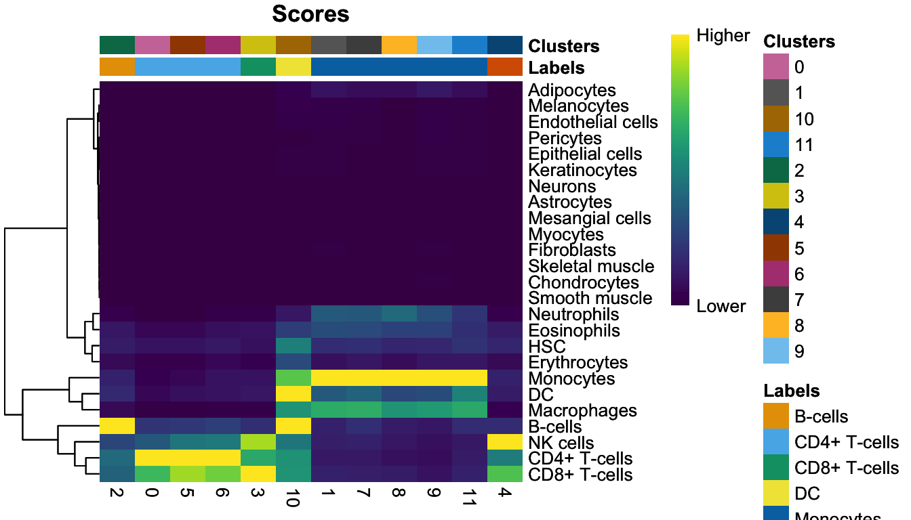

``` r
new.cluster.ids <- pred.scRNA$pruned.labels
names(new.cluster.ids) <- levels(scRNA)
levels(scRNA)
##  [1] "0"  "1"  "2"  "3"  "4"  "5"  "6"  "7"  "8"  "9"  "10" "11"
scRNA <- RenameIdents(scRNA,new.cluster.ids)
levels(scRNA)
## [1] "CD4+ T-cells" "Monocytes"    "B-cells"      "CD8+ T-cells" "NK cells"    
## [6] "DC"
p3 <- DimPlot(scRNA, reduction = "umap",label = T,pt.size = 0.5) + NoLegend()
p2+p3
```

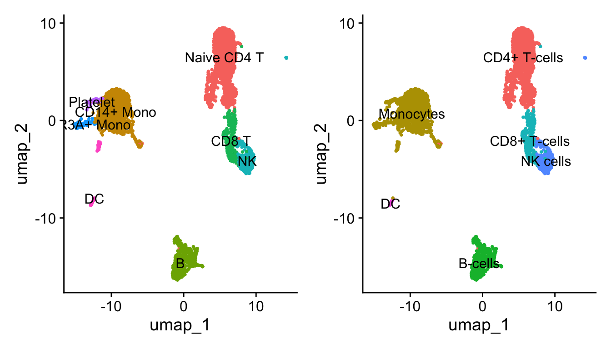


