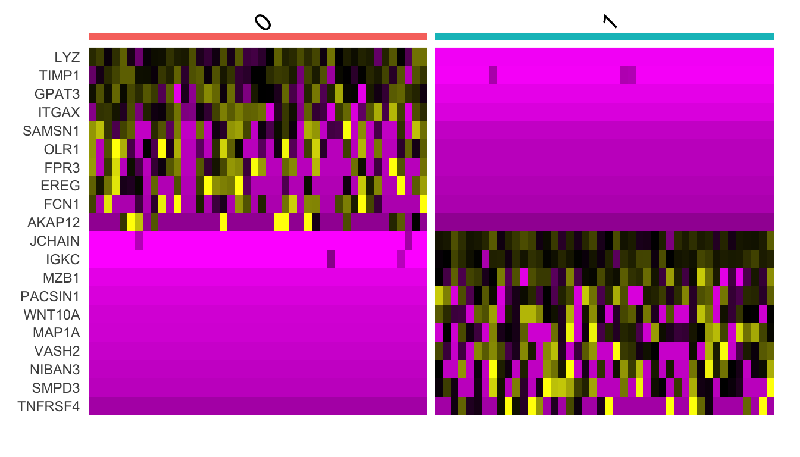

# 单细胞二次分群
**背景知识**

Seurat里的FindClusters函数设置的resolution数值越大，分群的数量就越多，但是当单细胞数量太多的时候，会遇到resolution再变大，分群的数量也不再增加的情况。一次分群分不开时就会需要二次分群。

## 示例数据

这里的示例数据seu.obj.Rdata是GSE218208降维聚类分群的结果，因为文件太大，没有直接放进文件夹里，如果load报错就自己运行一下隔壁GSE218208的代码得到这个文件再跑。


``` r
rm(list = ls())
library(Seurat)
library(dplyr)
load("../2.GSE218208/seu.obj.Rdata")
p1 = DimPlot(seu.obj, reduction = "umap",label=T)+NoLegend()
p1
```


## 二次分群

这里以树突细胞(DC)为例进行二次分群，想要切换别的细胞类型直接修改下面的my_sub即可。

核心就是提取感兴趣的亚群的细胞，后面就是标准流程和可视化了，没有区别


``` r
my_sub = "DC" #⭐
sub.cells <- subset(seu.obj, idents = my_sub)
f = "obj.Rdata"
if(!file.exists(f)){
  sub.cells = sub.cells %>%
  NormalizeData() %>%
  FindVariableFeatures() %>%
  ScaleData(features = rownames(.)) %>%
  RunPCA(features = VariableFeatures(.))  %>%
  FindNeighbors(dims = 1:15) %>%
  FindClusters(resolution = 0.5) %>%
  RunUMAP(dims = 1:15) 
  save(sub.cells,file = f)
}
## Modularity Optimizer version 1.3.0 by Ludo Waltman and Nees Jan van Eck
## 
## Number of nodes: 88
## Number of edges: 1998
## 
## Running Louvain algorithm...
## Maximum modularity in 10 random starts: 0.7358
## Number of communities: 2
## Elapsed time: 0 seconds
load(f)
DimPlot(sub.cells, reduction = 'umap',label = T)+NoLegend()
```


## marker基因及其可视化


``` r
sub.cells.markers <- FindAllMarkers(sub.cells, only.pos = TRUE,  
                            min.pct = 0.25, logfc.threshold = 0.25)

top10 <- sub.cells.markers %>% 
  group_by(cluster) %>% 
  top_n(n = 10, wt = avg_log2FC) %>% 
  pull(gene);top10
##  [1] "LYZ"     "TIMP1"   "GPAT3"   "ITGAX"   "SAMSN1"  "OLR1"    "FPR3"   
##  [8] "EREG"    "FCN1"    "AKAP12"  "JCHAIN"  "IGKC"    "MZB1"    "PACSIN1"
## [15] "WNT10A"  "MAP1A"   "VASH2"   "NIBAN3"  "SMPD3"   "TNFRSF4"
```


``` r
VlnPlot(sub.cells, features = top10)
```


``` r
RidgePlot(sub.cells, features = top10)
```


``` r
FeaturePlot(sub.cells, features = top10)
```


``` r
DotPlot(sub.cells,features = top10)+ RotatedAxis()
```


``` r
DoHeatmap(sub.cells, features = top10) + NoLegend()
```



## 放回原来的Seurat对象里面

上面的umap图是感兴趣的单独的展示，也可以把它放回原来的seurat对象里。


``` r
sub.cells@meta.data$celltype = paste0("M",sub.cells$seurat_clusters)

seu.obj$celltype = as.character(Idents(seu.obj))
seu.obj$celltype = ifelse(seu.obj$celltype==my_sub,
       sub.cells$celltype[match(colnames(seu.obj),colnames(sub.cells))],
       seu.obj$celltype) 
Idents(seu.obj) = seu.obj$celltype
p2 = DimPlot(seu.obj,label = T)+NoLegend()
p1+p2
```


