# 细胞通讯分析

**背景知识**

细胞通讯是单细胞数据高级分析中比较常见的一个，我们习惯使用的R包是CellChat。

这个是CellChat的一手教程：

https://htmlpreview.github.io/?https://github.com/jinworks/CellChat/blob/master/tutorial/CellChat-vignette.html

让AI来告诉我们做细胞通讯分析的用途：

> 细胞通讯分析是生物学研究中的一个重要领域，它涉及研究细胞之间如何通过信号传递来协调它们的功能和行为。以下是一些细胞通讯分析的主要用途：
> 
> 1. **疾病诊断和治疗**：了解细胞如何交流可以帮助诊断和治疗疾病，特别是那些与细胞通讯失调有关的疾病，如癌症、自身免疫疾病和神经退行性疾病。
> 
> 2. **药物开发**：通过研究细胞间通讯的机制，可以发现新的药物靶点，从而开发出更有效的治疗药物。
> 
> 3. **发育生物学**：细胞通讯在胚胎发育和组织形成中起着关键作用。研究这些过程有助于我们理解正常和异常发育的机制。
> 
> 4. **组织工程**：在组织工程中，细胞通讯对于细胞的增殖、分化和组织结构的形成至关重要。
> 
> 5. **细胞信号传导研究**：细胞通讯分析有助于揭示细胞内信号传导的复杂网络，这对于理解细胞如何响应外界刺激非常重要。
> 
> 6. **生物防御机制**：研究细胞如何通过通讯来协调免疫反应，可以帮助我们更好地理解生物体如何抵御病原体。
> 
> 7. **神经科学**：在神经科学领域，细胞通讯分析有助于我们理解大脑如何通过神经细胞间的信号传递来处理信息。
> 
> 8. **生物信息学和系统生物学**：通过分析细胞通讯网络，可以构建生物系统的数学模型，帮助我们从系统层面理解生物过程。
> 
> 9. **环境生物学**：研究细胞如何响应环境变化，例如温度、光照和化学物质，可以揭示生物如何适应环境。
> 
> 10. **农业和植物科学**：在植物科学中，了解植物细胞如何通过通讯来协调生长、发育和对环境的响应，对于提高作物产量和抗逆性至关重要。
> 
> 细胞通讯分析是一个多学科交叉的领域，它结合了分子生物学、细胞生物学、生物化学、生物信息学和其他学科的知识和技术。通过这种分析，科学家可以更深入地理解生命过程，并开发出新的生物技术和治疗方法。

## R包和数据

使用的数据sce.all.Rdata是Seurat降维聚类分群注释的结果，有两个样本。和多样本拟时序用的是同一个数据。


``` r
rm(list = ls())
if(!require(NMF))install.packages("NMF",update = F,ask = F)
if(!require(presto))devtools::install_local('presto-master.zip',upgrade = F,dependencies = T)
if(!require(CellChat))devtools::install_local("CellChat-main/",upgrade = F,dependencies = T)
if(!require(ggalluvial))install.packages("ggalluvial",update = F,ask = F)
library(CellChat)
library(ggplot2)
library(Seurat)
library(ggalluvial)
load("../5.monocle_mulitisample/sce.all.Rdata")
table(Idents(sce.all))
## 
##    CD14 Mono          pDC CD4 Memory T  T activated  CD4 Naive T        CD8 T 
##          100          100          100          100          100          100 
##           Mk  B Activated            B           DC    CD16 Mono           NK 
##          100          100          100          100          100          100
scRNA = sce.all
```

因为细胞通讯更更更费计算资源，我们还是抽样，实战中不能抽样的。

``` r
set.seed(112)
scRNA = subset(scRNA,downsample = 100)
table(Idents(scRNA))
## 
##    CD14 Mono          pDC CD4 Memory T  T activated  CD4 Naive T        CD8 T 
##          100          100          100          100          100          100 
##           Mk  B Activated            B           DC    CD16 Mono           NK 
##          100          100          100          100          100          100
```


## 了解参考数据

CellChatDB.human,CellChatDB.mouse分别是人和小鼠的配受体数据库


``` r
str(CellChatDB.human,max.level = 1)
## List of 4
##  $ interaction:'data.frame':	1939 obs. of  11 variables:
##  $ complex    :'data.frame':	157 obs. of  4 variables:
##  $ cofactor   :'data.frame':	31 obs. of  16 variables:
##  $ geneInfo   :'data.frame':	41787 obs. of  6 variables:
table(CellChatDB.human$interaction$annotation)
## 
##  Cell-Cell Contact       ECM-Receptor Secreted Signaling 
##                319                421               1199
```

PPI.human和PPI.mouse是稀疏矩阵，是STRING数据库里高等级证据的相互作用关系组成的0-1矩阵。


``` r
class(PPI.human)
## [1] "dgCMatrix"
## attr(,"package")
## [1] "Matrix"
dim(PPI.human)
## [1] 4815 4815
table(as.numeric(PPI.human))
## 
##        0        1 
## 23156523    27702
```

## 构建cellchat对象

seurat对象可以直接转换。在@DB加上要使用的配体受体数据库，注意物种


``` r
cellchat <- createCellChat(sce.all,
                           group.by = "ident",
                           assay = "RNA")
## [1] "Create a CellChat object from a Seurat object"
## The `meta.data` slot in the Seurat object is used as cell meta information 
## Set cell identities for the new CellChat object 
## The cell groups used for CellChat analysis are  CD14 Mono pDC CD4 Memory T T activated CD4 Naive T CD8 T Mk B Activated B DC CD16 Mono NK
cellchat@DB <- subsetDB(CellChatDB.human, 
                        search = "Secreted Signaling")
#search可以选择的值是： table(CellChatDB.human$interaction$annotation)
# 提取数据库支持的基因的表达矩阵子集
cellchat <- subsetData(cellchat) 
dim(cellchat@data.signaling) 
## [1]  337 1200
```

## 细胞通讯网络分析


``` r
# 识别过表达基因
cellchat <- identifyOverExpressedGenes(cellchat)
# 识别配体-受体对
cellchat <- identifyOverExpressedInteractions(cellchat)
# 将配体、受体投射到PPI网络
cellchat <- projectData(cellchat, PPI.human)#慢
## 推测细胞通讯网络
cellchat <- computeCommunProb(cellchat) #慢
## triMean is used for calculating the average gene expression per cell group. 
## [1] ">>> Run CellChat on sc/snRNA-seq data <<< [2025-04-07 20:21:48.305586]"
## [1] ">>> CellChat inference is done. Parameter values are stored in `object@options$parameter` <<< [2025-04-07 20:22:10.138138]"
cellchat <- computeCommunProbPathway(cellchat)
cellchat <- aggregateNet(cellchat)
```

## 画图展示

分析出来的重要信号通路如下


``` r
cellchat@netP$pathways
## [1] "GALECTIN" "CCL"      "ANNEXIN"  "CXCL"     "IL1"
```

每个通路都可以画多种图出来，图中线的颜色与发射信号的细胞一致，线的粗细代表的是信号强弱，线越粗信号越强。点的大小一般是按照每种细胞的数量来分配。

pathways.show是要画的信号通路，可以换成cellchat@netP$pathways显示的其他通路


``` r
pathways.show <- "GALECTIN"
```

##### hierarchy plot    


``` r
groupSize <- as.numeric(table(cellchat@idents)) 
vertex.receiver = seq(1,nlevels(scRNA)/2);vertex.receiver
## [1] 1 2 3 4 5 6
netVisual_aggregate(cellchat, signaling = pathways.show, layout = "hierarchy", vertex.receiver = vertex.receiver, vertex.weight  = groupSize)  
```

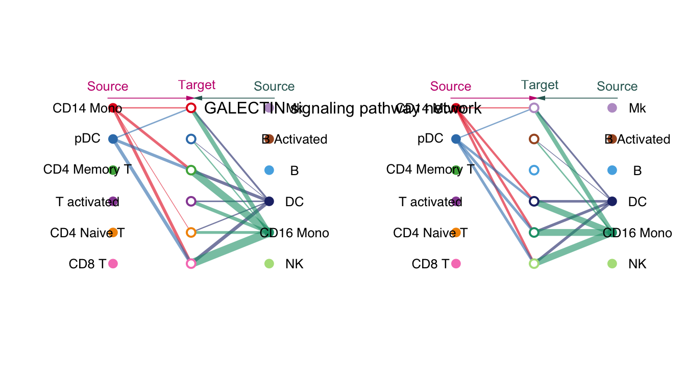

这个图分了两张子图，其实是分两次说明了所有细胞类型之间的互作。两张子图的差别是中间的圆圈，第一张子图中，第二列的圆圈意义同第一列，第二张子图中，第二列的圆圈意义同第三列，从"Target"这个单词的颜色和哪个"source"一致可以看出。

互作方向也有了，是从两边的source到中间的target。

### circle plot

circle plot 只是换了一个布局，一张图展示出来。


``` r
par(mfrow = c(1,1), xpd=TRUE,mar = c(2, 2, 2, 2))
netVisual_aggregate(cellchat, signaling = pathways.show, 
                    layout = "circle", 
                    vertex.receiver = vertex.receiver,
                    vertex.weight  = groupSize)
```

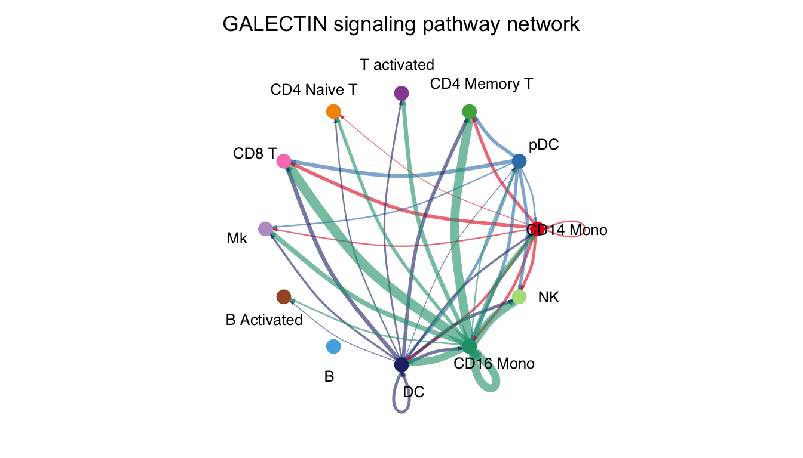


### chord plot

弦图还是很有细节的，内圈小短线代表发射出的信号被谁接收，和接受者颜色一致，发射端是平的且有小短线，接收端是尖的。


``` r
netVisual_aggregate(cellchat, signaling = pathways.show, layout = "chord", vertex.receiver = vertex.receiver, vertex.weight  = groupSize)
```

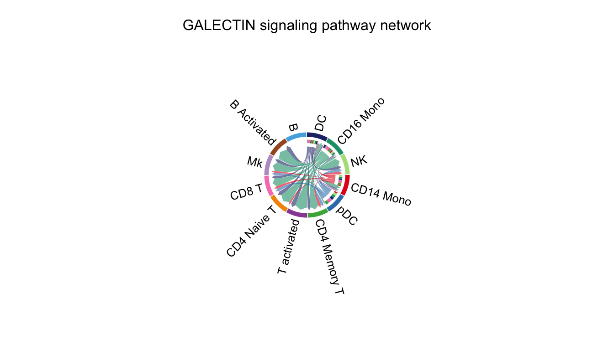

### heatmap

热图，纵坐标是发射端，横坐标是接收端，有颜色代表横纵坐标所指的两类细胞之间有通讯，颜色深浅代表通讯概率。右侧和上方的条形图是该行/列通讯概率之和


``` r
netVisual_heatmap(cellchat, signaling = pathways.show, color.heatmap = "Reds")
```

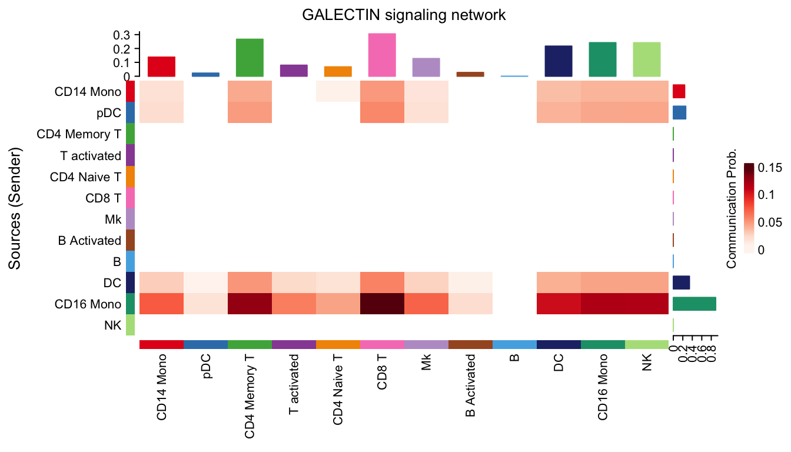

计算配体-受体对信号网络的贡献度


``` r
netAnalysis_contribution(cellchat, signaling = pathways.show)
```

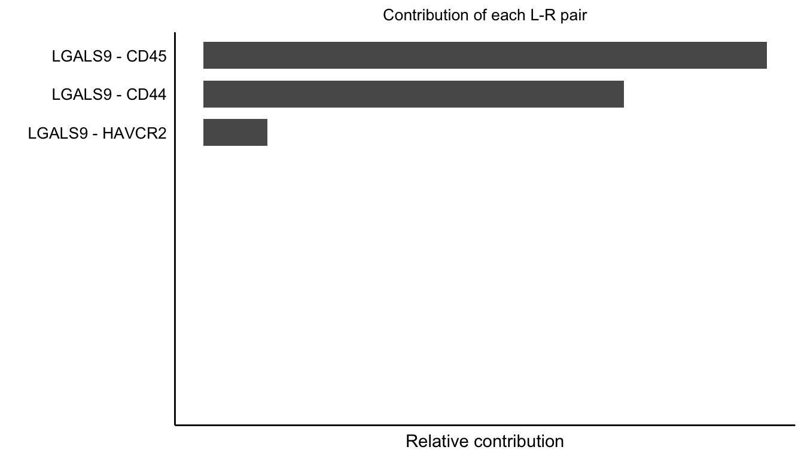

### 热图-展示每一类细胞是什么角色

分析细胞在信号网络中角色：发送者、接收者、调解者和影响者。


``` r
cellchat <- netAnalysis_computeCentrality(cellchat, slot.name = "netP") # the slot 'netP' means the inferred intercellular communication network of signaling pathways
netAnalysis_signalingRole_network(cellchat, signaling = pathways.show, width = 12, height = 5, font.size = 10)
```

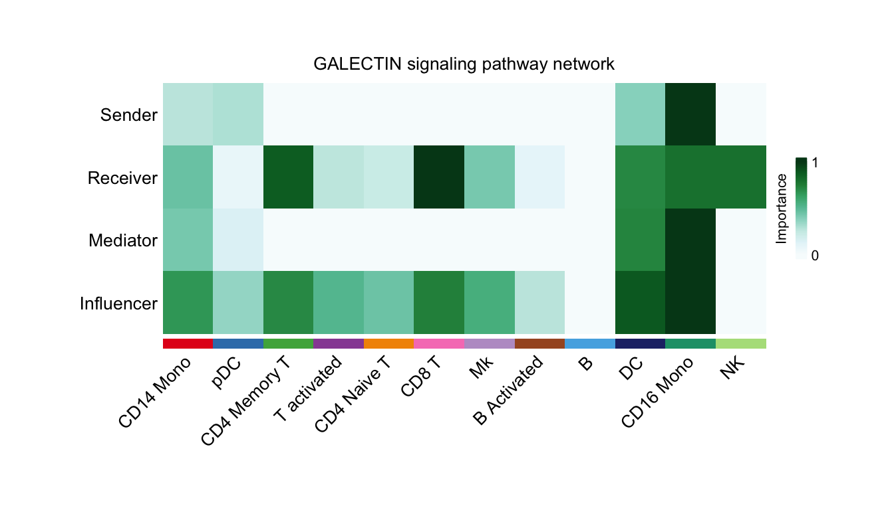

### 气泡图-显示所有的显著的配体-受体对

只有p<0.05的才会被画出来，颜色仍然是通讯概率，圈的大小是按照p值，p值越小圈越大。


``` r
#可以分开，也可以合到一起
netVisual_bubble(cellchat, sources.use = 1, 
                 targets.use = 1:nlevels(scRNA), 
                 remove.isolate = FALSE) 
```

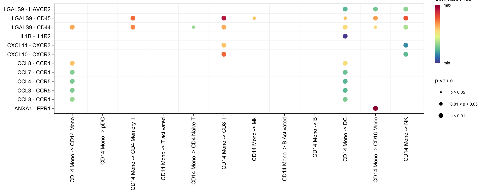


``` r
#从第一类细胞到全部细胞
netVisual_bubble(cellchat, sources.use = 1:nlevels(scRNA), 
                 targets.use = 1:nlevels(scRNA), 
                 remove.isolate = FALSE)#从全部细胞到全部细胞
```

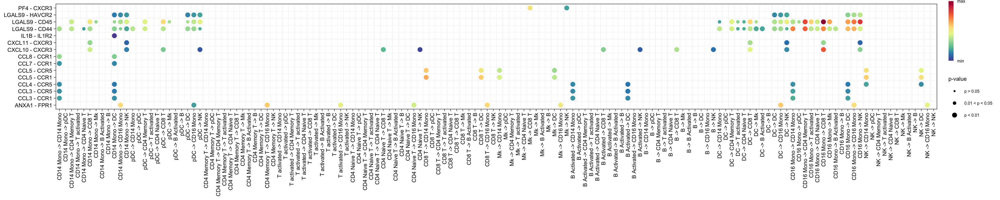

## 细胞通讯模式和信号网络

传出模式，揭示了发射端细胞如何相互协调，以及它们如何与某些信号通路协调以驱动通信。

传入模式，显示接收端细胞如何相互协调，以及它们如何与某些信号通路协调以响应输入信号。

### 选择合适的partten（细胞通讯模式）的数量


``` r
library(NMF)
selectK(cellchat, pattern = "outgoing")
```

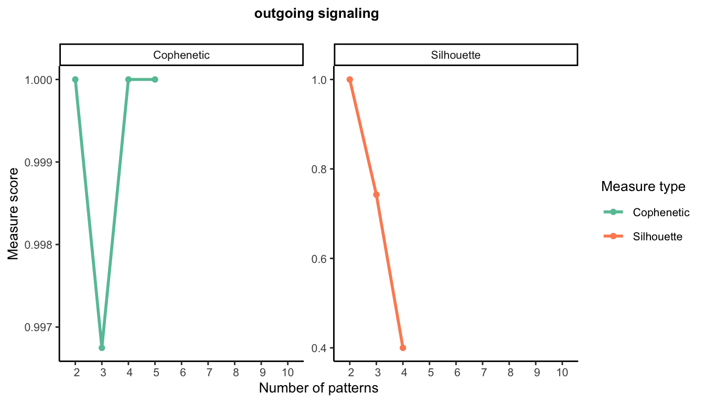

``` r
selectK(cellchat, pattern = "incoming")
```

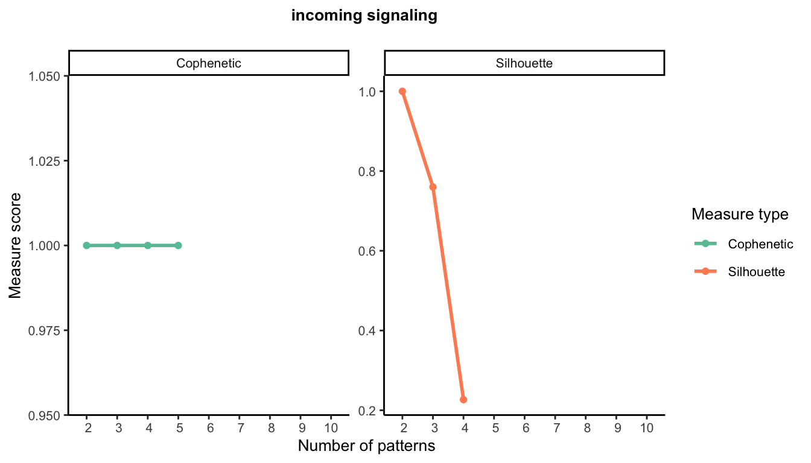

在帮助文档里面有解释：For a range of the number of patterns, a suitable number of patterns is the one at which Cophenetic and Silhouette values begin to drop suddenly。

这两个指标都是评估聚类稳定性的，二者都突然下降的值对应的横坐标就是合适的聚类数

这里是用parttern-细胞，parttern-通路矩阵画的热图。identifyCommunicationPatterns函数识别通讯模式，并画出热图


``` r
#传出
cellchat <- identifyCommunicationPatterns(cellchat, pattern = "outgoing", k = 3)# k是parttern的数量，根据上图选择的，嫌麻烦也可以用默认值5
#传入
cellchat <- identifyCommunicationPatterns(cellchat, pattern = "incoming", k =  3)# k是parttern的数量，根据上图选择的，嫌麻烦也可以用默认值5
```

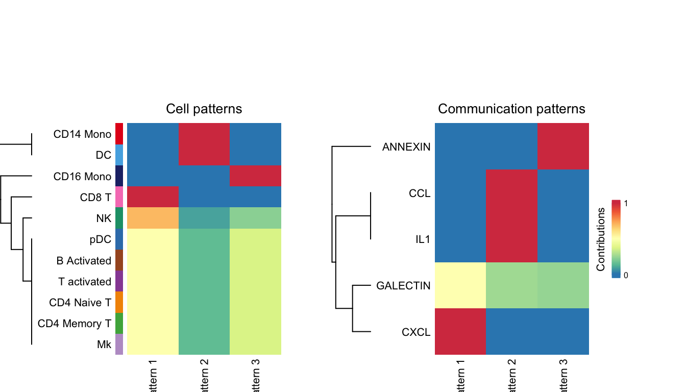

用桑基图和气泡图展示每种细胞传入/传出的信号都是属于哪些通路的


``` r
# 桑基图
netAnalysis_river(cellchat, pattern = "outgoing")
```

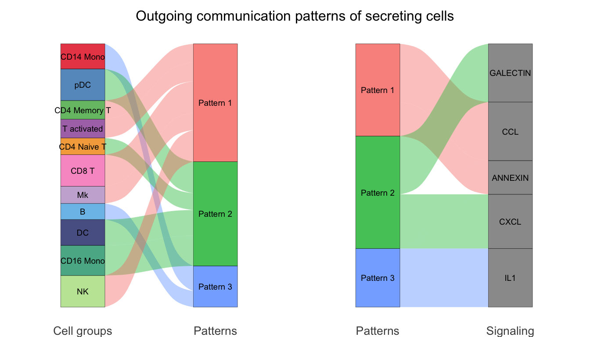

``` r
netAnalysis_river(cellchat, pattern = "incoming")
```

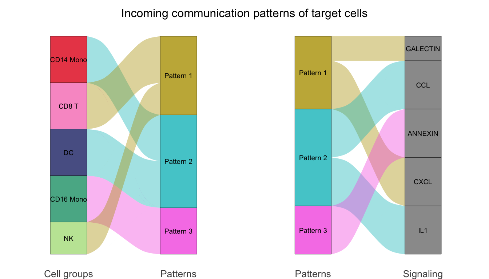

``` r
# 气泡图
netAnalysis_dot(cellchat, pattern = "outgoing",dot.size = 4)
```

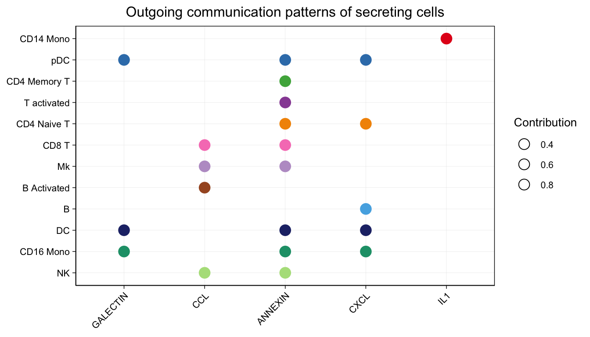

``` r
netAnalysis_dot(cellchat, pattern = "incoming",dot.size = 4)
```

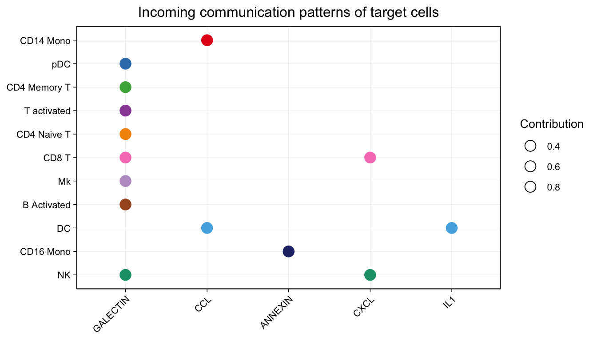

气泡图的颜色是按照细胞类型来分配，大小按照每个通路对每个细胞类型的贡献程度分配。

