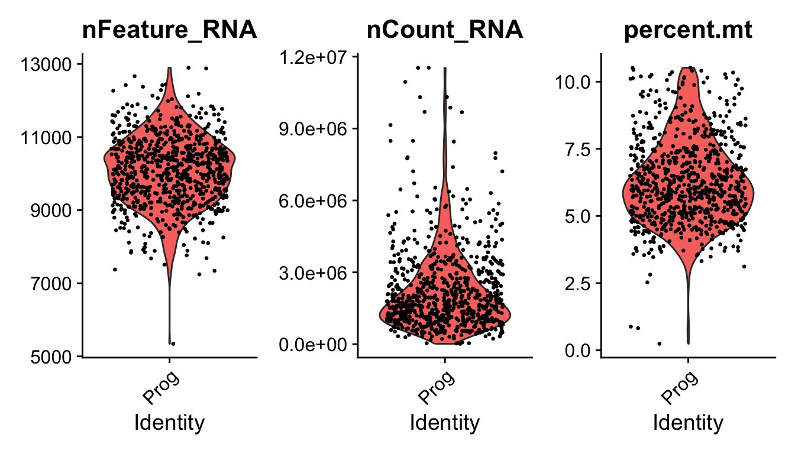
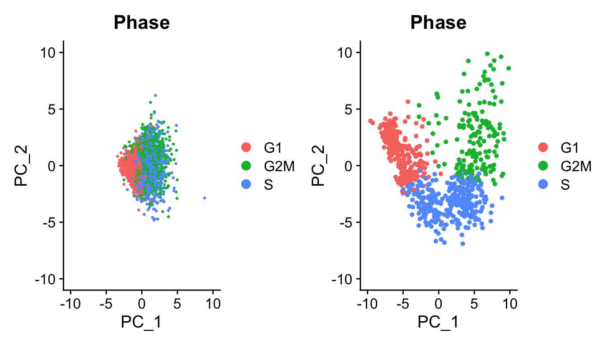
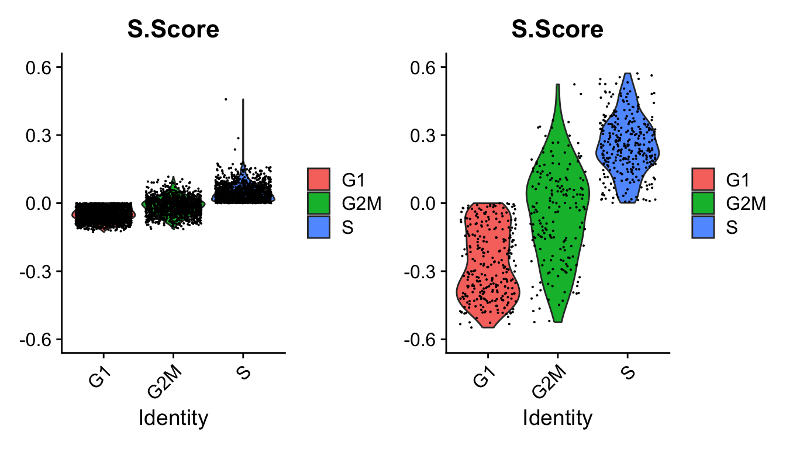
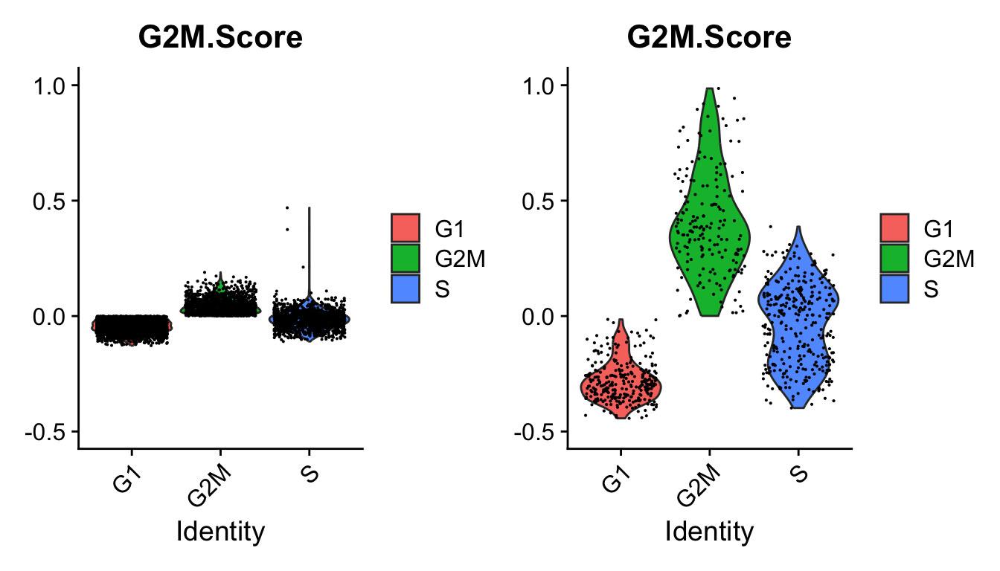
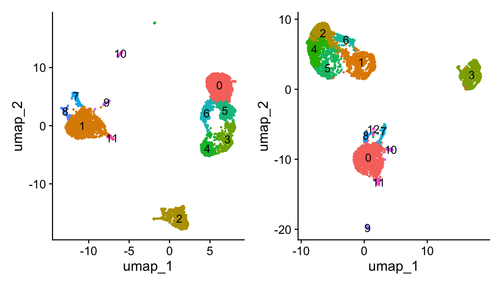
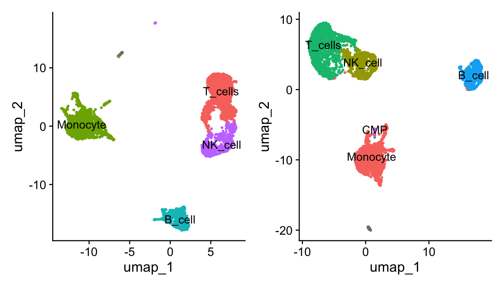

# 细胞周期
怎么知道我的单细胞数据需不需要去除细胞周期的影响呢

**背景知识**


尘封的高中生物学知识，细胞的有丝分裂，分为分裂期（M）和分裂间期（G1，S，G2），细胞处于不同的细胞周期时，代谢活跃状态和染色体的状态大不相同，直接比较表达量是不公平的。

在一些数据中，细胞周期的影响很大，大到每个周期的细胞各自聚成一簇，严重影响下游的聚类和分群。有的数据中，细胞周期的影响非常之低，可以忽略不记。

Seurat有自带的方法，根据在各个周期高表达的基因来计算细胞周期评分，根据评分的高低来推断细胞属于什么周期。

让我们来康一康如何探索细胞周期，以及有影响和没影响的数据各自长什么样。

## 读取数据并做好前期的质控

来自Seurat Vignette的示例数据

https://satijalab.org/seurat/articles/cell_cycle_vignette

### GSE218208


``` r
#untar("GSE218208_RAW.tar")
rm(list = ls())
a = data.table::fread("GSM6736629_10x-PBMC-1_ds0.1974_CountMatrix.tsv.gz",data.table = F)
a[1:4,1:4]
##                 alias:gene AAACCCAAGTAGGGTC AAACCCACACCATTCC AAACCCATCTACACTT
## 1   TSPAN6:ENSG00000000003                0                0                0
## 2     DPM1:ENSG00000000419                0                1                0
## 3    SCYL3:ENSG00000000457                0                0                0
## 4 C1orf112:ENSG00000000460                0                0                0
library(tidyverse)
a$`alias:gene` = str_split_i(a$`alias:gene`,":",i = 1)
a = distinct(a,`alias:gene`,.keep_all = T)
a = column_to_rownames(a,var = "alias:gene")
a[1:4,1:4]
##          AAACCCAAGTAGGGTC AAACCCACACCATTCC AAACCCATCTACACTT AAACGAAAGCACGTCC
## TSPAN6                  0                0                0                0
## DPM1                    0                1                0                0
## SCYL3                   0                0                0                0
## C1orf112                0                0                0                0
library(Seurat)
pbmc <- CreateSeuratObject(counts = a, 
                           project = "a", 
                           min.cells = 3, 
                           min.features = 200)
pbmc[["percent.mt"]] <- PercentageFeatureSet(pbmc, pattern = "^MT-")
head(pbmc@meta.data, 3)
##                  orig.ident nCount_RNA nFeature_RNA percent.mt
## AAACCCAAGTAGGGTC          a      10768         3213   7.030089
## AAACCCACACCATTCC          a       4102         1676   5.046319
## AAACCCATCTACACTT          a       4694         1740   6.305922
VlnPlot(pbmc, 
        features = c("nFeature_RNA",
                     "nCount_RNA", 
                     "percent.mt"), 
        ncol = 3,pt.size = 0.5)
```


``` r
pbmc = subset(pbmc,nFeature_RNA < 4200 &
                nCount_RNA < 18000 &
                percent.mt < 10)
```

### marrow


``` r
exp.mat <- read.delim("nestorawa_forcellcycle_expressionMatrix.txt",row.names = 1)
marrow <- CreateSeuratObject(counts = exp.mat,
                             project = "b",
                             min.cells = 3, 
                             min.features = 200)
marrow[["percent.mt"]] <- PercentageFeatureSet(marrow, pattern = "^MT-")
head(marrow@meta.data, 3)
##          orig.ident nCount_RNA nFeature_RNA percent.mt
## Prog_013       Prog    2563086        10208   5.187809
## Prog_019       Prog    3030619         9990   5.965877
## Prog_031       Prog    1293487        10192   5.664456
VlnPlot(marrow, 
        features = c("nFeature_RNA",
                     "nCount_RNA", 
                     "percent.mt"), 
        ncol = 3,pt.size = 0.5)
```



``` r
#从图上可以看出这个数据已经过滤了
```

## 计算细胞周期评分


``` r
check_cc =  function(ob){
  s.genes <- intersect(cc.genes$s.genes,rownames(ob))
  g2m.genes <- intersect(cc.genes$g2m.genes,rownames(ob))
  ob = ob %>% 
  NormalizeData() %>%  
  FindVariableFeatures() %>%  
  CellCycleScoring(s.features = s.genes, 
                   g2m.features = g2m.genes) %>%
  ScaleData(features = rownames(.)) %>%  
  RunPCA(features = c(s.genes,g2m.genes))
  return(ob)
}
ob1 = check_cc(pbmc)
head(ob1@meta.data)
##                  orig.ident nCount_RNA nFeature_RNA percent.mt      S.Score
## AAACCCAAGTAGGGTC          a      10768         3213   7.030089 -0.049741327
## AAACCCACACCATTCC          a       4102         1676   5.046319  0.077834857
## AAACCCATCTACACTT          a       4694         1740   6.305922 -0.042199858
## AAACGAAAGCACGTCC          a       5584         2055   4.512894 -0.005870195
## AAACGAAGTTCAAACC          a       2917         1548   2.673980 -0.036017674
## AAACGAAGTTGGACTT          a       3755         1408   5.219707 -0.008708112
##                     G2M.Score Phase
## AAACCCAAGTAGGGTC -0.078938340    G1
## AAACCCACACCATTCC -0.036964594     S
## AAACCCATCTACACTT -0.033518345    G1
## AAACGAAAGCACGTCC -0.026582838    G1
## AAACGAAGTTCAAACC  0.006352434   G2M
## AAACGAAGTTGGACTT -0.060231178    G1
```

## 比较两个数据的细胞周期评分和PCA

可以看到这个函数处理完后，meta.data里面多了4列，分别是s和g2m的评分以及推断的细胞周期。


``` r
table(ob1$Phase)
## 
##   G1  G2M    S 
## 1821 1224 1294
```


``` r
ob2 = check_cc(marrow)
table(ob2$Phase)
## 
##  G1 G2M   S 
## 279 183 312
PCAPlot(ob1,group.by = "Phase")+ PCAPlot(ob2,group.by = "Phase")
```


这样的比较不太直观，把坐标调到相同范围


``` r
library(patchwork)
PCAPlot(ob1,group.by = "Phase")+ 
  PCAPlot(ob2,group.by = "Phase")&
  xlim(-10,10)&
  ylim(-10,10)
```



再比较一下S.Score和G2M.Score


``` r
p1 = VlnPlot(ob1,"S.Score",group.by = "Phase")
p2 = VlnPlot(ob2,"S.Score",group.by = "Phase")
wrap_plots(p1,p2,nrow = 1) & ylim(-0.6,0.6)
```




``` r
p1 = VlnPlot(ob1,"G2M.Score",group.by = "Phase")
p2 = VlnPlot(ob2,"G2M.Score",group.by = "Phase")
wrap_plots(p1,p2,nrow = 1) & ylim(-0.5,1)
```



这个周期的判断还是比较粗暴的，哪个分高就是那个周期，两个分都是负的那就G1期。

因此虽然GSE218208的数据也是有周期区别，但是分数相差很小，影响很小。

**所以像这样的大多数点都集中在0点附近的数据，就可以不用去除细胞周期的影响！**

ok，你不踏实。那我们来比较一下去除和不去除细胞周期影响的下游注释看有没有区别吧。

## 比较去除和不去处细胞周期影响的下游注释

### 不考虑细胞周期的降维聚类分群


``` r
f = "ob1.Rdata"
if(!file.exists(f)){
  ob1 = pbmc %>% 
  NormalizeData() %>%  
  FindVariableFeatures() %>%  
  ScaleData(features = rownames(.)) %>%  
  RunPCA(features = VariableFeatures(.))  %>%
  FindNeighbors(dims = 1:15) %>% 
  FindClusters(resolution = 0.5) %>% 
  RunUMAP(dims = 1:15) %>% 
  RunTSNE(dims = 1:15)
  save(ob1,file = f)
}
## Modularity Optimizer version 1.3.0 by Ludo Waltman and Nees Jan van Eck
## 
## Number of nodes: 4339
## Number of edges: 151523
## 
## Running Louvain algorithm...
## Maximum modularity in 10 random starts: 0.8942
## Number of communities: 12
## Elapsed time: 0 seconds
load(f)
```

### 考虑细胞周期的降维聚类分群


``` r
s.genes <- intersect(cc.genes$s.genes,rownames(pbmc))
g2m.genes <- intersect(cc.genes$g2m.genes,rownames(pbmc))
f = "ob2.Rdata"
if(!file.exists(f)){
  ob2 = pbmc %>% 
  NormalizeData() %>%  
  FindVariableFeatures() %>%  
  CellCycleScoring(s.features = s.genes, g2m.features = g2m.genes) %>%
  ScaleData(vars.to.regress = c("S.Score", "G2M.Score"),features = rownames(.)) %>%  #运行极其慢
  RunPCA(features = VariableFeatures(.))  %>%
  FindNeighbors(dims = 1:15) %>% 
  FindClusters(resolution = 0.5) %>% 
  RunUMAP(dims = 1:15) %>% 
  RunTSNE(dims = 1:15)
  save(ob2,file = f)
}
## Modularity Optimizer version 1.3.0 by Ludo Waltman and Nees Jan van Eck
## 
## Number of nodes: 4339
## Number of edges: 146175
## 
## Running Louvain algorithm...
## Maximum modularity in 10 random starts: 0.8902
## Number of communities: 13
## Elapsed time: 0 seconds
load(f)
p1 <- DimPlot(ob1, reduction = "umap",label = T)+NoLegend()
p2 <- DimPlot(ob2, reduction = "umap",label = T)+NoLegend()
p1+p2
```



简单点用singleR来注释


``` r
library(celldex)
library(SingleR)
ls("package:celldex")
##  [1] "BlueprintEncodeData"              "DatabaseImmuneCellExpressionData"
##  [3] "defineTextQuery"                  "fetchLatestVersion"              
##  [5] "fetchMetadata"                    "fetchReference"                  
##  [7] "HumanPrimaryCellAtlasData"        "ImmGenData"                      
##  [9] "listReferences"                   "listVersions"                    
## [11] "MonacoImmuneData"                 "MouseRNAseqData"                 
## [13] "NovershternHematopoieticData"     "saveReference"                   
## [15] "searchReferences"                 "surveyReferences"
f = "../supp/single_ref/ref_Human_all.RData"
if(!file.exists(f)){
  ref <- celldex::HumanPrimaryCellAtlasData()
  save(ref,file = f)
}
ref <- get(load(f))
library(BiocParallel)
scRNA = ob1
test = scRNA@assays$RNA$data
pred.scRNA <- SingleR(test = test, 
                      ref = ref,
                      labels = ref$label.main, 
                      clusters = scRNA@active.ident)
new.cluster.ids <- pred.scRNA$pruned.labels
names(new.cluster.ids) <- levels(scRNA)
scRNA <- RenameIdents(scRNA,new.cluster.ids)
p3 <- DimPlot(scRNA, reduction = "umap",label = T,pt.size = 0.5) + NoLegend()
m = scRNA
```

解释一下为什么会有`scRNA = ob1`,`m = scRNA`这样的代码：

当然是为了少改代码犯错误啦。两次注释的代码是一样的，如果把scRNA这个变量名替换掉就麻烦，别说可以全部替换，万一你替换的变量名称是函数或者文件名等东西的一部分，那不还得报错还得改回去？所以移花接木另行赋值是个更好的选择。


``` r
scRNA = ob2
test = scRNA@assays$RNA$data
pred.scRNA <- SingleR(test = test, 
                      ref = ref,
                      labels = ref$label.main, 
                      clusters = scRNA@active.ident)
new.cluster.ids <- pred.scRNA$pruned.labels
names(new.cluster.ids) <- levels(scRNA)
scRNA <- RenameIdents(scRNA,new.cluster.ids)
p4 <- DimPlot(scRNA, reduction = "umap",label = T,pt.size = 0.5) + NoLegend()
p3+p4
```



``` r
# table(Idents(m)==Idents(scRNA))
```

去不去除当然还是有区别的，只不过影响不大，可以忽略不计啊。

