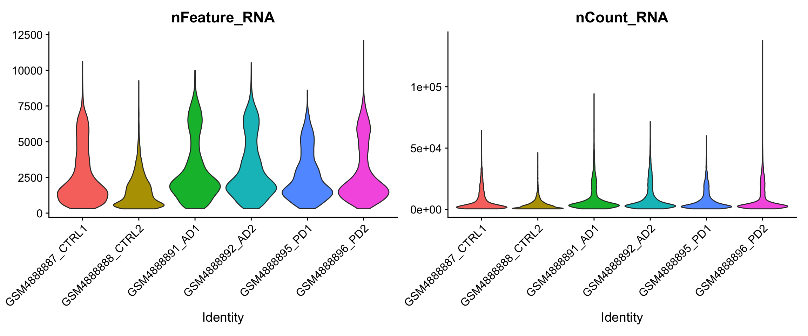
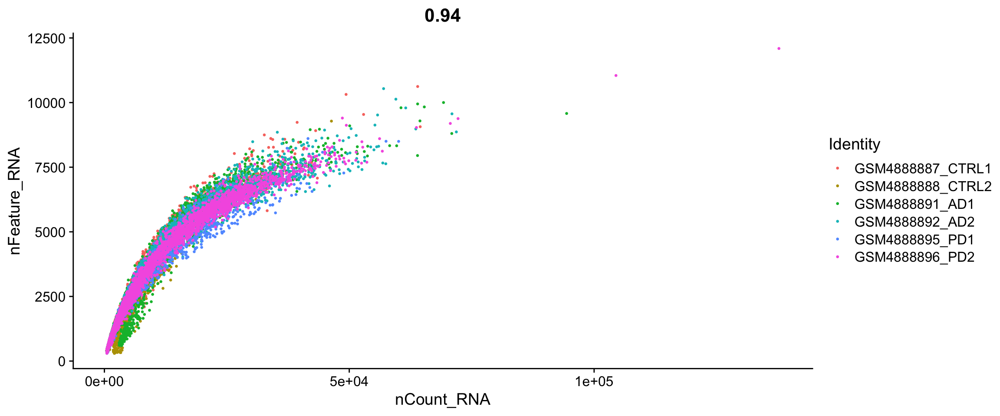
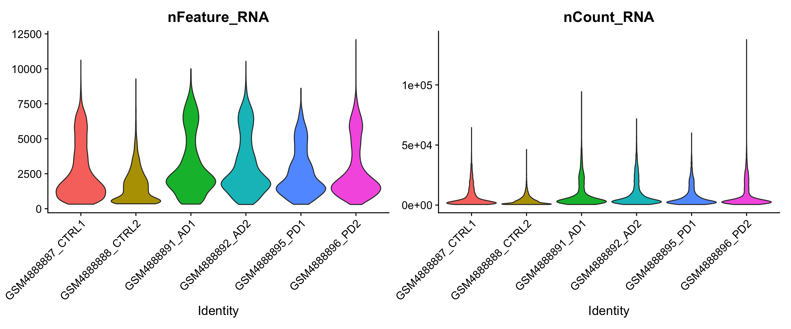
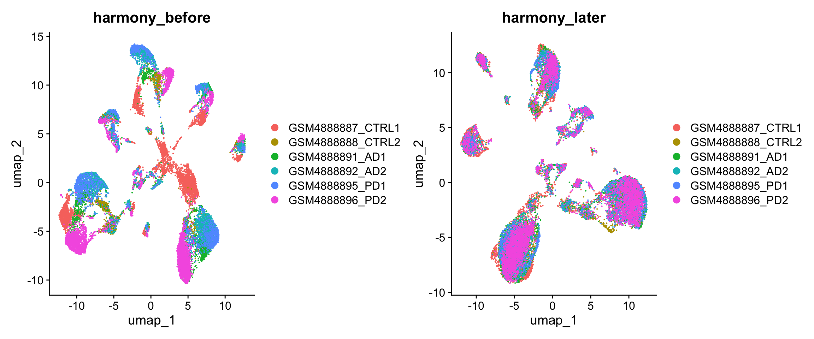
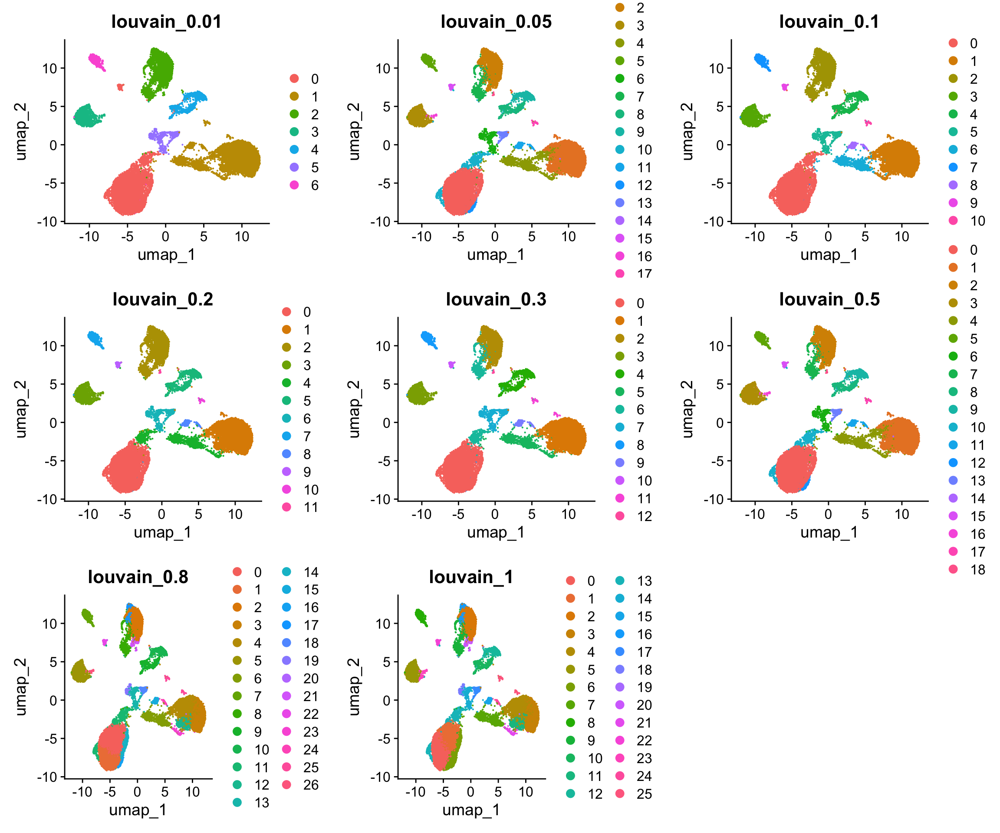
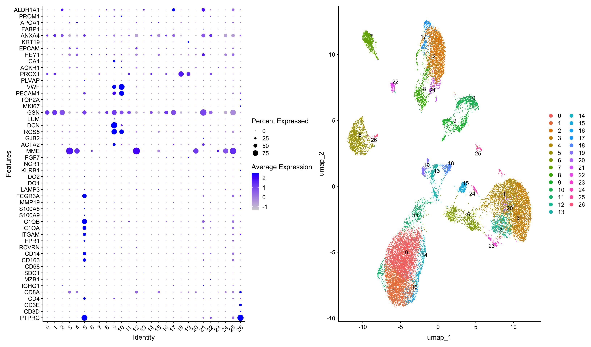
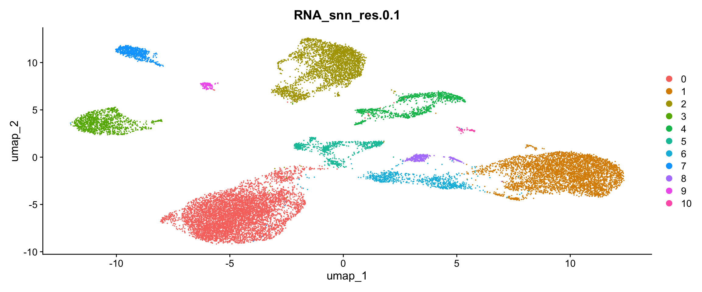
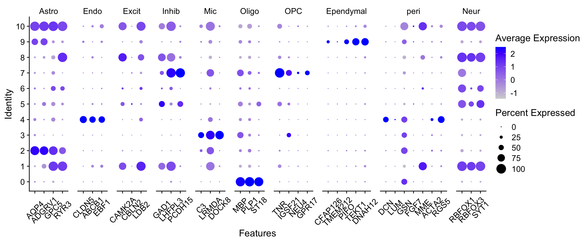
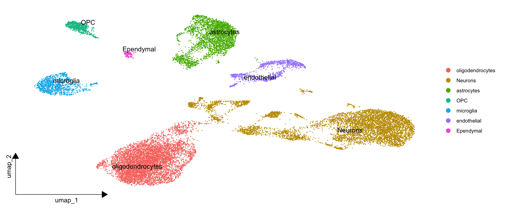

# 多样本分析


## 加载包

``` r
library(COSG)
library(harmony)
library(ggsci)
library(future)
library(Seurat)
library(clustree)
library(cowplot)
library(data.table)
library(patchwork)
library(stringr)
library(SingleR)
library(tidyverse)
library(tidydr)
```

## 创建多样本Seurat对象

不同于单样本分析，多样本分析需要将多个样本整合到一个Seurat对象中。这里我们使用`lapply`函数，将多个样本的数据读取并整合到一个列表中。进而创建Searut对象。


``` r
dir="data/multi-samples/outputs"
samples=list.files(dir)
samples 
## [1] "GSM4888887_CTRL1" "GSM4888888_CTRL2" "GSM4888891_AD1"   "GSM4888892_AD2"  
## [5] "GSM4888895_PD1"   "GSM4888896_PD2"

sceList = lapply(samples,function(pro){ 
  #pro=samples[1] 
  print(pro)  
  tmp = Read10X(file.path(dir, pro)) 
  if(length(tmp)==2){
    ct = tmp[[1]] 
  }else{ct = tmp}
  sce =CreateSeuratObject(counts =  ct ,
                          project =  pro  ,
                          min.cells = 5,
                          min.features = 300 )
  return(sce)
})
## [1] "GSM4888887_CTRL1"
## [1] "GSM4888888_CTRL2"
## [1] "GSM4888891_AD1"
## [1] "GSM4888892_AD2"
## [1] "GSM4888895_PD1"
## [1] "GSM4888896_PD2"

sce.all=merge(x=sceList[[1]],
              y=sceList[ -1 ],
              add.cell.ids = samples) # 每个细胞的名称前都会添加一个样本标识符前缀

sce.all <- JoinLayers(sce.all)


# 添加分组信息
phe=str_split(colnames(sce.all),'[_-]',simplify = T)
phe[1:5,]
##      [,1]         [,2]    [,3]               [,4]
## [1,] "GSM4888887" "CTRL1" "AAACCCAAGACGTCCC" "1" 
## [2,] "GSM4888887" "CTRL1" "AAACCCAAGGGCCTCT" "1" 
## [3,] "GSM4888887" "CTRL1" "AAACCCACAGGTATGG" "1" 
## [4,] "GSM4888887" "CTRL1" "AAACCCAGTCTTGAAC" "1" 
## [5,] "GSM4888887" "CTRL1" "AAACCCATCAAGCTGT" "1"
sce.all$group = phe[,1]

table(sce.all@meta.data$group)
## 
## GSM4888887 GSM4888888 GSM4888891 GSM4888892 GSM4888895 GSM4888896 
##       4605       2184       2503       4167       2095       5333
table(sce.all@meta.data$orig.ident)
## 
## GSM4888887_CTRL1 GSM4888888_CTRL2   GSM4888891_AD1   GSM4888892_AD2 
##             4605             2184             2503             4167 
##   GSM4888895_PD1   GSM4888896_PD2 
##             2095             5333
```


## 质控

第一步我们先计算关注的指标

``` r
#计算线粒体基因比例
mito_genes=rownames(sce.all)[grep("^MT-", rownames(sce.all),ignore.case = T)] 
print(mito_genes) #可能是13个线粒体基因
##  [1] "MT-TF"   "MT-RNR1" "MT-TV"   "MT-RNR2" "MT-ND1"  "MT-TI"   "MT-TM"  
##  [8] "MT-ND2"  "MT-CO1"  "MT-CO2"  "MT-TK"   "MT-ATP8" "MT-ATP6" "MT-CO3" 
## [15] "MT-ND3"  "MT-ND4L" "MT-ND4"  "MT-TH"   "MT-ND5"  "MT-ND6"  "MT-CYB" 
## [22] "MT-TP"   "MT-TL1"  "MT-TD"   "MT-TG"
sce.all=PercentageFeatureSet(sce.all, features = mito_genes, col.name = "percent_mito")
fivenum(sce.all@meta.data$percent_mito)
## [1]  0.0000000  0.3938158  0.9076559  2.4844720 86.9161677
  
#计算核糖体基因比例
ribo_genes=rownames(sce.all)[grep("^Rp[sl]", rownames(sce.all),ignore.case = T)]
print(ribo_genes[1:10])
##  [1] "RPL22"     "RPL11"     "RPS6KA1"   "RPS8"      "RPS15AP11" "RPS13P2"  
##  [7] "RPL21P23"  "RPL31P12"  "RPL5"      "RPL7P9"
sce.all=PercentageFeatureSet(sce.all,  features = ribo_genes, col.name = "percent_ribo")
fivenum(sce.all@meta.data$percent_ribo)
## [1]  0.0000000  0.3896445  0.6633781  1.3927122 14.5989305
  
#计算红血细胞基因比例
Hb_genes=rownames(sce.all)[grep("^Hb[^(p)]", rownames(sce.all),ignore.case = T)]
print(Hb_genes)
## [1] "HBEGF" "HBS1L" "HBB"   "HBG2"  "HBM"   "HBA2"  "HBA1"  "HBQ1"
sce.all=PercentageFeatureSet(sce.all,  features = Hb_genes,col.name = "percent_hb")
fivenum(sce.all@meta.data$percent_hb)
## [1]  0.00000000  0.00000000  0.00000000  0.01954031 28.35028077
```

过滤前可视化

``` r
#可视化细胞的上述比例情况
feats <- c("nFeature_RNA", "nCount_RNA")
p1=VlnPlot(sce.all, group.by = "orig.ident", features = feats, pt.size = 0, ncol = 2) + 
    NoLegend()
p1 
```



``` r

feats <- c("percent_mito", "percent_ribo", "percent_hb")
p2=VlnPlot(sce.all, group.by = "orig.ident", features = feats, pt.size = 0, ncol = 3, same.y.lims=T) + 
  scale_y_continuous(breaks=seq(0, 100, 5)) + 
  NoLegend()
p2
```


``` r

p3=FeatureScatter(sce.all, "nCount_RNA", "nFeature_RNA", group.by = "orig.ident", pt.size = 0.5)
p3
```




开始过滤

``` r
# 根据上述指标，过滤低质量细胞/基因
# 过滤指标1:最少表达基因数的细胞&最少表达细胞数的基因
# 一般来说，在`CreateSeuratObject`的时候已经是进行了这个过滤操作
# 如果后期看到了自己的单细胞降维聚类分群结果很诡异，就可以回过头来看质量控制环节
# 先走默认流程即可
if(F){
    selected_c <- WhichCells(sce.all, expression = nFeature_RNA > 500)
    selected_f <- rownames(sce.all)[Matrix::rowSums(sce.all@assays$RNA$counts > 0 ) > 3]
    sce.all <- subset(sce.all, features = selected_f, cells = selected_c)
  }
```


``` r
 #过滤指标2:线粒体/核糖体基因比例(根据上面的violin图)
selected_mito <- WhichCells(sce.all, expression = percent_mito < 25);length(selected_mito)
## [1] 20269
selected_ribo <- WhichCells(sce.all, expression = percent_ribo > 3);length(selected_ribo)
## [1] 1386
selected_hb <- WhichCells(sce.all, expression = percent_hb < 1 );length(selected_hb)
## [1] 20876

sce.all <- subset(sce.all, cells = selected_mito)
# sce.all.filt <- subset(sce.all.filt, cells = selected_ribo)
# sce.all.filt <- subset(sce.all.filt, cells = selected_hb)
dim(sce.all)
## [1] 28985 20269
```


过滤后可视化

``` r
#可视化过滤后的情况
feats <- c("nFeature_RNA", "nCount_RNA")
p1_filtered=VlnPlot(sce.all, group.by = "orig.ident", features = feats, pt.size = 0,
                    ncol = 2) + 
  NoLegend()
p1_filtered
```



``` r
  
feats <- c("percent_mito", "percent_ribo", "percent_hb")
p2_filtered=VlnPlot(sce.all, group.by = "orig.ident", features = feats, pt.size = 0, ncol = 3) + 
    NoLegend()
p2_filtered
```


## harmony流程


``` r
sce.all <- NormalizeData(sce.all, 
                             normalization.method = "LogNormalize",
                             scale.factor = 1e4)
sce.all <- FindVariableFeatures(sce.all)
sce.all <- ScaleData(sce.all)
sce.all <- RunPCA(sce.all, features = VariableFeatures(object = sce.all))
sce.all <- RunHarmony(sce.all, "orig.ident")
sce.all <- RunUMAP(sce.all,  dims = 1:15, 
                       reduction = "harmony")
# sce.all <- RunTSNE(sce.all,  dims = 1:15, 
#                        reduction = "harmony")
names(sce.all@reductions)
## [1] "pca"     "harmony" "umap"
```

harmony使用前后区别

``` r
seuratObj <- RunUMAP(sce.all,  dims = 1:15,
                     reduction = "pca")

DimPlot(seuratObj, reduction = "umap", group.by = "orig.ident") +  
  ggtitle("harmony_before")| # 未使用harmony
DimPlot(sce.all, reduction = "umap", group.by = "orig.ident") +
   ggtitle("harmony_later") # 使用harmony
```




``` r
sce.all <- FindNeighbors(sce.all, reduction = "harmony",
                             dims = 1:15) 
```

设置不同的分辨率，观察分群效果，进而选择最佳分辨率


``` r
apply(sce.all@meta.data[,grep("RNA_snn",colnames(sce.all@meta.data))],2,table)
## $RNA_snn_res.0.01
## 
##    0    1    2    3    4    5    6 
## 6970 6138 3145 1294 1154  833  735 
## 
## $RNA_snn_res.0.05
## 
##    0    1    2    3    4    5    6    7    8    9 
## 6834 5722 3145 1293 1154  834  735  358  137   57 
## 
## $RNA_snn_res.0.1
## 
##    0    1   10    2    3    4    5    6    7    8    9 
## 6832 4922   57 3145 1295 1154  834  800  735  358  137 
## 
## $RNA_snn_res.0.2
## 
##    0    1   10   11    2    3    4    5    6    7    8    9 
## 6550 4791   57   22 3121 1294 1216 1154  834  735  358  137 
## 
## $RNA_snn_res.0.3
## 
##    0    1   10   11   12    2    3    4    5    6    7    8    9 
## 6548 4768  137   83   22 2533 1293 1153  928  877  834  735  358 
## 
## $RNA_snn_res.0.5
## 
##    0    1   10   11   12   13   14   15   16   17   18    2    3    4    5    6 
## 6057 4427  522  358  259  236  166  135   67   57   22 2536 1225 1128  740  599 
##    7    8    9 
##  582  580  573 
## 
## $RNA_snn_res.0.8
## 
##    0    1   10   11   12   13   14   15   16   17   18   19    2   20   21   22 
## 3590 2144  569  553  522  397  285  266  265  254  225  213 2122  183  158  135 
##   23   24   25   26    3    4    5    6    7    8    9 
##  123   92   83   67 2062 2006 1225  801  740  605  584 
## 
## $RNA_snn_res.1
## 
##    0    1   10   11   12   13   14   15   16   17   18   19    2   20   21   22 
## 3325 2170  584  574  569  513  386  266  256  236  213  185 2114  163  136  135 
##   23   24   25    3    4    5    6    7    8    9 
##  114   92   83 2043 1962 1179  827  797  735  612
```


``` r
p1_dim=plot_grid(ncol = 3, 
                 DimPlot(sce.all, reduction = "umap", group.by = "RNA_snn_res.0.01") +
                   ggtitle("louvain_0.01"), 
                 DimPlot(sce.all, reduction = "umap", group.by = "RNA_snn_res.0.5") +
                   ggtitle("louvain_0.05"),
                 DimPlot(sce.all, reduction = "umap", group.by = "RNA_snn_res.0.1") +
                   ggtitle("louvain_0.1"),
                 DimPlot(sce.all, reduction = "umap", group.by = "RNA_snn_res.0.2") +
                   ggtitle("louvain_0.2"),
                  DimPlot(sce.all, reduction = "umap", group.by = "RNA_snn_res.0.3") +
                   ggtitle("louvain_0.3"),
                  DimPlot(sce.all, reduction = "umap", group.by = "RNA_snn_res.0.5") +
                   ggtitle("louvain_0.5"),
                  DimPlot(sce.all, reduction = "umap", group.by = "RNA_snn_res.0.8") +
                   ggtitle("louvain_0.8"),
                  DimPlot(sce.all, reduction = "umap", group.by = "RNA_snn_res.1") +
                   ggtitle("louvain_1"));p1_dim
```




``` r
p2_tree=clustree(sce.all@meta.data, prefix = "RNA_snn_res.");p2_tree
```


## marker 基因
选择需要的阈值，可视化一些marker基因辅助后续的单细胞亚群定义
这里直接选0.8


``` r
sel.clust = "RNA_snn_res.0.8"
sce.all <- SetIdent(sce.all, value = sel.clust)
table(sce.all@active.ident) 
## 
##    0    1    2    3    4    5    6    7    8    9   10   11   12   13   14   15 
## 3590 2144 2122 2062 2006 1225  801  740  605  584  569  553  522  397  285  266 
##   16   17   18   19   20   21   22   23   24   25   26 
##  265  254  225  213  183  158  135  123   92   83   67
```

可以选择marker基因手动注释


``` r
marker_cosg <- cosg(
    sce.all,
    groups='all',
    assay='RNA',
    slot='data',
    mu=1,
    n_genes_user=100)

cat(paste0('cluster',0:10,':',
           unlist(apply(marker_cosg$names,2,function(x){
             paste(head(x),collapse=',')
           })),'\n'))
## cluster0:PLP1,QDPR,RNF220,PEX5L,ST18,ENPP2
##  cluster1:SLC5A11,AC090502.1,MOBP,LINC00639,SH3TC2,SYNJ2
##  cluster2:RNF219-AS1,ADGRV1,RANBP3L,PRDM16,ZNF98,HPSE2
##  cluster3:SAMD5,GRM1,AL033504.1,HTR4,ADAMTS19,AP005212.5
##  cluster4:AC069437.1,AL117190.2,NNAT,LAMP5,PCDH11X,COCH
##  cluster5:TBXAS1,DOCK8,APBB1IP,FYB1,RBM47,SYK
##  cluster6:HPCA,NEFM,NRGN,CTXN1,GPR88,PHYHIP
##  cluster7:CA10,MEGF11,TNR,AC004852.2,SMOC1,COL9A1
##  cluster8:TUBB2B,GFAP,AGT,ENHO,CHI3L2,AQP4
##  cluster9:DCN,ADGRD1,NOTCH3,COL1A2,NR2F2,GJC1
##  cluster10:CLDN5,FLT1,VWF,TGM2,ADGRL4,MECOM
##  cluster0:GBP1,IFIT2,ISG15,APOL2,IFIT3,RARRES3
##  cluster1:PTPRQ,AC138646.1,AL138720.1,COL25A1,CTXN3,LOXHD1
##  cluster2:KCNJ6,SLC18A2,SLC6A3,VWC2L,AC007091.1,CLSTN2
##  cluster3:AC106869.1,ATAD3C,RAPGEF3,ST18,HIP1,AC009063.2
##  cluster4:RXFP1,FBXL21,ZNF804B,CASZ1,STAC,FRMD7
##  cluster5:PDE1A,MIR219A2,LINC00844,PPP1R14A,CHRM5,LINC01170
##  cluster6:LINC00836,AC073941.1,CD44,LINC02251,CYP4F3,TNC
##  cluster7:IL1RAPL2,LINC01885,AP002989.1,EXOC1L,KCNC2,PDGFD
##  cluster8:CHRM2,TAC3,AC134980.1,NXPH2,NELL1,GFRA2
##  cluster9:CR382287.2,SLC26A3,ADAMTSL1,MT-ND4L,AL353148.1,MT-ATP8
##  cluster10:SOD3,CHI3L2,MTCO1P12,CXCL14,OTOS,TMPRSS3
##  cluster0:C4orf22,AL672167.1,ADGB,CFAP157,TEKT1,FAM183A
##  cluster1:SLC35F3,ROBO2,RBFOX1,KCNIP4,MACROD2,KCNQ5
##  cluster2:LINC01520,AC087321.1,AC004704.1,AC020704.1,LINC01967,LINC01305
##  cluster3:PSPHP1,DRAXIN,CERS3,AC083902.2,LINC01924,AC103949.1
##  cluster4:SKAP1,IKZF3,GRAP2,LINC00861,PRF1,CD2
```

可以根据经验构建自己的注释集合（可选）

``` r
gastric_cancer_markers = c('PTPRC', 
                           'MUC2' , 'ITLN1',
                           'FABP1' , 'APOA1',
                           'CEACAM5' , 'CEACAM6',
                           'EPCAM', 'KRT18', 'MUC1',
                           'MUC6' , 'TFF2',
                           'PGA4' , 'PGA3',
                           'MUC5AC' , 'TFF1','CHGA' , 'CHGB') 

Myo=c("Krt17", "Krt14", "Krt5", "Acta2", "Myl9", "Mylk", "Myh11")
Lum=c("Krt19", "Krt18", "Krt8")
Hs=c("Prlr", "Cited1", "Pgr", "Prom1", "Esr1")  
AV=c("Mfge8", "Trf", "Csn3", "Wfdc18", "Elf5", "Ltf")
Lp=c("Kit", "Aldh1a3", "Cd14")
Fib=c("Col1a1", "Col1a2", "Col3a1", "Fn1")
GSE150580_breast_cancer_markers_list =list(
  Myo=Myo,
  Lum=Lum,
  Hs=Hs, 
  AV=AV,
  Lp=Lp,  
  Fib=Fib
) 

macrophages=c('Adgre1', 'Cd14',  'Fcgr3')
cDCs=c('Xcr1', 'Flt3',  'Ccr7')
pDCs=c('Siglech', 'Clec10a',  'Clec12a')  
monocytes=c('Ly6c2' , 'Spn')
neutrophils=c('Csf3r', 'S100a8',  'Cxcl3') 
SCP1661_meyloids_markers_list =list(
  macrophages=macrophages,
  cDCs=cDCs,
  pDCs=pDCs, 
  monocytes=monocytes,
  neutrophils=neutrophils  
) 

lung_epi_markers =  c('TPPP3',"SPRR3","GDPD3","SPRR1A","SPRR2A","RARRES2","TMPRSS11E",
                      "ASCL3","CFTR","FOXI2","1SG20","FOXI1",
                      "SAA4","SAA2","EFHC1","CCDC153","CCDC113","SAA1","CDC20B","FOXJ1",
                      "MYCL","FOXN4","CCNO",
                      "PIGR","BP1","MUC5A","VMO1","SCGB3A1","CYP2A13","CYP2B6","SCGB1A1",
                      "BCAM","KRT15","KRT5","TP63")

myeloids_markers_list1 =list(
  CM=c("TTN","MYH7","MYH6","TNNT2") ,
  EC=c("VWF", "IFI27", "PECAM1","MGP"),
  FB=c("DCN", "C7" ,"LUM","FBLN1","COL1A2"),
  MP=c("CD163", "CCL4", "CXCL8","PTPRC"),
  SMC=c("ACTA2", "CALD1", "MYH11"),
  Tc=c("CD3D","CD3E"),
  DC1 = c( 'Clec9a', 'Xcr1',   'Wdfy4'), 
  DC2 = c('Itgax', 'Sirpa',   'Cd209a'), 
  mregDCs= c('Ccr7', 'Cd80', 'Cd200',   'Cd247') ,
  hypoxia=c('Hif1a', 'Slc2a1', 'Vegfa', 'Hmox1', 
            'Bnip3', 'Nos2', 'Mmp2', 'Sod3', 
            'Cited2', 'Ldha'),
  peric=c("ABCC9","PDGFRB","RGS5")
)

myeloids_markers_list2 = list(pDC = c("CLEC4C","IRF7","TCF4","GZMB"),
                              cDC1 = c("XCR1","CLNK","CLEC9A"),
                              cDC2 = c("FCER1A","HLA-DPB1","HLA-DQB1","CD1E","CD1C","CLEC10A","HLA-DQA2"),
                              DC3 = c("CCL19","LAMP3","IDO1","IDO2","LAD1","FSCN1","CCR7","LY75","CCL22","CD40","BIRC3","NFKB2"),
                              Macrophages = c("APOC1","HLA-DRB5","C1QA","C1QB"),
                              RTMs = c("THBS1"),#Resident tissue macrophages
                              Lam = c("APOE"),#Lipid associated macrophages
                              Monocytes = c("LYZ","HLA-DRB1","TIMP1","S100A11","CXCL8","IL1B","PTGS2","S100A9","S100A8","MMP19"),
                              Mono_C = c('CD14'),#Mono_CD14
                              Mono_F = c('FCGR3A'),#Mono_FCGR3A
                              Mast = c('TPSAB1' , 'TPSB2'))


Tcells_markers = c('PTPRC', 'CD3D', 'CD3E', 'CD4','CD8A',
                   'CCR7', 'SELL' , 'TCF7','CXCR6' , 'ITGA1',
                   'FOXP3', 'IL2RA',  'CTLA4','GZMB', 'GZMK','CCL5',
                   'IFNG', 'CCL4', 'CCL3' ,
                   'PRF1' , 'NKG7') 

# CD4T
CD4_markers_list =list(
  Tc=c("CD3D","CD3E"),
  CD4=c("CD4" ),
  Treg=c("TNFRSF4","BATF","TNFRSF18","FOXP3","IL2RA","IKZF2"),
  naive=c("CCR7","SELL","CD5"),
  Tfh=c("CXCR5","BCL6","ICA1","TOX","TOX2","IL6ST"),#滤泡辅助性T细胞
  ILC=c("TNFRSF25","KRT81","LST1","AREG","LTB","CD69")
) 

# CD8T
CD8_markers_list1 =list(
  CD8=c("CD8A","CD8B"),
  TN_TCM=c("CCR7","SELL","TCF7","LEF1"),
  TEM=c("GZMK"  ),
  TEFF=c("TBX21","FCGR3A","FGFBP2"),
  TRM=c("XCL1","XCL2","ITGAE","CD69"),
  IEL_T = c("TMIGD2"),
  yT1c=c("GNLY","PTGDS","GZMB","TRDC"),
  yT2c=c("TMN1","HMGB2","TYMS"),
  MAIT_T = c("SLC4A10")
) 
CD8_markers_list2 =list(
  CD8T=c("CD8A","CD8B"),
  MAIT=c("ZBTB16","NCR3","RORA"),
  ExhaustedCD8T=c("LAG3","TIGIT","PDCD1","HAVCR2","CTLA4"),
  EffMemoryCD8=c("EOMES","ITM2C"),
  Resting_NK=c("XCL1","XCL2","KLRC1"),
  Cytotoxic_NK=c("CX3CR1","FGFBP2","FCGR3A","KLRD1"),
  Pre_exhausted=c("IFNG","PRF1","GNLY","GZMA","NKG7","GZMK")
)

cd4_and_cd8T_markers_list  =list( 
  naive=c("CCR7","SELL","TCF7","IL7R","CD27","CD28","LEF1","S1PR1"),
  CD8Trm=c("XCL1","XCL2","MYADM"),
  NKTc=c("GNLY","GZMA"), 
  Tfh=c("CXCR5","BCL6","ICA1","TOX","TOX2","IL6ST"),
  th17=c("IL17A","KLRB1","CCL20","ANKRD28","IL23R","RORC","FURIN","CCR6","CAPG","IL22"),
  CD8Tem=c("CXCR4","GZMH","CD44","GZMK"),
  Treg=c("FOXP3","IL2RA","TNFRSF18","IKZF2"),
  naive=c("CCR7","SELL","TCF7","IL7R","CD27","CD28"),
  CD8Trm=c("XCL1","XCL2","MYADM"), 
  MAIT=c("KLRB1","ZBTB16","NCR3","RORA"),
  yT1c=c("GNLY","PTGDS","GZMB","TRDC"),
  yT2c=c("TMN1","HMGB2","TYMS"),
  yt=c("TRGV9","TRDV2")
) 

# CD20 (MS4A1)表达于除plasma B 之外的所有B，很关键的区分naive 和plasma的marker
# SDC1 = CD138 plasma B （接受抗原，可表达抗体） 
Bcels_markers_list = list(
  All = c('MS4A1','SDC1','CD27','CD38','CD19', 'CD79A'),
  GC_B = c('IL4R','TCL1A','LRMP','SUGCT'),
  IGA_plasm_B= c ( 'IGHA1'), 
  IGG_plasm_B= c ( 'IGHG1')
)  

Hepatic_stellate_markers_list =list(
  qHSC=c("Lrat","Ecm1","Angptl6","Vipr1" ),
  S1=c("Ccl2" ,"Cxcl10" ,"Cxcl1" ,"Ccl7" ),
  S2=c("Acta2" ,"Tpm1" ,"Vim" ,"Tagln","Tnc","Tpm2"),
  S3=c("Col1a1","Col1a2","Col3a1" ,"Lox","Lum" )
)

# arteries (HEY1, IGFBP3), capillaries (CD36, CA4), veins (ACKR1) and
# lymphatic ECs (LECs; CCL21, PROX1). 
stromal_markers = c('TEK',"PTPRC","EPCAM","PDPN",
                    "PECAM1",'PDGFRB',"PLVAP",'PROX1','ACKR1','CA4','HEY1',
                    'CSPG4','GJB2', 'RGS5','ITGA7',
                    'ACTA2','RBP1','CD36', 
                    'ADGRE5','COL11A1','FGF7', 'MME') 

last_markers = c('PTPRC', 'CD3D', 'CD3E', 'CD4','CD8A',
                 'CD19', 'CD79A', 'MS4A1' ,
                 'IGHG1', 'MZB1', 'SDC1',
                 'CD68', 'CD163', 'CD14', 
                 'TPSAB1' , 'TPSB2',  # mast cells,
                 'RCVRN','FPR1' , 'ITGAM' ,
                 'C1QA',  'C1QB',  # mac
                 'S100A9', 'S100A8', 'MMP19',# monocyte
                 'FCGR3A',
                 'LAMP3', 'IDO1','IDO2',## DC3 
                 'CD1E','CD1C', # DC2
                 'KLRB1','NCR1', # NK 
                 'FGF7','MME', 'ACTA2', ## human  fibo 
                 'GJB2', 'RGS5',
                 'DCN', 'LUM',  'GSN' , ## mouse PDAC fibo 
                 'MKI67' , 'TOP2A', 
                 'PECAM1', 'VWF',  ## endo 
                 "PLVAP",'PROX1','ACKR1','CA4','HEY1',
                 'EPCAM' , 'KRT19','KRT7', # epi 
                 'FYXD2', 'TM4SF4', 'ANXA4',# cholangiocytes
                 'APOC3', 'FABP1',  'APOA1',  # hepatocytes
                 'Serpina1c',
                 'PROM1', 'ALDH1A1' )

markers = c('gastric_cancer_markers','lung_epi_markers',
            'Tcells_markers',
            'stromal_markers', 
            'last_markers' )
markers_list <- c(
  'GSE150580_breast_cancer_markers_list' ,
  'SCP1661_meyloids_markers_list' ,
  'myeloids_markers_list1' ,
  'myeloids_markers_list2' ,
  'CD4_markers_list' ,
  'CD8_markers_list1' ,
  'CD8_markers_list2' ,
  'cd4_and_cd8T_markers_list'   ,
  'Bcels_markers_list' ,
  'Hepatic_stellate_markers_list' 
)
```

设置物种

``` r
sp='human' # human/mouse
```


``` r
if(sp == 'human') {
  # 创建一个列表来存储所有的DotPlot图
  plot_list1 <- lapply(markers, function(x) {
    genes_to_check <- str_to_upper(get(x))
    
    plot1 <- DotPlot(sce.all, features = genes_to_check) + 
      coord_flip() + 
      theme(axis.text.x = element_text(angle = 45, hjust = 1))
    
    # 如果需要保存图形，可以取消注释以下行
    # h = length(genes_to_check) / 6 + 4
    # ggsave(paste('check_for_', x, '.pdf'), height = h)
    
    return(plot1)  # 返回图形对象
  })
  
  plot_list2 <- lapply(markers_list, function(x) {
    genes_to_check <- lapply(get(x), str_to_upper)
    dup <- names(table(unlist(genes_to_check)))[table(unlist(genes_to_check)) > 1]
    genes_to_check <- lapply(genes_to_check, function(x) x[!x %in% dup])
    
    plot2 <- DotPlot(sce.all, features = genes_to_check) + 
      theme(axis.text.x = element_text(angle = 45, hjust = 1))
    
    # 如果需要保存图形，可以取消注释以下行
    # w = length(unique(unlist(genes_to_check))) / 5 + 7
    # ggsave(paste('check_for_', x, '.pdf'), width = w)
    
    return(plot2)  # 返回图形对象
  })
  
  last_markers_to_check <<- str_to_upper(last_markers) 
  
  # 打印所有的图形
  plot_grid(plotlist = c(plot_list1, plot_list2), ncol = 3)

} else if(sp == 'mouse') {
  # 创建一个列表来存储所有的DotPlot图
  plot_list1 <- lapply(markers, function(x) {
    genes_to_check <- str_to_title(get(x))
    
    plot1 <- DotPlot(sce.all, features = genes_to_check) + 
      coord_flip() + 
      theme(axis.text.x = element_text(angle = 45, hjust = 1))
    
    # 如果需要保存图形，可以取消注释以下行
    # h = length(genes_to_check) / 6 + 4
    # ggsave(paste('check_for_', x, '.pdf'), height = h)
    
    return(plot1)  # 返回图形对象
  })
  
  plot_list2 <- lapply(markers_list, function(x) {
    genes_to_check <- lapply(get(x), str_to_title)
    dup <- names(table(unlist(genes_to_check)))[table(unlist(genes_to_check)) > 1]
    genes_to_check <- lapply(genes_to_check, function(x) x[!x %in% dup])
    
    plot2 <- DotPlot(sce.all, features = genes_to_check) + 
      theme(axis.text.x = element_text(angle = 45, hjust = 1))
    
    # 如果需要保存图形，可以取消注释以下行
    # w = length(unique(unlist(genes_to_check))) / 5 + 6
    # ggsave(paste('check_for_', x, '.pdf'), width = w)
    
    return(plot2)  # 返回图形对象
  })
  
  last_markers_to_check <<- str_to_title(last_markers) 
  
  # 打印所有的图形
  plot_grid(plotlist = c(plot_list1, plot_list2), ncol = 3)
  
} else {
  print('we only accept human or mouse')
}
```




``` r
DotPlot(sce.all , features = last_markers_to_check ) + 
  coord_flip() + 
  theme(axis.text.x=element_text(angle=45,hjust = 1))|
DimPlot(sce.all, reduction = "umap",raster = F,
               label = T,repel = T)
```


## 亚群命名
我们找到合适的 marker 基因后就可以进一步去可视化（我的理解是拿这些图在文章中展示），
判断单细胞亚群的生物学名字。这里我们直接使用已经定义好的名字。


``` r
# 这里只是为了展示代码，就拿0.1分辨率的结果来展示
colnames(sce.all@meta.data)
##  [1] "orig.ident"       "nCount_RNA"       "nFeature_RNA"     "group"           
##  [5] "percent_mito"     "percent_ribo"     "percent_hb"       "RNA_snn_res.0.01"
##  [9] "seurat_clusters"  "RNA_snn_res.0.05" "RNA_snn_res.0.1"  "RNA_snn_res.0.2" 
## [13] "RNA_snn_res.0.3"  "RNA_snn_res.0.5"  "RNA_snn_res.0.8"  "RNA_snn_res.1"
DimPlot(sce.all, group.by = "RNA_snn_res.0.1")
```



``` r
astrocytes = c("AQP4", "ADGRV1", "GPC5", "RYR3") 
endothelial = c("CLDN5", "ABCB1", "EBF1") 
excitatory = c("CAMK2A", "CBLN2", "LDB2") 
inhibitory = c("GAD1", "LHFPL3", "PCDH15") 
microglia = c("C3", "LRMDA", "DOCK8") 
oligodendrocytes = c("MBP", "PLP1", "ST18") 
OPC='Tnr,Igsf21,Neu4,Gpr17'
Ependymal='Cfap126,Fam183b,Tmem212,pifo,Tekt1,Dnah12'
pericyte=c(  'DCN', 'LUM',  'GSN' ,'FGF7','MME', 'ACTA2','RGS5')
Neurons= c("RBFOX1", "RBFOX3", "SYT1")

gene_list = list(
  Astro = astrocytes,
  Endo = endothelial,
  Excit = excitatory,
  Inhib = inhibitory,
  Mic = microglia,
  Oligo = oligodendrocytes,
  OPC= str_to_upper(trimws(strsplit(OPC,',')[[1]])),
  Ependymal= str_to_upper(trimws(strsplit(Ependymal,',')[[1]])) ,
  peri = pericyte ,
  Neur = Neurons
)

gene_list = lapply(gene_list, function(x){
  unique(c(str_to_title(x), str_to_upper(x)))
})

gene_list
## $Astro
## [1] "Aqp4"   "Adgrv1" "Gpc5"   "Ryr3"   "AQP4"   "ADGRV1" "GPC5"   "RYR3"  
## 
## $Endo
## [1] "Cldn5" "Abcb1" "Ebf1"  "CLDN5" "ABCB1" "EBF1" 
## 
## $Excit
## [1] "Camk2a" "Cbln2"  "Ldb2"   "CAMK2A" "CBLN2"  "LDB2"  
## 
## $Inhib
## [1] "Gad1"   "Lhfpl3" "Pcdh15" "GAD1"   "LHFPL3" "PCDH15"
## 
## $Mic
## [1] "C3"    "Lrmda" "Dock8" "LRMDA" "DOCK8"
## 
## $Oligo
## [1] "Mbp"  "Plp1" "St18" "MBP"  "PLP1" "ST18"
## 
## $OPC
## [1] "Tnr"    "Igsf21" "Neu4"   "Gpr17"  "TNR"    "IGSF21" "NEU4"   "GPR17" 
## 
## $Ependymal
##  [1] "Cfap126" "Fam183b" "Tmem212" "Pifo"    "Tekt1"   "Dnah12"  "CFAP126"
##  [8] "FAM183B" "TMEM212" "PIFO"    "TEKT1"   "DNAH12" 
## 
## $peri
##  [1] "Dcn"   "Lum"   "Gsn"   "Fgf7"  "Mme"   "Acta2" "Rgs5"  "DCN"   "LUM"  
## [10] "GSN"   "FGF7"  "MME"   "ACTA2" "RGS5" 
## 
## $Neur
## [1] "Rbfox1" "Rbfox3" "Syt1"   "RBFOX1" "RBFOX3" "SYT1"
```


``` r
 p1=DotPlot(sce.all, assay = "RNA", features = gene_list, 
            group.by = 'RNA_snn_res.0.1') + 
  theme(axis.text.x = element_text(angle = 45, 
                                     vjust = 0.5, hjust=0.5));p1
```



根据最终的可视化图，我们就可以手动的给亚群命名了。

``` r
sce.all
## An object of class Seurat 
## 28985 features across 20269 samples within 1 assay 
## Active assay: RNA (28985 features, 2000 variable features)
##  3 layers present: counts, data, scale.data
##  3 dimensional reductions calculated: pca, harmony, umap
dim(sce.all)
## [1] 28985 20269

sel.clust = "RNA_snn_res.0.1"
sce.all <- SetIdent(sce.all, value = sel.clust)

res_len <- table(sce.all@active.ident) %>% length();res_len
## [1] 11
celltype=data.frame(ClusterID=(0:(res_len-1)),
                    celltype= (0:(res_len-1)))
```


``` r
# 自定义细胞亚群        
celltype[celltype$ClusterID %in% c(2),2]='astrocytes'
celltype[celltype$ClusterID %in% c(4),2]='endothelial' 
celltype[celltype$ClusterID %in% c(3),2]='microglia'  
celltype[celltype$ClusterID %in% c(0),2]='oligodendrocytes'
celltype[celltype$ClusterID %in% c( 7 ),2]='OPC'
celltype[celltype$ClusterID %in% c( 1,5,6,8,10 ),2]='Neurons' 
celltype[celltype$ClusterID %in% c( 9 ),2]='Ependymal'

head(celltype)
##   ClusterID         celltype
## 1         0 oligodendrocytes
## 2         1          Neurons
## 3         2       astrocytes
## 4         3        microglia
## 5         4      endothelial
## 6         5          Neurons
table(celltype$celltype)
## 
##       astrocytes      endothelial        Ependymal        microglia 
##                1                1                1                1 
##          Neurons oligodendrocytes              OPC 
##                5                1                1

sce.all@meta.data$celltype = "NA"
for(i in 1:nrow(celltype)){
    sce.all@meta.data[which(sce.all@meta.data[[sel.clust]] == celltype$ClusterID[i]),'celltype'] <- celltype$celltype[i]}

Idents(sce.all)=sce.all$celltype
table(sce.all@active.ident)
## 
## oligodendrocytes          Neurons       astrocytes              OPC 
##             6832             6971             3145              735 
##        microglia      endothelial        Ependymal 
##             1295             1154              137
```

最后我们就可以可视化我们的命名效果了。

``` r
DimPlot(sce.all, reduction = "umap",raster = F,
        label = T,repel = T)  +
  theme_dr(xlength = 0.22, ylength = 0.22, arrow = grid::arrow(length = unit(0.15, "inches"), type = "closed"))+
  theme(panel.grid = element_blank())
```



保存Seurat对象以便后续分析

``` r
saveRDS(sce.all, file = "./sce.all_final.rds")
```
