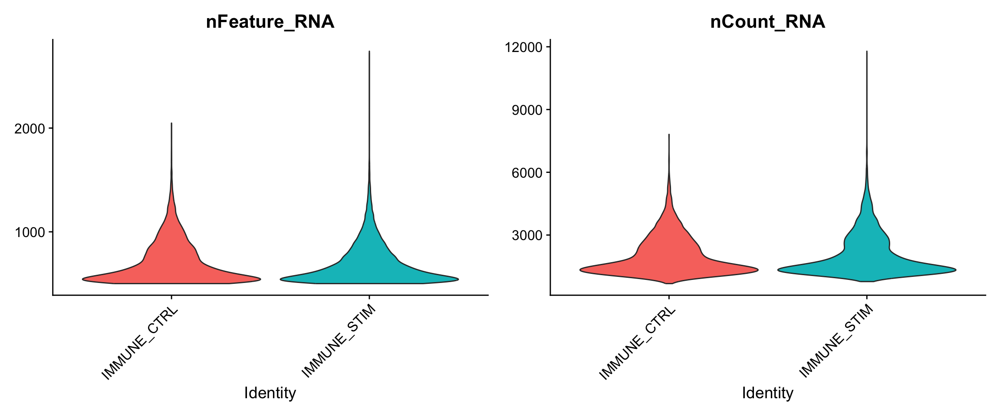
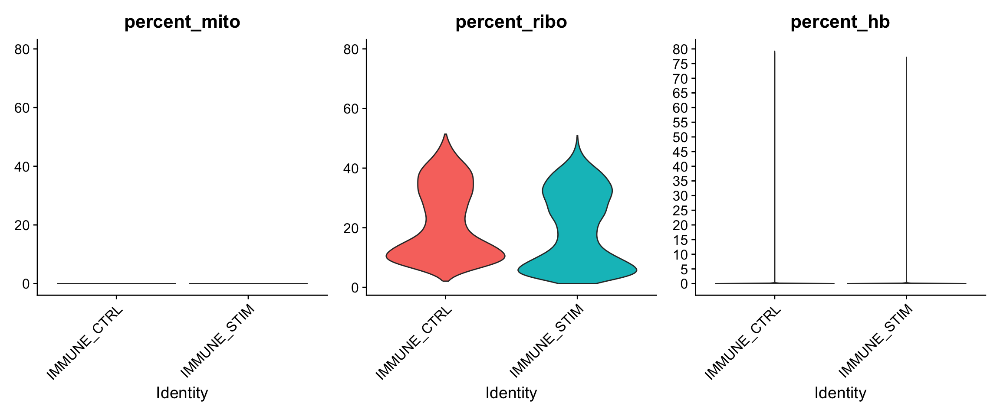
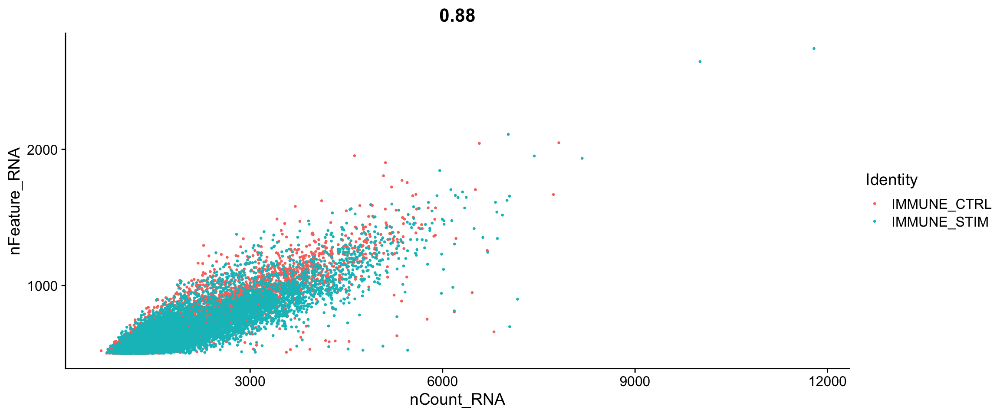
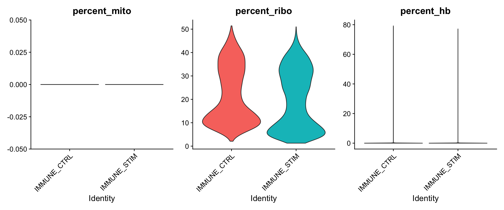
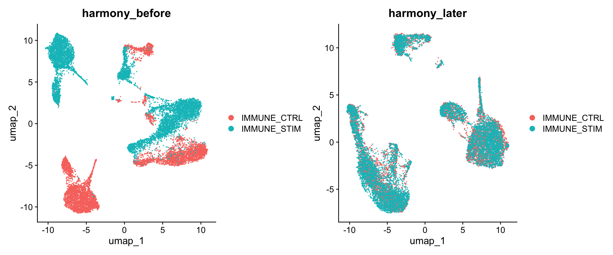
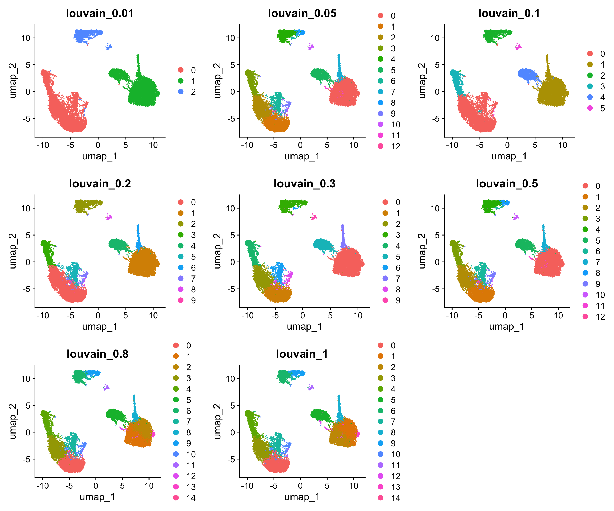
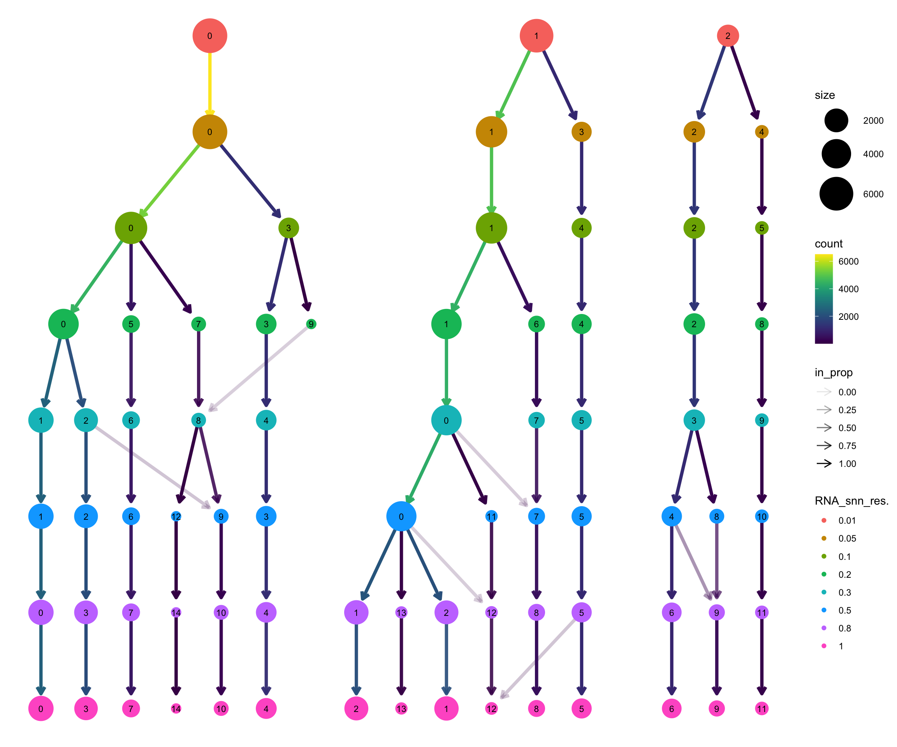

# (PART) 多样本分析 pipline 

# 基础流程


## 加载包

``` r
library(COSG)
library(harmony)
library(ggsci)
library(future)
library(Seurat)
library(clustree)
library(cowplot)
library(data.table)
library(patchwork)
library(stringr)
library(SingleR)
library(tidyverse)
library(tidydr)
```

## 创建多样本Seurat对象
示范数据: 来自于 SeuratData 包的 ifnb 数据集

``` r
library(SeuratData)
library(ifnb.SeuratData)
library(ReactomePA)
library(org.Hs.eg.db)

data("ifnb")
ifnb=UpdateSeuratObject(ifnb)
table(ifnb$orig.ident)
## 
## IMMUNE_CTRL IMMUNE_STIM 
##        6548        7451

sce.all <- ifnb
head(sce.all@meta.data, 10)
##                   orig.ident nCount_RNA nFeature_RNA stim seurat_annotations
## AAACATACATTTCC.1 IMMUNE_CTRL       3017          877 CTRL          CD14 Mono
## AAACATACCAGAAA.1 IMMUNE_CTRL       2481          713 CTRL          CD14 Mono
## AAACATACCTCGCT.1 IMMUNE_CTRL       3420          850 CTRL          CD14 Mono
## AAACATACCTGGTA.1 IMMUNE_CTRL       3156         1109 CTRL                pDC
## AAACATACGATGAA.1 IMMUNE_CTRL       1868          634 CTRL       CD4 Memory T
## AAACATACGGCATT.1 IMMUNE_CTRL       1581          557 CTRL          CD14 Mono
## AAACATACTGCGTA.1 IMMUNE_CTRL       2747          980 CTRL        T activated
## AAACATACTGCTGA.1 IMMUNE_CTRL       1341          581 CTRL        CD4 Naive T
## AAACATTGAGTGTC.1 IMMUNE_CTRL       2155          880 CTRL              CD8 T
## AAACATTGCTTCGC.1 IMMUNE_CTRL       2536          669 CTRL          CD14 Mono
table(sce.all@meta.data$orig.ident) 
## 
## IMMUNE_CTRL IMMUNE_STIM 
##        6548        7451
```


## 质控
第一步我们先计算关注的指标

``` r
#计算线粒体基因比例
mito_genes=rownames(sce.all)[grep("^MT-", rownames(sce.all),ignore.case = T)] 
print(mito_genes) #可能是13个线粒体基因
## character(0)
sce.all=PercentageFeatureSet(sce.all, features = mito_genes, col.name = "percent_mito")
fivenum(sce.all@meta.data$percent_mito)
## [1] 0 0 0 0 0
  
#计算核糖体基因比例
ribo_genes=rownames(sce.all)[grep("^Rp[sl]", rownames(sce.all),ignore.case = T)]
print(ribo_genes[1:10])
##  [1] "RPL22"   "RPL11"   "RPS6KA1" "RPS8"    "RPL5"    "RPS27"   "RPS10P7"
##  [8] "RPS6KC1" "RPS7"    "RPS27A"
sce.all=PercentageFeatureSet(sce.all,  features = ribo_genes, col.name = "percent_ribo")
fivenum(sce.all@meta.data$percent_ribo)
## [1]  1.268678  9.423351 18.634718 31.750724 51.411509
  
#计算红血细胞基因比例
Hb_genes=rownames(sce.all)[grep("^Hb[^(p)]", rownames(sce.all),ignore.case = T)]
print(Hb_genes)
##  [1] "HBEGF" "HBS1L" "HBB"   "HBD"   "HBG1"  "HBG2"  "HBM"   "HBA2"  "HBA1" 
## [10] "HBQ1"
sce.all=PercentageFeatureSet(sce.all,  features = Hb_genes,col.name = "percent_hb")
fivenum(sce.all@meta.data$percent_hb)
## [1]  0.00000  0.00000  0.00000  0.00000 79.22364
```

过滤前可视化

``` r
#可视化细胞的上述比例情况
feats <- c("nFeature_RNA", "nCount_RNA")
p1=VlnPlot(sce.all, group.by = "orig.ident", features = feats, pt.size = 0, ncol = 2) + 
    NoLegend()
p1 
```



``` r

feats <- c("percent_mito", "percent_ribo", "percent_hb")
p2=VlnPlot(sce.all, group.by = "orig.ident", features = feats, pt.size = 0, ncol = 3, same.y.lims=T) + 
  scale_y_continuous(breaks=seq(0, 100, 5)) + 
  NoLegend()
p2
```



``` r

p3=FeatureScatter(sce.all, "nCount_RNA", "nFeature_RNA", group.by = "orig.ident", pt.size = 0.5)
p3
```




开始过滤

``` r
# 根据上述指标，过滤低质量细胞/基因
# 过滤指标1:最少表达基因数的细胞&最少表达细胞数的基因
# 一般来说，在`CreateSeuratObject`的时候已经是进行了这个过滤操作
# 如果后期看到了自己的单细胞降维聚类分群结果很诡异，就可以回过头来看质量控制环节
# 先走默认流程即可
if(F){
    selected_c <- WhichCells(sce.all, expression = nFeature_RNA > 500)
    selected_f <- rownames(sce.all)[Matrix::rowSums(sce.all@assays$RNA$counts > 0 ) > 3]
    sce.all <- subset(sce.all, features = selected_f, cells = selected_c)
  }
```


``` r
 #过滤指标2:线粒体/核糖体基因比例(根据上面的violin图)
selected_mito <- WhichCells(sce.all, expression = percent_mito < 25);length(selected_mito)
## [1] 13999
selected_ribo <- WhichCells(sce.all, expression = percent_ribo > 3);length(selected_ribo)
## [1] 13757
selected_hb <- WhichCells(sce.all, expression = percent_hb < 1 );length(selected_hb)
## [1] 13926

sce.all <- subset(sce.all, cells = selected_mito)
# sce.all.filt <- subset(sce.all.filt, cells = selected_ribo)
# sce.all.filt <- subset(sce.all.filt, cells = selected_hb)
dim(sce.all)
## [1] 14053 13999
```


过滤后可视化

``` r
#可视化过滤后的情况
feats <- c("nFeature_RNA", "nCount_RNA")
p1_filtered=VlnPlot(sce.all, group.by = "orig.ident", features = feats, pt.size = 0,
                    ncol = 2) + 
  NoLegend()
p1_filtered
```


``` r
  
feats <- c("percent_mito", "percent_ribo", "percent_hb")
p2_filtered=VlnPlot(sce.all, group.by = "orig.ident", features = feats, pt.size = 0, ncol = 3) + 
    NoLegend()
p2_filtered
```




## harmony流程

``` r
sce.all <- NormalizeData(sce.all, 
                             normalization.method = "LogNormalize",
                             scale.factor = 1e4)
sce.all <- FindVariableFeatures(sce.all)
sce.all <- ScaleData(sce.all)
sce.all <- RunPCA(sce.all, features = VariableFeatures(object = sce.all))
sce.all <- RunHarmony(sce.all, "orig.ident")
sce.all <- RunUMAP(sce.all,  dims = 1:15, 
                       reduction = "harmony")
# sce.all <- RunTSNE(sce.all,  dims = 1:15, 
#                        reduction = "harmony")
names(sce.all@reductions)
## [1] "pca"     "harmony" "umap"
```

harmony使用前后区别

``` r
seuratObj <- RunUMAP(sce.all,  dims = 1:15,
                     reduction = "pca")

DimPlot(seuratObj, reduction = "umap", group.by = "orig.ident") +  
  ggtitle("harmony_before")| # 未使用harmony
DimPlot(sce.all, reduction = "umap", group.by = "orig.ident") +
   ggtitle("harmony_later") # 使用harmony
```




``` r
sce.all <- FindNeighbors(sce.all, reduction = "harmony",
                             dims = 1:15) 
```

设置不同的分辨率，观察分群效果，进而选择最佳分辨率


``` r
apply(sce.all@meta.data[,grep("RNA_snn",colnames(sce.all@meta.data))],2,table)
## $RNA_snn_res.0.01
## 
##    0    1    2 
## 6508 5944 1547 
## 
## $RNA_snn_res.0.05
## 
##    0    1    2    3    4 
## 6508 4875 1408 1069  139 
## 
## $RNA_snn_res.0.1
## 
##    0    1    2    3    4    5 
## 5314 4875 1408 1194 1069  139 
## 
## $RNA_snn_res.0.2
## 
##    0    1    2    3    4    5    6    7    8    9 
## 4470 4406 1408 1170 1072  604  466  240  139   24 
## 
## $RNA_snn_res.0.3
## 
##    0    1    2    3    4    5    6    7    8    9 
## 4436 2495 2032 1372 1171 1075  614  433  232  139 
## 
## $RNA_snn_res.0.5
## 
##    0    1   10   11   12    2    3    4    5    6    7    8    9 
## 4302 2474  139   68   24 2003 1171 1123 1082  626  490  250  247 
## 
## $RNA_snn_res.0.8
## 
##    0    1   10   11   12   13   14    2    3    4    5    6    7    8    9 
## 2468 2185  248  139   76   61   24 2038 1978 1189 1081  983  639  503  387 
## 
## $RNA_snn_res.1
## 
##    0    1   10   11   12   13   14    2    3    4    5    6    7    8    9 
## 2461 2174  255  139   85   64   24 2049 1920 1244 1069  974  641  504  396
```


``` r
p1_dim=plot_grid(ncol = 3, 
                 DimPlot(sce.all, reduction = "umap", group.by = "RNA_snn_res.0.01") +
                   ggtitle("louvain_0.01"), 
                 DimPlot(sce.all, reduction = "umap", group.by = "RNA_snn_res.0.5") +
                   ggtitle("louvain_0.05"),
                 DimPlot(sce.all, reduction = "umap", group.by = "RNA_snn_res.0.1") +
                   ggtitle("louvain_0.1"),
                 DimPlot(sce.all, reduction = "umap", group.by = "RNA_snn_res.0.2") +
                   ggtitle("louvain_0.2"),
                  DimPlot(sce.all, reduction = "umap", group.by = "RNA_snn_res.0.3") +
                   ggtitle("louvain_0.3"),
                  DimPlot(sce.all, reduction = "umap", group.by = "RNA_snn_res.0.5") +
                   ggtitle("louvain_0.5"),
                  DimPlot(sce.all, reduction = "umap", group.by = "RNA_snn_res.0.8") +
                   ggtitle("louvain_0.8"),
                  DimPlot(sce.all, reduction = "umap", group.by = "RNA_snn_res.1") +
                   ggtitle("louvain_1"));p1_dim
```




``` r
p2_tree=clustree(sce.all@meta.data, prefix = "RNA_snn_res.");p2_tree
```



## marker 基因

选择需要的阈值，可视化一些marker基因辅助后续的单细胞亚群定义
这里直接选0.8


``` r
sel.clust = "RNA_snn_res.0.8"
sce.all <- SetIdent(sce.all, value = sel.clust)
table(sce.all@active.ident) 
## 
##    0    1    2    3    4    5    6    7    8    9   10   11   12   13   14 
## 2468 2185 2038 1978 1189 1081  983  639  503  387  248  139   76   61   24
```

可以选择marker基因手动注释


``` r
marker_cosg <- cosg(
    sce.all,
    groups='all',
    assay='RNA',
    slot='data',
    mu=1,
    n_genes_user=100)

cat(paste0('cluster',0:10,':',
           unlist(apply(marker_cosg$names,2,function(x){
             paste(head(x),collapse=',')
           })),'\n'))
## cluster0:SELL,GIMAP5,GIMAP7,AES,LEF1,CD3D
##  cluster1:S100A8,S100A9,VCAN,S100A12,CD14,CLEC4E
##  cluster2:SDS,CTSL,CTSD,PLA2G7,CCL2,CCL7
##  cluster3:TRAT1,GPR171,ALOX5AP,ZFP36L2,SPOCK2,CD2
##  cluster4:NKG7,GNLY,PRF1,GZMB,KLRD1,CCL5
##  cluster5:VMO1,MS4A4A,FCGR3A,PPM1N,MS4A7,CH25H
##  cluster6:CD79A,MS4A1,CD79B,TNFRSF13B,BANK1,KIAA0226L
##  cluster7:SNHG12,SCML1,RP11-51J9.5,NR4A2,HSPH1,RSRC2
##  cluster8:PKIB,CCL22,FSCN1,FCER1A,CALCRL,CLEC10A
##  cluster9:MIR155HG,NME1,AC006129.4,TVP23A,PYCR1,CD70
##  cluster10:PF4,NRGN,PPBP,SDPR,GNG11,TREML1
##  cluster0:TSPAN13,MAP1A,SCT,MYBL2,SMPD3,CLEC4C
##  cluster1:PPBP,GNG11,SDPR,ACRBP,TUBB1,PF4
##  cluster2:KLRF1,GNLY,FBRS,AKNA,GZMA,GZMH
##  cluster3:ALAS2,HBA1,CA1,AHSP,HBA2,HBM
```

## 亚群命名

不管是手动还是自动，都需要给亚群命名。当我们根据Marker基因确定好每个亚群的名字后，我们可以给亚群命名。

因为不同数据结构亚群注释的情况不同，在这个实力数据中，各个细胞已经给我注释信息，在 seurat_annotations 中,我们可以直接使用这个信息来命名亚群。


``` r
sce.all$celltype = as.character(sce.all$seurat_annotations)
```

最后我们就可以可视化我们的命名效果了。

``` r
sel.clust = "celltype"
sce.all <- SetIdent(sce.all, value = sel.clust)
table(sce.all@active.ident) 
## 
##    CD14 Mono          pDC CD4 Memory T  T activated  CD4 Naive T        CD8 T 
##         4362          132         1762          633         2504          814 
##           Mk  B Activated            B           DC    CD16 Mono           NK 
##          236          388          978          472         1044          619 
##        Eryth 
##           55

DimPlot(sce.all, reduction = "umap",raster = F,
        label = T,repel = T)  +
  theme_dr(xlength = 0.22, ylength = 0.22, arrow = grid::arrow(length = unit(0.15, "inches"), type = "closed"))+
  theme(panel.grid = element_blank())
```


保存Seurat对象以便后续分析

``` r
saveRDS(sce.all, file = "./sce.all.rds")
```
